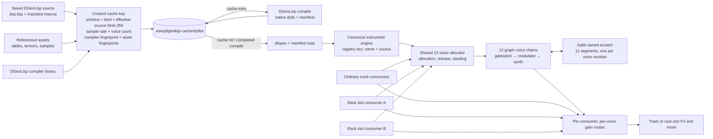

# sequencer

A Metal-based step sequencer and audio workstation built in Rust, ESeqLisp, and
DGenLisp on top of a lock-free audio engine. The earlier `ratatui` interface is
still available as the `sequencer` binary, but `metal_seq` is the active UI.

![Metal sequencer]okay(https://img.shields.io/badge/interface-Metal-blue)


## Features

- **Step sequencer** with up to 64 tracks and 64 steps per track
- **Per-step parameter locks** (p-locks) for duration, velocity, transpose, chop, and two aux sends
- **Multi-pattern bank** with clone, delete, and instant switching
- **Per-track effects chain**: manually added built-in and custom DSP effects written in a Lisp dialect (DGenLisp) that hot-compile into the audio graph
- **Embedded control Lisp via `eseqlisp`** for scratch scripting, hook-based pattern automation, and in-app instrument/effect editing
- **Global reverb bus** with per-track send levels
- **Polyphonic voice pool** with chord recording
- **Keyboard playing and recording** with quantized step input
- **Sample browser** with folder tree navigation and audition
- **Per-track step count** (polymetric patterns) with page navigation
- **Lock-free audio engine** (C-based audiograph library) with real-time safe graph editing
- **Piano keyboard visualizer** showing currently sounding notes
- **Mouse support** for clicking steps, tracks, params, and pattern buttons
- **Retained ratatui TUI** for the earlier terminal workflow

## Requirements

- **macOS only** -- the DGenLisp effect compiler depends on Metal for GPU-accelerated DSP
- Rust toolchain
- C compiler (Xcode command line tools)

## Building

```
cargo build --release
```

The audiograph C library is compiled automatically via `build.rs` + `cc`.

## Running

Run the current Metal UI from the repository root:

```
cargo run -p sequencer --bin metal_seq --release
```

Run the retained terminal UI with:

```
cargo run -p sequencer --bin sequencer --release
```

On first launch, the app creates local `samples/` and `effects/` directories.
Drop `.wav` files into `samples/` (nested folders are fine) and they will appear
in the sidebar browser.

## Headless UI capture

The Metal sequencer can render a named UI buffer from a deterministic,
Lisp-defined project fixture without opening the interactive app or an audio
device. This is useful for visually iterating on instrument, process, effect,
and sequencer panels. See [Metal sequencer UI capture](../../docs/metal-seq-ui-capture.md).

## Architecture

```
src/
  ui/               -- current Metal application, event loop, and Lisp host bindings
  tui/              -- retained legacy ratatui interface and shared app/graph state
  effects/          -- built-in audio effects and the effect-chain model
  sequencer/        -- sequencer state, clock, and snapshots
  lisp_host/        -- ESeqLisp/DGenLisp host support
  agent/            -- agent protocol, tools, providers, and validation
  bin/              -- focused command-line probes and migration tools
  audio.rs          -- cpal output stream and per-block processing
  audiograph.rs     -- FFI bindings to the C audio graph
  project.rs        -- project persistence
  sampler.rs        -- sample loading and playback
  scheduler.rs      -- lookahead scheduling and event routing

ui/                 -- declarative Metal UI source
  main.lisp
  effects/          -- effect, instrument, sampler, and process panels
  themes/
  capture-fixtures/

effects/            -- saved custom DGenLisp effects
instruments/        -- saved DGenLisp instruments, grouped by family
midi-fx/            -- saved ESeqLisp MIDI effects
defmacros/          -- reusable DGenLisp macros
processes/          -- saved process definitions
scripts/            -- loadable demos grouped by processes, sequencers, and UI
audiograph/         -- lock-free C audio graph implementation and tests
tools/              -- DGenLisp compiler and maintenance utilities
```

The `metal_seq` binary is rooted at `src/ui/main.rs`; `src/tui/` is retained
because the current app still shares parts of its state and audio-graph model.
The audio runs through the C-based lock-free graph engine in `audiograph/`,
which supports real-time node addition, removal, and parameter changes without
blocking the audio thread.

### Shared DGenLisp instrument engines

Note-triggered custom instruments use a project-wide shared-engine model
inspired by the voice pools in Elektron synthesizers. A saved instrument's
`dsp.lisp` is compiled at runtime into a native dylib plus a manifest. Tracks
and rack slots that resolve to the same saved instrument identity (name and
source) use one canonical engine, one dylib process function, and one pool of
12 voices. They do not instantiate private synth engines per track or per rack
slot.



The engine and its consumers have deliberately different identities:

- The **engine identity** selects the compiled instrument and owns its shared
  voice pool, synth nodes, modulators, and DGenLisp process function.
- A **consumer identity** represents an ordinary track or one specific rack
  slot. Each consumer has independent output and external-modulation routes,
  parameter state, p-locks, FX, gain, pan, mute, and polyphony limit.
- A voice allocation records both its engine voice number and its current
  consumer. Voice stealing changes the consumer route without creating a new
  synth node. Two slots in the same rack may therefore use the same instrument
  while remaining independently routable.

This separation is also a DSP correctness requirement. Generated DGenLisp
instrument dylibs own mutable scratch arrays divided into 12 segments by voice
number. Per-node state memory is separate, but scratch is shared by every call
into that dylib image. Consequently, two independent allocators must never
drive the same dylib with overlapping voice numbers. Keeping one canonical
engine and allocator per saved instrument identity makes the voice lease
authoritative across the whole project.

The allocator applies per-consumer polyphony caps within the shared pool and
prefers suitable idle or releasing voices before stealing an active voice.
When a voice moves between consumers, the audio thread disables its previous
gain route and enables only its new route. Note state, parameter fingerprints,
and release-tail ownership stay attached to the allocated voice. If a topology
reset invalidates the remembered consumer, the voice's first subsequent
allocation closes every other route for that engine voice before opening the
new one, re-establishing exclusive ownership.

#### Dylib cache

The persistent cache lives at `.eseq/dgenlisp-cache/dylibs`. Its key is a
SHA-256 hash over the cache schema, compile kind (instrument or effect),
effective source hash, sample rate, instrument voice count, the DGenLisp tool
fingerprint, and fingerprints of every referenced source asset. “Effective
source” includes the host preamble and materialized `defmacro` imports, so a
change to injected DSP helpers invalidates the cache even when the saved
`dsp.lisp` text itself is unchanged.

Each artifact directory contains the effective `source.lisp`, `manifest.json`,
`metadata.json`, and compiled dylib. Cache hits validate the metadata and all
required files before loading. Loaded artifacts are leased so an in-use dylib
path is not reused as a second live image; if no matching artifact is currently
free, the cache may compile another artifact under the same content key. This
also prevents `dlopen` from returning a stale handle after recompilation.

## Custom effects

tinyseq supports custom DSP effects written in DGenLisp, a Lisp dialect that
compiles to native shared libraries. Each saved effect lives in its own
`effects/<name>/` directory with a `dsp.lisp` file and an optional `ui.lisp`.
Effects are hot-compiled in a background thread and patched into the audio
graph on completion.

## Instrument probe

`instrument_probe` is a command-line render harness for DGenLisp instruments. It loads an instrument through the same host-side compile/load/init path used by tinyseq, sends a note into the instrument, renders audio blocks, and reports basic signal statistics. Use it when adding or changing instruments so quiet output, silent output, broken parameter defaults, and missing local data files are caught before testing in the DAW/TUI.

Run it against a saved instrument name:

```sh
cargo run --bin instrument_probe -- emulations/monomachine-dpro-wave-v2 \
  --frames 4096 \
  --min-peak 0.01 \
  --min-rms 0.001
```

Or run it against a direct source path:

```sh
cargo run --bin instrument_probe -- instruments/emulations/monomachine-dpro-wave-v2/dsp.lisp \
  --midi-note 60 \
  --velocity 0.8
```

Useful options:

| Option | Meaning |
|--------|---------|
| `--frames N` | Total frames to render, default `44100` |
| `--block-size N` | DSP block size, default `128` |
| `--sample-rate N` | Render sample rate, default `44100` |
| `--midi-note N` | MIDI note sent to the instrument, default `69` |
| `--velocity V` | Note velocity from `0..1`, default `1` |
| `--gate-frames N` | Number of frames the gate stays high, default is the full render |
| `--param name=value` | Override an instrument parameter; repeat the flag for multiple params |
| `--min-peak V` | Exit with failure if the rendered peak is below `V` |
| `--min-rms V` | Exit with failure if the rendered RMS is below `V` |
| `--json` | Print a machine-readable report |

For direct paths, relative assets such as wavetable JSON files are resolved from the source file's parent directory. For saved instrument names, assets are resolved from the saved instrument directory, matching the normal host loader.

## `eseqlisp` integration

tinyseq now embeds [`eseqlisp`](https://github.com/universalsequences/eseqlisp) for control scripting and editing.

- Custom instrument/effect editing runs inside the terminal UI instead of shelling out to `vim`
- `Ctrl+G` opens a fullscreen scratch buffer for live sequencer scripting
- Scratch can query and mutate pattern data, register timed hooks, and is saved with project files
- Project load restores scratch text and cursor position, but does not auto-run saved scratch code or hooks

`eseqlisp` is intentionally separate from DGenLisp:

- **DGenLisp** is the DSP/instrument/effect language
- **eseqlisp** is the control/UI/agent language

## Dependencies

- **ratatui** + **crossterm** -- terminal UI
- **cpal** -- cross-platform audio output
- **hound** -- WAV file loading
- **cc** -- C compiler integration for audiograph

## License

The audiograph engine is licensed under its own terms (see `audiograph/LICENSE`). The rest of the project is unlicensed / public domain -- do whatever you want with it.
