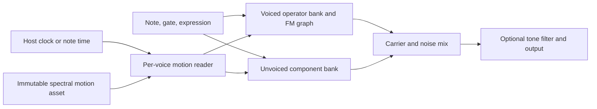

# FS1R-inspired factory FM/formant synth: investigation

2026-09-08 · investigation `eseq-hhjb` · next DSP validation `eseq-kb9y`

The subsequent [factory FM/formant synth specification](fm-formant-synth-spec.md)
supersedes this report's implementation recommendations with a compact,
native-rate carrier/window direction and explicit validation gates. The measured
results below remain evidence from the initial research probe.

**Recommendation: pursue an original FM/formant instrument, with the FS1R as
the architectural reference. The idea is feasible enough to justify DSP
development, but neither sonic equivalence nor production performance has been
established.**

The strongest product idea is an instrument whose notes have controllable
articulation: harmonic body, resonant identity, breath, and motion can change
independently. That offers a clear role beside the existing factory synths.
The difficult work is making those dimensions interact predictably across
pitch, modulation, polyphony, and parameter locks.

This investigation combines primary documentation, repository inspection, and
small compiled DSP experiments. No shipping instrument or application code was
changed. References to proposed behavior below are design recommendations,
not statements about Yamaha's implementation.

## What the FS1R actually contributes

Yamaha documents eight voiced and eight unvoiced operators; 88 FM algorithms;
eight voiced spectral forms; and operator frequency and amplitude envelopes.
The voiced forms include sine, all/odd harmonic families, resonant forms, and
`frmt`. In formant mode, frequency controls the spectral center; bandwidth and
skirt shape its spread. Note pitch and formant position are distinct controls.
Unvoiced operators provide shaped noise, with frequency-linking options.
The unit also has filtering and effects, so a finished preset demonstration
does not isolate the oscillator engine. Its documented polyphony is 32 notes,
falling to 16 when filtering is used. These are hardware limits, not our target.
[Yamaha owner's manual, pp. 8–12, 43, 62–70](https://data.yamaha.com/files/download/other_assets/5/333335/FS1RE1.PDF)

The separate data list describes FSeq frames carrying fundamental pitch and
voiced/unvoiced frequencies and levels for eight tracks, with 128/256/384/512
frame formats. Loop points, direction mode, speed, and pitch behavior are
separate sequence settings. Bandwidth/skirt are not per-frame fields in that
format. We should therefore distinguish **spectral motion data** from the
parameters of the synthesizer interpreting it.
[Yamaha data list, Fseq Parameter / Frame Parameter tables](https://usa.yamaha.com/files/download/other_assets/4/317954/FS1RE2.PDF)

Two conclusions follow for our product. First, operator count alone will not
make the instrument distinctive. Second, static vowels cover only part of the
opportunity: per-component articulation and motion deserve first-class design.

For comparison, Operator has four oscillators and eleven algorithms, while
F.'em already offers an extensive freely configurable operator matrix and
multistage envelopes. We should make a specific claim about accessible
formant articulation and sequencer integration, rather than claim that advanced
FM is absent from software.
[Ableton manual](https://www.ableton.com/en/manual/live-instrument-reference/),
[Tracktion F.'em](https://www.tracktion.com/products/f-em)

## The distinction the DSP must preserve

Consider a note at 100 Hz with a prominent spectral region around 1,200 Hz.
Raising the note to 200 Hz should be able to leave that region around 1,200 Hz.
Changing the articulation should instead move the region while the note remains
at 100 Hz. Those are different musical gestures.

In a harmonic construction, the available spectral lines are still multiples
of the fundamental. A formant center between harmonics describes an envelope
over those lines, not an extra oscillator at the exact center. As pitch rises,
fewer lines describe each region. A fixed formant setting consequently cannot
guarantee identical perceived vowels at every register. Our probe's 1,234 Hz
center at a 110 Hz fundamental, for example, has its strongest line at 1,210 Hz.

The existing `heat-formant-bank` and older `test-fm-formant` experiment shape an
input with resonant filters. They demonstrate useful vowel coloration, but do
not validate a self-contained operator with separate pitch, center, bandwidth,
skirt, and a defined modulation input. That is the missing abstraction.

Filtering remains a valid synthesis method. The architectural problem would be
claiming operator-level behavior while exposing only a global effect after the
FM mix. We need control at the individual component, including separate
voiced/unvoiced levels and their time evolution.

## Candidate implementations

| Candidate | What it gives us | Principal issue to resolve |
|---|---|---|
| Phase-aligned formant (PAF) | Compact analytical oscillator; explicit harmonic structure; inexpensive candidate for moving spectral peaks | Calibrate physical bandwidth and skirt; define transitions and modulation; control aliasing |
| Overlapping formant bursts, FOF-style | Explicit grain frequency, decay, rise, and overlap; strong correspondence between time shape and spectral envelope | Bounded overlap/state, CPU at high pitch, interaction with the FM graph |
| Per-operator excitation and resonator | Familiar filters and controllable noise; much can be built from current primitives | State response under fast moves and nonlinear modulation; independent skirt needs more than a single Q control |
| Explicit harmonic summation | Directly specified partial weights; useful numerical reference | Cost grows with the harmonic budget; audio-rate modulation generates further sidebands |

FOF synthesis generates overlapping sinusoidal bursts at the fundamental rate.
The burst frequency controls the spectral region, decay relates to bandwidth,
and rise time controls the skirt. Csound explicitly documents overlap-dependent
cost and separate controls for these dimensions. This is a useful reference
for the behavior we want, including the inconvenient parts a single reset
oscillator would omit.
[Csound FOF](https://csound.com/docs/manual/fof.html),
[IRCAM CHANT principles](https://support.ircam.fr/docs/om-libraries/om-chant/co/Intro.html)

The PAF candidate crossfades adjacent harmonically related cosines and multiplies
them by a periodic shaped pulse. For the Gaussian version in the experiment:

```text
r = center_hz / fundamental_hz
k = floor(r), q = r - k
window = exp(-b² sin²(phase / 2))
carrier = (1-q) cos(k phase + pm) + q cos((k+1) phase + pm)
output = window × carrier
```

Here phase and `pm` are in radians, and `b` is a dimensionless shaping index.
The unmodulated construction follows Puckette; the shared `pm` term is our
experimental extension. Puckette discusses phase-synchronized parameter updates,
normalization, and coherent summation. Those details matter: merely changing
the integer/fractional frequency terms at arbitrary times is not a completed
articulation design.
[PAF construction](https://msp.ucsd.edu/techniques/v0.07/book-html/node88.html),
[movable carrier construction](https://msp.ucsd.edu/techniques/v0.07/book-html/node87.html)

Gaussian and Cauchy shaping functions have different spectral tails. That
provides a starting point for evaluating shape control, but a blend is not
automatically a calibrated, independent skirt parameter. The reference also
explains the bandwidth restrictions of non-overlapping windowed waveforms.
[Puckette, pulse trains](https://msp.ucsd.edu/techniques/v0.07/book-html/node86.html)

Yamaha's published patent literature describes periodic carrier/window
constructions, overlap concerns, and formant-shape parameters. It establishes
that relevant implementation ideas are publicly described. It does **not**
establish that a particular diagram is the exact FS1R signal path or that PAF
reproduces its sound. I found no verified correspondence sufficient to make an
emulation claim.
[Yamaha formant synthesizer patent](https://patents.google.com/patent/JP2504173B2/en),
[Yamaha formant generator patent](https://patents.google.com/patent/JP2712963B2/en)

My preferred next comparison is PAF versus a bounded overlapping-burst design,
with a resonator implementation as an inexpensive reference for noise shaping.
Select by measured behavior and listening, rather than decide the oscillator
law from the name FS1R.

## What the compiled experiment established

The reproducible experiment lives in
[`tools/fs1r-research`](../tools/fs1r-research/README.md).
It ran on an Apple M1 Max, at 48 kHz, using the pinned macOS DGenLisp v0.1.13
binary. The recorded compiler SHA-256 is
`34c1066d31d82739010c7bca234fe37756a0bd1ec455186190813a9cca6c1c78`.
Repository HEAD was `aeff67d86bcd9b195bdbdef3f8887a48afbcbd4f`; the working
checkout contained concurrent edits. Input hashes and lock contents are stored
with the results.

| Check | Result | Interpretation |
|---|---|---|
| Fundamentals 100 / 200 / 400 Hz, center 1,200 Hz | Strongest spectral line remained 1,200 Hz in all three | Pitch and spectral placement can be controlled separately |
| Fundamental 100 Hz, centers 700 / 2,500 Hz | Peaks at the specified centers | Formant movement need not transpose the note |
| Eight static cases, including PM and extreme width | Largest waveform error about 1.91e-5 | Compiled waveform arithmetic agrees with float64 reference evaluated at the compiled phases |
| Block sizes 64 / 128 / 256, one static case | Maximum difference 0 | This probe is block-size invariant in the checked case |
| Eight-pair workload, gate release | Finite audio; final 100 ms RMS about 1.75e-10 | Basic compile/state/envelope path works for this workload |
| Existing built `instrument_probe`, A4, 48,000 frames | Peak 0.907, RMS 0.107; no nonfinite samples or state | Production host compile/load/render smoke check passes |

The eight-pair workload includes eight PAF stages, a fixed feed-forward PM
chain, eight amplitude envelopes, and eight filtered-noise components. It
shares a fundamental phase and each pair shares its amplitude envelope. It has
no independent frequency envelopes, no feedback, no motion reader, and no
anti-aliasing. It is an executable feasibility experiment, not the synth.

All four compiled variants passed the repository's known fusion-pattern check.
That is limited evidence; it cannot prove arbitrary graph combinations safe.
The numerical reference intentionally uses exported phase signals, so it
checks waveform evaluation separately from phase-accumulator accuracy.

### CPU evidence is encouraging but incomplete

The reproducible rerun measured approximately **2.44 microseconds per 128-frame
block** for one PAF plus phase diagnostics, and **44.01 microseconds** for the
eight-pair workload. The latter's seven batch averages ranged from 43.42 to
44.23 microseconds. These include Python/ctypes call overhead.

An earlier identical DSP run ranged from 54.70 to 128.00 microseconds, with a
109.42 microsecond median. Both records are preserved. The reason for that
variation was not isolated, so these are indicative microbenchmarks, not a
realtime performance guarantee.

For scale only, 44.01 microseconds is about 1.65% of one core's time budget at
this block size. Multiplying that by twelve gives roughly 20% before host
overhead, additional envelopes, or oversampling; the noisier run would imply
roughly 49%. Neither extrapolation is a measured polyphonic result. Benchmark
the complete instrument on both target machines before choosing a voice budget.

### Aliasing is a demonstrated design constraint

The analytical experiment compares a native 48 kHz waveform against a
16x-rate rendering followed by ideal frequency-domain lowpass/downsampling.
One-second periodic signals avoid window/end effects. The 8x and 16x references
agree to numerical precision in these cases.

| Analytical case | Relative RMS error of native-rate output |
|---|---:|
| f0=100 Hz, center=1,200 Hz, width index=2, no PM | Below the useful numerical floor |
| f0=1,000 Hz, center=18,000 Hz, width index=12 | -8.19 dB |
| f0=500 Hz, center=8,000 Hz, width index=2, PM depth=8 radians at ratio 8 | -1.40 dB |

These are **error levels relative to the reference signal**, not dBFS and not
measurements of Yamaha hardware. They show that the simple candidate becomes
grossly different from its bandlimited reference at demanding settings.

Consequently, a center-frequency clamp and an output lowpass are insufficient.
Once high-frequency content has folded into the audible band, filtering the
output cannot separate it from wanted content. Likewise, PolyBLEP correction
for a sawtooth discontinuity is not a general solution for PM sidebands.

Evaluate proper oversampling of the interacting oscillator/feedback region,
with control interpolation and decimation, alongside a construction whose
spectral tails are explicitly limited. Set a spectral-error requirement for
the intended parameter domain. Do not choose 2x or 4x by habit, assume that it
solves every setting, or silently narrow a control's range when it becomes hard.

## Repository capability audit

| Area | Evidence in the current tree | Consequence |
|---|---|---|
| Oscillator math, state, noise, filters | DGenLisp operator inventory; successful compiled probes | Enough primitives for research candidates; no dedicated formant primitive found |
| FM | `tests/fixtures/instruments/core/operator/dsp.lisp:354` has phase modulation and one-sample self-feedback | An example exists; its feedback and anti-aliasing choices are not an approved new contract |
| Shared readable patches | `docs/factory-macro-library-spec.md`; `content/defmacros` | Keep the final instrument composed of meaningful operator/voice/motion sections |
| Note and expression input | `dgen_manifest.rs:60–80`; `gatepitch.rs` | Gate, pitch, trigger, note-on, legato, pressure, pitch bend, and mod wheel have named host routes |
| Musical clock | `audio/render.rs:144`; `gatepitch.rs:186` | `clock`/`barclock` and `clockinc` support DSP-side timing; clock is bar phase, not an unbounded song position |
| Polyphony | `audio/voices/pool.rs:6` | Current pool ceiling is 12 voices; do not promise 32-note hardware parity |
| Parameters and presets | `dgen_manifest.rs`; `instrument_storage.rs:20` | Scalar parameter maps and key locks exist; arbitrary editable trajectory assets need a defined persistence path |
| Tensor data | tensor operators, `dgen_ffi.rs:321` | Bulk tensor writes exist, but are not a complete versioned motion-asset workflow |
| Oversampling | No general oversampled instrument region found in the inspected DGen API/source or host wrapper | Robust rate handling may require a reusable compiler/runtime feature |
| Platform distribution | `content/dgenlisp.lock` | macOS pins v0.1.13; Linux pins v0.1.5. Local compiler source and macOS success do not establish Linux support |

Paths above are under `crates/sequencer/src` unless qualified. These findings
come from source inspection; only the small DSP and host smoke paths were
executed. No UI, scheduler, serialization, or Linux tests were run.

The ABI carries a runtime sample rate. Passing a different sample rate alone
does not create oversampling: the host must also supply/interpolate inputs,
advance the correct number of internal samples, and filter/decimate outputs.
Hand-unrolling a few extra oscillator evaluations while leaving envelope and
feedback state at another rate would produce inconsistent behavior.

The clock route is particularly useful. A note-relative contour can run in DSP
from note-on and `clockinc`; a bar-locked contour can use bar phase. Multi-bar
position, seek recovery, stopped transport, and live note behavior still need
explicit semantics. Modulo-one bar phase alone does not identify an arbitrary
song location.

## Proposed instrument architecture

This is a proposed design, not an FS1R wiring diagram:



I would retain eight voiced slots and eight unvoiced slots as the intended
instrument design, with independently controllable levels. Make the simple
sine/FM case economical, and establish whether inactive components can be
omitted or safely skipped. Multiplying an expensive live branch by zero does
not by itself establish that the compiler avoids its work.

Each voiced slot should expose oscillator mode, ratio/fixed pitch, spectral
center, bandwidth, shape/skirt, level envelope, and appropriate frequency
motion. Center and bandwidth should have understandable units. The instrument
should distinguish operator amplitude from routing gain: modulator amplitude
changes timbre, while carrier amplitude changes the audible mix.

Each unvoiced slot needs its own spectral region and articulation. A shaped
noise source is a reasonable original design, but noise bandwidth approaching
zero needs a specified limit. A filter fed with noise does not automatically
become a deterministic oscillator. Do not mimic a hardware endpoint with a
hidden unstable-Q trick.

The most consequential FM decision is where phase modulation acts. Modulating
only the sinusoidal carrier, modulating the full formant waveform's phase,
and modulating its center frequency are different synthesis operations. The
probe implements only the first. Audition and document the selected law before
designing presets around it.

For graph routing, a fixed ordered feed-forward graph with explicit delayed
feedback is a sound starting contract. Same-sample acyclic edges can evaluate
in topological order. Any cycle must contain a deliberate delay, with units and
behavior defined at the internal processing rate. Do not accidentally delay
every connection by one sample simply to make an arbitrary matrix executable.
That changes FM behavior and makes the result depend on implementation order.

Algorithm selection should be a structural edit with an intentional transition
policy. It should not be treated as an ordinary continuous morph. For a first
factory bank, a small set of useful graphs is enough if the operator building
blocks remain editable in the patcher. Whether graphs compile into specialized
programs or a shared runtime structure should be decided from latency, state,
and performance measurements.

The panel should make normal sound design possible without showing every
parameter simultaneously: a performance view for morph, breath, brightness,
FM intensity, and motion; an operator view; and a motion view. Those macro
controls need real mappings with audible range across the preset, not simply
names attached to arbitrary collections of gains.

## Motion data and audio resynthesis

Use a native, versioned motion representation rather than make Yamaha SysEx
the internal format. A useful proposed frame has per-component frequency,
amplitude, bandwidth, and optional shape, plus optional fundamental pitch.
Duration/timebase, loop region, interpolation, and pitch-follow policy belong
to the asset or playback configuration.

Interpolate frequency and bandwidth in log units when positive, and gain in
decibels with an explicit silence representation. Frame-to-frame continuity is
necessary but does not settle oscillator phase continuity. Morphing two assets
also requires consistent component identity: sorting peaks independently in
every frame can swap tracks and create unintended crossings.

The ownership model should be immutable shared asset data plus per-voice
playhead/state. Build and validate edited data off the audio thread, then
publish a coherent revision. A preset/project must retain the exact asset or
content identity required to reopen it. A transient tensor write does not
provide save/load, undo, revision consistency, or a safe multi-voice update.

Compile-time tensor assets can serve a deliberately fixed factory motion bank.
They are a poor basis for a UI that promises arbitrary live editing or imports
but secretly recompiles the instrument after every edit. Implement the asset
contract properly when those capabilities are added.

Audio-to-motion analysis is plausible but a separate feature. The maintained
`fs1r-wav2syx` project demonstrates a pipeline using pitch/formant extraction,
voiced/unvoiced band analysis, smoothing, and SysEx generation. It is useful
prior art, not evidence that our candidate oscillator will reconstruct its
input accurately.
[Project documentation](https://github.com/quadratschulz/fs1r-wav2syx)

Praat's documentation explains why analysis settings matter: formant ceilings,
window lengths, and spectral assumptions affect whether detected peaks
represent the intended resonances. A production importer needs confidence
handling, temporal track assignment, and a residual-noise model, not merely
the loudest eight FFT bins.
[Praat formant analysis](https://www.fon.hum.uva.nl/praat/manual/Sound__To_Formant__burg____.html)

Start sound design with authored contours and controlled recordings. Published
vowel parameter tables can supply reference cases for analysis, but finished
presets should be evaluated across the keyboard and with velocity/expression.
[Csound formant reference](https://csound.com/manual/misc/formants/)

## Development gates and product judgment

The next durable task is `eseq-kb9y`: settle and validate the DSP contract.
These are acceptance gates for that work, not claims of completed features:

1. **One component with meaningful controls.** Measured center/bandwidth/skirt,
   pitch independence, gain behavior, and continuous moves. Compare PAF and
   overlapping bursts on the same cases, including narrow high-register sounds.
2. **Interaction quality.** PM laws, modulation depth, delayed feedback,
   retriggers, legato, and abrupt locks. Define smoothing so recorded locks and
   ordinary playback have the same audible timing.
3. **Rate and cost.** Alias comparison to converged high-rate references;
   block-size and sample-rate checks; complete workload and host polyphony
   benchmarks on published macOS and Linux compilers. Fix compiler/runtime
   deficiencies directly if those prevent the required quality.
4. **Motion and persistence.** A separate asset contract before editable/imported
   motion becomes a product promise. Verify seek, looping, note-off, save/load,
   undo, and simultaneous voices against that contract.
5. **Musical acceptance.** A compact bank covering choir/vowels, breathy reeds,
   glassy keys, FM bass, resonant percussion, and evolving non-vocal textures.
   Compare dry tones as well as finished effects chains. Require listening
   approval before claiming the instrument captures what made the demos exciting.

The UI stage should follow the repository's normal functional layout tests and
real sequencer panel captures. It should also prove parameter-lock feedback and
the selected operator's controls, not merely render a plausible panel.

A bit-accurate FS1R recreation would be a different project: it would need
isolated hardware captures, oscillator/parameter-law identification, envelopes,
feedback behavior, and compatibility tests. YouTube presets are useful musical
references but cannot identify all those hidden variables. No particular demo
was supplied, and this investigation contains no listening comparison to one.

The sensible commitment now is **the synthesis direction and a rigorous core
validation step**. Eight-operator FM plus individually articulated spectral
components could become a distinctive factory instrument. The small probe
removes uncertainty about basic expressibility; aliasing, motion continuity,
full-load performance, and the actual sound remain the decisive work.

## Change and confidence record

Added this report and isolated research files under `tools/fs1r-research`.
Production DSP, UI, compiler, and host behavior are unchanged. The experiment
uses intentionally limited mathematical candidates and clearly labels their
limitations; none is proposed for shipping as-is. No fragile workaround was
introduced into the application. No Rust suite or full application build was
needed for these research artifacts. No commit, push, or remote Beads sync was
performed.
