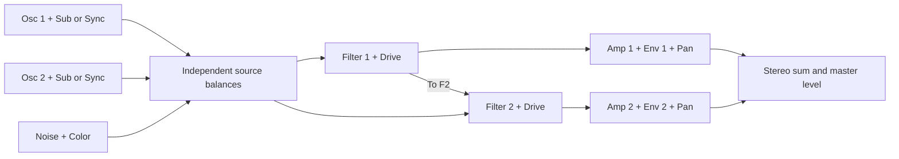

# Heat — factory analog synthesizer

Revision 1 · 2026-09-05 · Specification and inspection: `eseq-38fe`

Implementation epic: `eseq-vumc`; shared mono-legato foundation: `eseq-xpa`.

## 1. Product decision

Heat is eseq's factory counterpart to Ableton Analog. The target is complete
functional and performance parity with the inspected Live 12 device within
the expression scope below, followed by measured sonic matching. It is not a rename of `analog-bread-and-butter`
and must not inherit that experiment's reduced architecture as a constraint.

Heat must cover simple subtractive sounds and Analog's deeper capabilities:
independent dual signal paths, hard sync, formant filtering, envelope loops,
stereo articulation, unison, expressive playing, shared legato, and MIDI pressure. These are release
requirements, not optional features to append after shipping a partial clone.
Full MPE (zones, member-channel per-note bend, and Slide) is explicitly outside
this version: eseq does not have MPE. This scope was clarified by the author
after inspection. System-wide GatePitch legato and MIDI pressure are explicitly
in scope, including the shared host work needed to support them.
Heat uses original eseq UI, source, and factory presets. No requirement exists
to reproduce Ableton's branding, artwork, or preset files.

This specification supersedes the earlier bread-and-butter spec **for Heat**.
In particular, a reduced filter selection, shared envelopes, generic Hz
modulation, or a deliberately small parameter surface no longer satisfies the
target. The old experiment can remain available independently.

“Parity” has three separate gates:

1. **Functional:** every in-scope reference control has its actual behavior, including
   interactions, off states, event handling, and expression routing.
2. **Sonic:** matched settings produce acceptably matched spectra, dynamics,
   tuning, stereo image, and modulation. The test corpus below defines this.
3. **Factory:** the packaged application loads, plays, edits, saves, forks, and
   restores Heat without development files or a developer toolchain checkout.

The current inspection establishes neither a numerical similarity percentage
nor sonic equivalence. No matched audio was captured or auditioned in this
session. “50% there” remains the author's qualitative assessment.

## 2. Evidence and scope of inspection

### Running applications

Computer Use inspected both running applications and the actual device views:

| Reference | Observed state |
| --- | --- |
| ESeq | `/Applications/ESeq.app`, running `metal_seq`; bundle version `0.1.0`, build `a4a66cae`. One selected analog-bread-and-butter instrument track; poly enabled, six voices; transport stopped. |
| Ableton | `/Applications/Ableton Live 12 Suite.app`, version `12.4.5 (2026-08-19_225ce5e356)`; Untitled set; selected `1-Analog` track and active Analog device; transport stopped, 48 kHz. |

Application paths were confirmed from running process paths; versions came
from their bundle metadata. These are not an assertion that the running ESeq
binary was built from today's working tree.

In ESeq, the synth overview, shared filter envelope detail, and LFO detail
were inspected visually. In Live, the oscillator, filter, amplifier, LFO,
Global, and MPE detail panels were inspected through accessibility and
screenshots, including the filter-type and MPE-destination menus. Only view
selection and menu inspection were intended; no sound parameters, playback,
project content, or saves were intentionally changed.

The Live patch had both saw oscillators on, routed to F1; F1 LP24 at 22 kHz,
zero resonance, Sym1 drive; F2 and Amp2 off; noise, LFOs, vibrato, unison, and
glide off. This is an observed patch, **not a verified factory Init preset**.
Its values must not silently become Heat defaults.

Late in inspection, Computer Use lost access to Live's window with
`windowNotFoundAtPosition` / `failedToCreateImageDestination`; reconnecting
failed. The observations above were already obtained. Final view restoration
could not be verified. No endpoint sweeps or audio measurements were attempted.

### Source evidence

The installed user-library DSP at
`~/Library/Application Support/com.universalsequences.eseq/instruments/core/analog-bread-and-butter/dsp.lisp`
is byte-identical to the tracked
[DSP fixture](../crates/sequencer/tests/fixtures/instruments/core/analog-bread-and-butter/dsp.lisp).
SHA-256: `f9cf35f1e5415394a1ac524650655b000016eb5dceb329f9ce322d8b310309f9`.
The user-library UI was also read. Its displayed values and layout agree with
the inspected app; the in-memory compiled DSP was not extracted or hashed.

Repository HEAD during inspection: `bf2fb5a33b79d6d29ae068661d164b4f2aa9c8e1`.
Relevant local references:

- [Early synth specification](../crates/sequencer/docs/analog-bread-and-butter-synth-spec.md)
- [UI fixture](../crates/sequencer/tests/fixtures/instruments/core/analog-bread-and-butter/ui.lisp)
- [Factory macro design](factory-macro-library-spec.md)
- [Current factory example](../content/instruments/Synths/Digi%20Drift/dsp.lisp)
- [Content tiers](content-tiers-spec.md)
- [Existing mono-legato proposal](legato-mono-spec.md)
- [Current GatePitch event implementation](../crates/sequencer/src/effects/gatepitch.rs)

The [official Analog reference](https://www.ableton.com/en/manual/live-instrument-reference/#analog)
was used as supplementary evidence. It identifies output-side filter drive,
Filter Follow inheriting F1 modulation, oscillator keytracking pivot at C3,
waveform-dependent sub generation, and Free-plus-loop interaction. These
details require measurement against the installed version. The following
control inventory otherwise comes from the inspected UI; DSP differences come
from local source. Requirements and proposed engineering gates are Heat
design decisions, not claims about proprietary internals.

## 3. Gap analysis

| Area | Analog observed in Live | Bread-and-butter source / UI | Heat consequence |
| --- | --- | --- | --- |
| Oscillators | Two independent on/off sources; sine, saw, rectangle, white noise; level, route, tuning | Sine, saw, pulse, triangle; no source enable; fine tuning only ±50 cents | Correct source repertoire, enable states, tuning ranges, and level law. |
| Oscillator detail | Per-oscillator keytracking, pitch envelope, PW/LFO amount, Sub/Sync | Shared PW; no pitch envelopes or sync; one shared sub | Two complete oscillator sections, with independent sub/sync behavior. |
| Source routing | Each oscillator and noise can feed either filter | Complementary F1/F2 source splits already exist | Retain the concept; calibrate routing gain law and edge cases. |
| Filters | Ten types; independent enable, Follow, drive modes; cutoff and resonance modulation | Four types: SVF LP12/BP/HP and ladder LP24; no Follow or off state | Implement every type and behavior; a ladder is not established as Analog's LP24 model. |
| Drive | Named Sym/Asym modes | Mandatory pre-filter tanh, extra ladder drive, amp tanh, output tanh | Replace uncalibrated repeated saturation with explicit, measured stages. |
| Envelopes | Four independent filter/amp envelopes, plus two pitch envelopes | One shared filter ADSR and one shared amp ADSR | Independent state and controls for all six envelopes. |
| Envelope detail | Slope, sustain time, velocity-to-attack/level, legato, Free, three special loop modes | Ordinary ADSR and shared velocity amounts | Build the envelope state machine and host event semantics. |
| Amplifiers | Independent on/off, level, pan, own envelope and modulation | Independent level/pan, but shared envelope; limited opposing pan LFO | Independent articulation and calibrated stereo behavior. |
| LFOs | Five shapes including stepped/ramped random; sync, retrigger, offset, delay, attack | Four shapes, Hz only, no retrigger/offset; limited fixed routes | Complete both LFOs and lane-specific destination depths. |
| Performance | Voice priority, unison 2/4 with delay/detune, glide modes, independent vibrato, tuning controls | Host polyphony, pitch smoother, fixed drift; vibrato is extra LFO1 depth | Host and DSP work are both required. |
| Expression | Pressure and Slide each have two destination slots; per-note bend | Channel aftertouch is parsed by the new MIDI layer; no equivalent device pressure contract | Deliver shared MIDI pressure support and Heat pressure routes. Slide and MPE bend are excluded by author decision. |
| UI | Persistent signal-path controls plus selected section detail | Compressed sources/filters, shared ADSR view, placeholder LFO visualization | Preserve overview/detail workflow while exposing the complete device. |

### Concrete defects and compromises in the early DSP

These findings explain why adding knobs alone will not reach parity:

- `osc1_pan` and `osc2_pan` are declared but never consumed by the DSP.
  OSC1's visible pan control is therefore ineffective in this source.
- The UI reuses oscillator labels `sine/saw/pulse/tri` for LFO values whose
  actual DSP order is `sine/triangle/saw/pulse`. Three enum labels are wrong.
  LFO Width only affects the pulse expression; it does not skew triangle.
- LFO Delay is implemented as an additional ADSR attack of `delay + attack`,
  multiplied by another attack envelope. Modulation starts ramping immediately;
  it does not wait silently for the requested delay.
- Vibrato and pitch-LFO depth are added using the same `lfo1` signal. Turning
  vibrato up cannot supply an independent vibrato rate or delayed onset.
- Filter cutoff is `base Hz + pitch Hz * keytrack + env * Hz amount + LFO * Hz`.
  This couples keyboard position, baseline, and sweep span very differently
  from pitch-domain tracking. Both cutoffs are capped at 14 kHz.
- F1 resonance declares default `0.22` below its declared minimum `0.45`;
  DSP clamps to `0.45`, which was also displayed in the running panel.
- `f1_to_f2` adds F1 to F2 without reducing the F1-to-Amp1 branch. This may be
  the intended send topology, but is not enough to prove reference routing
  parity; intermediate positions and bypass combinations need measurement.
- Pan uses `1 ± pan * 0.45`; at a full pan extreme the opposite side remains
  at `0.55` gain. It cannot hard-pan a branch. Repeated tanh stages further
  change the relationship between branch levels and the stereo sum.
- Glide is a one-pole smoother in Hz, with no explicit first-note seeding or
  interval-independent completion. A zero-initialized history can sweep the
  first gliding note upward from zero. This is not a complete portamento model.
- The sub selector couples octave and waveform, unlike two independent
  per-oscillator Sub/Sync sections. Useful source parameters such as sub route
  and oscillator slop are not exposed in the inspected custom UI.

These are static-source findings; their audible magnitude has not been
measured here. No changes to the experiment are part of this specification.

## 4. Signal architecture

Each logical note owns a complete voice. An enabled unison group contains two
or four complete voice instances, with independent state and delayed onsets;
duplicating only oscillators is insufficient for full-voice unison parity.



No F2-to-F1 feedback edge is required. The F1 branch/send split, drive placement
relative to that split, routing gain law, and filter bypass semantics must be
resolved by reference captures before their equations are finalized. The graph
specifies connectivity, not an unverified gain law.

Quick Routing provides four atomic, undoable assignments of normal parameters:
separate lanes; both sources split to both lanes; both through F1/Amp1; both
through F1 then F2/Amp2. These are visible parameter configurations, not hidden
DSP modes. Record exact source/noise balances, sends, and enable changes from
the reference, including whether unrelated controls remain unchanged.

State ownership is explicit:

- **Host:** note identity/lifetime, allocation, priority, held-note ordering,
  expression delivery, transport timing, and atomic preset restoration.
- **Voice DSP:** oscillator and filter histories, local envelopes/LFOs,
  calibrated pitch transitions and modulation evaluation.
- **Instrument state:** parameter schema, tuning/performance configuration,
  expression assignments, master controls, and UI selection.

## 5. Required control and behavior contract

Use stable IDs such as `osc1_wave`, `filter2_follow`, `amp1_env_loop`.
`N` below expands to independent instances 1 and 2, never aliases.

### Oscillator N and noise

Each oscillator has enable, waveform, level, F1/F2 balance, octave, semitone,
and cents detune; fine detune covers the observed ±300 cents. Detail contains
keyboard scaling, pitch-LFO depth from LFON, a dedicated initial-pitch/time
envelope, pulse width and its LFON depth, Sub/Sync selector, sub level, and sync
ratio. Store sub level and sync ratio independently when changing modes.

Waveforms are sine, saw, rectangle, and white noise. PW is per oscillator.
The reference's 100% PW means square, so the user value is not raw 0..1 duty
cycle. Calibrate its mapping and limits; reuse of the old duty-cycle control
would be incorrect. Source-noise mode and the separate colored-noise module
remain distinct. Sub derives from its owning oscillator; sync uses an internal
master, not oscillator 1 arbitrarily resetting oscillator 2.

The separate noise generator has enable, dB level, F1/F2 balance, and a color
cutoff displayed in Hz. Preserve noise statistics and temporal independence
across voices. Optional deterministic seeds belong to tests, not a fixed
repeated noise pattern in normal playback.

Oscillator generation, PWM, and hard sync must control aliasing across pitch,
modulation, and sample-rate extremes. A PolyBLEP waveform implementation is a
candidate, not evidence of sonic matching by itself.

### Filter N

Required types: LP12, LP24, BP6, BP12, Notch2, Notch4, HP12, HP24, Formant6,
Formant12. Preserve these distinct response families; do not populate the
chooser with several labels for the same transfer function. In formant modes,
the resonance-position control becomes vowel selection/morphing behavior.

Each filter has enable, cutoff, resonance, independent envelope, and signed
cutoff/resonance depths from LFON, keyboard, and its own filter envelope.
Drive must cover Off and the reference's Sym/Asym variants. The exact installed
menu and all transfer curves remain capture requirements; implement explicit
variants rather than assigning different multipliers to one tanh by guesswork.

F1 owns To F2. F2 owns Follow and an offset that preserves a useful relationship
to the fully modulated F1 cutoff. Keep F2's independent cutoff stored separately
from its Follow offset. Measure how F2's own modulation combines in Follow.

Use physical/logarithmic domains internally where supported by measurement:
pitch tracking and envelope sweeps should operate in octaves/semitones, with
final Hz conversion for the filter. Do not infer exact depth scaling from
UI-normalized values. The inspected reference reaches 22 kHz at 48 kHz; Heat
must not inherit the experiment's 14 kHz ceiling. Apply sample-rate-aware
stability limits while preserving reference behavior at supported rates.

Drive Off must remove the explicit drive stage. Native nonlinear filter
behavior may remain if justified by reference audio. Gain compensation,
resonance growth, self-oscillation, and DC management need measured contracts;
an always-on output saturator must not hide unstable filters or incorrect gain.

### Amplifier N

Independent enable, dB level, pan, and envelope. Pan has signed LFON, keyboard,
and own-envelope depths. Level has LFON and keyboard depths; the inspected
Amp panel shows its envelope contribution fixed at 100%, not another editable
level-envelope amount. Envelope velocity sensitivity remains independently
editable. Calibrate pan endpoints and center gain with isolated branch renders.

### Four independent filter/amp envelopes

Each owns attack, decay, sustain level, sustain time including infinite hold,
release, linear/exponential slope, velocity-to-attack, velocity-to-level,
legato, Free, and loop mode. No shared parameter or history is allowed unless
the user explicitly links controls through normal host modulation.

| Mode | Required event behavior |
| --- | --- |
| Off | Ordinary A-D-S-R; finite sustain time can fall while key remains held. |
| AD-R | Repeat attack/decay during hold, enter release on note-off. |
| ADR-R | Repeat attack/decay/release during hold; resolve note-off to the final release behavior measured from Analog. |
| ADS-AR | Normal held contour; note-off produces the extra attack/release articulation shown in the installed UI. |

Use `ADS-AR` as the observed UI spelling; supplementary manual text uses a
different spelling. The behavior, not that discrepancy, is authoritative.
Free bypasses sustain to produce a triggered contour. Free plus looping is an
explicit interaction to reproduce, including how panic stops it. Legato is an
envelope policy distinct from fingered glide. Determine reference behavior for
overlapping poly notes, note stealing, and mixed legato settings across the
four envelopes; a single track-wide “suppress all triggers” flag is insufficient
to express independent envelope settings.

The envelope editor must draw the actual slope, finite sustain behavior, and
loop region. Note-off during attack, retrigger during release, zero/short times,
and per-note velocity transitions must have defined state transitions.

### LFO N and vibrato

Each LFO has enable, Hz/sync mode, rate/division, sine/triangle/rectangle/
stepped-random/ramped-random shape, width, delay, attack, retrigger, and phase
offset. Width skews triangle and rectangle; it is inapplicable to sine/random.
Disabled output contributes zero without losing stored settings.

Delay means zero contribution until the delay elapses, followed by an attack
to full depth. Retrigger and offset define the starting phase. Free-running
phase continuity, phase scope across poly voices, tempo changes, stopped
transport, and note-on during a tempo ramp must be specified from captures.
Synced rate uses host musical time, not a guessed BPM parameter.

Reference lane pairing is LFON to OscN pitch/PW, FilterN cutoff/resonance, and
AmpN pan/level. Keep those simple destination-local depths. Host modulation is
additional; it must not replace the reference's internal modulation behavior.

Vibrato is its own generator: enable, amount, rate, delay, attack, error, and
mod-wheel depth. Changing either general LFO cannot alter vibrato. Measure
error distributions and whether random variations are per note or continuous.

### Global performance and expression

Required global controls: volume; octave/semitone/cents tuning; stretch and
tuning error; pitch-bend range; available polyphony; Last/High/Low priority;
unison enable, 2/4 voices, detune and onset delay; glide enable, time,
Constant/Proportional mode and legato-only condition.

Constant glide reaches a target in the same duration across intervals;
Proportional glide takes longer over larger intervals. Measure time taper,
curve shape, direction, repeated pitches, first note, and voice reuse. Never
initialize a first audible pitch from zero as a side effect of blank history.

**Pressure is in scope; full MPE is not.** Heat has two pressure destination
slots and signed amounts, usable with MIDI channel aftertouch and conventional
MIDI polyphonic key pressure. Poly pressure is a discrete MIDI message type;
it does not require implementing MPE. Channel pitch bend and mod wheel remain
ordinary channel controls. Do not show nonfunctional Slide or per-note MPE
bend controls in Heat.

Required pressure destinations, as observed in Analog's pressure chooser:

- Global: vibrato amount/rate, unison detune; noise level/balance/color.
- Per lane: oscillator pitch, LFO-to-pitch, pitch-envelope depth, PW,
  LFO-to-PW, sub level, sync ratio, source level/balance; filter cutoff,
  LFO-to-cutoff, envelope-to-cutoff, Q, LFO-to-Q, envelope-to-Q; amp level,
  LFO-to-level, pan, LFO-to-pan; LFO rate.

Use one shared MIDI/controller infrastructure, not a Heat-only handler. The
current `MidiMessage::Aftertouch` parses channel pressure (`0xD0`); the inspected
parser does not handle polyphonic key pressure (`0xA0`). Preserve source port
and channel identity through dispatch. Channel pressure addresses voices from
that source/channel; poly pressure additionally addresses the original MIDI
key, even if downstream pitch is transposed. A value must never leak into a
different track, channel, input port, or reused voice.

Define precedence explicitly: Heat's effective pressure for a voice is the
most recent poly-pressure value for its source/channel/key when present,
otherwise current channel pressure. Initial channel pressure is zero. New
notes inherit current channel pressure; note-specific pressure state is reset
when that note lifetime ends. Repeated same-key note lifetimes must not inherit
stale values; document routing for simultaneously held same-key voices because
MIDI 1.0 poly pressure addresses a key, not a unique note ID. Panic, port
disconnect and controller reset clear relevant state.

Pressure is a live modulation source, separate from note-on velocity. Keep
saved amounts/assignments separate from transient controller values. Preserve
pressure changes through the supported performance recording/playback path so
recorded articulation can be reproduced; if that path needs expression-event
storage, extend it as shared infrastructure. Do not silently turn pressure
into permanent base-parameter edits. Routing through MIDI FX, racks, and voice
stealing needs identity-aware tests. Ordinary modulation sources and future
instruments should be able to consume the same pressure signal.

## 6. Parameter schema and calibration boundary

One authoritative parameter schema must drive DSP declarations, UI options,
units, formatting, defaults, serialization, modulation metadata, and test
enumeration. At minimum it records stable ID, section, type, enum order,
physical range, taper, default, modulation domain, applicability, and reference
evidence. Enum labels must not be copied from a different component's list.

Do not freeze guessed numerical ranges. Before implementing calibrated DSP,
create a machine-readable reference ledger for **every** control with minimum,
maximum, initialized default, midpoint, physical display, normalized value,
and behavior at off/zero/center. Record all enum choices and dependencies.
Capture the initialized device separately from the user's current patch.
Resolve the smallest and largest supported voice counts and all synced rates.

Known anchors include ±300-cent oscillator fine tuning, ±50-cent global fine
tuning, 2/4 unison, ten filter types, and 22 kHz cutoff in the observed 48 kHz
session. Other numerical mappings remain unmeasured, including sync ratio,
pitch-envelope initial/time percentages, drive curves, and modulation tapers.
An implementation cannot claim exact parameter parity until the ledger is
complete. UI-normalized `0.5` is not a physical unit.

Continuous control smoothing occurs in the appropriate domain and preserves
timing for note events and p-locks. Enum changes need defined transition/state
handling. Inactive controls retain their values, show applicability clearly,
and react correctly when re-enabled. Parameter metadata must never advertise
modulation that the DSP ignores.

## 7. eseq integration and implementation design

Ship through the current curated directory convention:

```text
content/instruments/Synths/Heat/dsp.lisp
content/instruments/Synths/Heat/ui.lisp
content/instruments/Synths/Heat/dsp.layout.json
content/instruments/Synths/Heat.presets
```

Resolve as `factory:Synths/Heat` through the standard content resolver. Keep
read-only factory source and user preset/fork storage consistent with existing
instruments. Do not place Heat only in dev fixtures or depend on the installed
user copy of bread-and-butter. Package all referenced macro dependencies.

Use section macros with readable patcher layouts: two oscillator sections,
noise, source routing, two filter/envelope sections, two amp/envelope sections,
modulation, and output. Keep internals readable one level down. Extract shared
library macros only when actual reuse justifies them. Existing primitives can
be reused after behavioral verification; no need to rewrite correct DSP for
its own sake.

Host-modulatable parameters stay top-level under the present compiler contract;
resolve `(mod p)` at top-level macro arguments. Do not rely on macro-local
`@mod true` declarations that silently lose destinations. Verify generated
manifests and actual host modulation for each destination.

The current GatePitch timeline stores frame/kind/pitch/velocity and pulses a
trigger on every note-on. It does not by itself deliver the independent
envelope legato or note-expression contract above. MIDI parsing already
includes channel pressure/bend concepts, so audit the entire path before
declaring them absent. Missing transport, expression, allocation, or trigger
support must be implemented in shared host infrastructure with narrow tests.
Do not emulate pressure by writing one shared global parameter. Coordinate
with existing open legato issue `eseq-xpa`; extend its shared solution where
Heat requires additional event distinctions instead of adding a competing
implementation. The older legato proposal defers racks; Heat rack support
needs explicit additional coverage, not an assumption that it is already done.

System-wide legato must flow through GatePitch and the shared voice allocator,
so existing and future gate/trigger instruments can use it. Overlapping mono
notes keep gate high and update pitch/velocity; releasing the newest held note
returns to the previous eligible note; releasing a buried note does not close
the current gate. Gapped notes and transitions from a released voice retrigger.
Live MIDI, musical typing and scheduled notes must obey the same policy.
Preserve normal retrigger as an explicit mode and serialize the selection.

For Heat's independently configurable envelopes, distinguish a new note event
from a gate transition and from a legato transition. A blanket suppression of
the only event pulse would prevent one envelope from retriggering while another
continues. Extend the shared event/signal contract cleanly to expose the needed
facts, then let each envelope apply its policy. Verify sample-offset ordering,
stale scheduled note-offs, same-key overlaps, fallback, panic, voice-mode
changes, and rack instances with focused tests. Coordinate any revision of the
older `aux[2]` proposal with this richer contract; do not layer a second hidden
trigger mechanism beside it.

Host allocation and the instrument's voice/unison settings need one authority.
Store performance settings with the sound so preset recall is complete, then
apply them through the supported allocator configuration. The track UI and
Heat UI must show that same effective state. Avoid a DSP voice count that
disagrees with the host's six/eight/etc. allocated voices.

Rendering must be real-time safe: bounded state per voice, no allocation,
locking, compilation, or file IO on the audio path. Confirm inactive-mode
computation costs in generated code; `selector` and macros do not prove dead
branches are skipped. Optimize without changing measured behavior, and report
CPU for the actual shipped source at maximum intended note/unison load.

## 8. UI specification

Heat should retain a persistent signal-path overview and one selected detail
panel. The early patch's small text, crowded output controls, and placeholder
LFO plot should not define the factory design.

Overview exposes Osc1/Osc2, Noise, Filter1/Filter2, Amp1/Amp2, LFO1/LFO2 and
Global/Expression selection, with their frequent controls and enable states.
The signal-flow display makes source balances, F1 send, and active output
branches legible. Detail shows the selected section's full controls and real
visualization; identical sections use identical layouts with independent state.

Oscillator detail shows waveform/PW, pitch contour, and Sub/Sync. Filter detail
shows its envelope, response, drive, and cutoff/Q modulation. Amp detail shows
its envelope and pan/level modulation. LFO detail shows the selected shape,
width, phase and delay/fade. Global exposes performance, Quick Routing, tuning,
and vibrato; Expression exposes the two pressure assignments and pressure activity. No Slide/MPE controls ship in this scope.

Use existing eseq control and envelope widgets where their behavior fits.
Selection changes only the detail view, never a sound parameter. Parameter
values, enum highlights, plots, and units must follow effective reactive state
during p-lock playback, automation, preset change and track/rack selection.
Limit re-evaluation to affected subtrees. Add each new reactive widget prop to
its `bindable_props` contract and test it as a `ReactiveRef`.

Use readable native sizing with a defined overflow strategy at narrow panel
widths; do not shrink every label to fit. Keyboard editing, reset, modulation
assignment, undo/redo, and parameter printing must work through normal host
paths. Plot interactions edit the same parameters as numeric controls.

## 9. Validation and release gates

Author clarification, 2026-09-06: Heat's LFOs run at audio rate. Reproducing
Analog's internal control-rate stepping/interpolation is out of scope and
provides no performance benefit in DGen. Compare waveform, period, delay/fade,
retrigger behavior and modulation depth; do not require control-grid parity.

### Reference corpus

Create isolated measurement sets/copies, preserving the user's working set.
Capture dry float WAV plus machine-readable patch/event descriptions, exact
Live version, sample rate, tempo, seed/retrigger settings and gain. Disable
return sends, track effects, warping, normalization, and master processing in
the measurement set. Record repeated trials when phase or noise is variable.

The corpus must isolate:

| Family | Required comparisons |
| --- | --- |
| Sources | Every wave, PW extremes/center, sub behavior, sync ratios, note range, pitch contour, keytracking and detune. |
| Routing | Each source isolated into each lane, center balances, F1 send sweep, four quick routes, every relevant bypass combination. |
| Filters | All ten types; cutoff/resonance sweeps; every drive mode at multiple input levels; Follow with F1/F2 modulation; self-oscillation and formants. |
| Envelopes | All four independently; linear/exp, finite/infinite sustain, loops, Free, note-off in every stage, retrigger and mixed legato policies. |
| Modulation | Both LFOs, random statistics, retrigger/phase, delay/fade, tempo changes and all signed destination depths; independent vibrato. |
| Playing | Gapped/overlapping/repeated notes, chords, stealing by each priority, pedal behavior, glide intervals, unison delay/detune and channel/poly pressure isolation. |
| Gain/stereo | Branch level laws, pan endpoints/center, source summing, drive transitions, master level and dense chords. |

Define MIDI notes numerically to avoid DAW octave-label ambiguity. Use at least
notes 24, 48, 60, 84 and 108, velocities 1/32/64/96/127, and both short and long
gates. Evaluate at 44.1, 48 and 96 kHz and multiple block sizes (64/256/1024).
Some test patches intentionally produce silence; do not apply minimum-RMS
checks indiscriminately to disabled sources, noise-off, or completed releases.

### Proposed quantitative gates

These are Heat engineering targets, not results from this session. Lock them
against repeated Analog captures before fitting; reference variability must
not be mistaken for implementation error.

- Deterministic event, routing, enable, and isolation tests must pass exactly
  apart from documented smoothing/transition intervals.
- Steady deterministic oscillator pitch: within 1 cent. Envelope landmarks
  and LFO delay/period: within the greater of 1 ms or 2% of reference duration.
- Dry non-resonant level: within 0.5 dB; filter characteristic frequency within
  3%; sustained harmonic levels within 2 dB for significant harmonics above
  -60 dB relative to the fundamental. Define analysis windows before fitting.
- Resonant/nonlinear/formant patches additionally compare spectra, transients,
  vowel trajectory and decay. Publish per-case errors, not only one aggregate
  score that can conceal a missing response family.
- Random/phase-varying patches compare distributions and time-frequency
  statistics; sample-by-sample nulling is only appropriate for deterministic,
  phase-aligned cases. Run repeated reference-versus-reference trials first.
- Final level-matched blind audition across bass, lead, pluck, pad, brass,
  sync, formant, and looping-envelope sounds requires the author's acceptance.
  A good metric alone does not establish perceptual equivalence.

Any intentional deviation must be named in the comparison report. If it breaks
the product's full-parity target, fix the design or explicitly revise the
product scope before calling the factory release complete.

### Host, UI, and packaging

Use `instrument_probe` for the actual compile/load/init path, plus an offline
event/render harness for long releases, polyphony, controller events and
matched A/B measurements that a short peak/RMS smoke probe cannot cover.
If that harness lacks required event types, extend it rather than substituting
manual listening for deterministic coverage.

Select exact relevant tests with `cargo nextest run` after verifying nextest
availability, following AGENTS.md. Do not run whole-package/workspace tests by
default. Add focused tests for parameter/enum consistency, every meaningful
control's effect, independence between sections and notes, reference event
semantics, NaN/Inf and state stability, and instance isolation. Do not accept
“any sample changed” as proof of an effective control; verify its intended
quantity changes by a meaningful amount in a patch where it applies.

Run layout tests on the real factory panel for functional bindings, correct
widget types, finite/nonzero dimensions and usable overflow. Capture Heat in
the production `metal_seq capture` path with a durable project fixture and
inspect the PNG; capture the patcher too. Exercise all detail sections,
relevant off states, preset recalls, and two tracks with different Heat state.
Do not test decorative wording, colors, or exact pixel positions.

Round-trip sound presets and project state, including performance/expression
settings, p-locks and rack instances. Verify factory discovery and source
forking in a packaged app with no fixture/user fallback. Benchmark dense
polyphony/unison and rapid control changes on macOS and Linux; choose a
documented supported voice ceiling based on worst-case callback time. Publish
hardware, profile, sample rate, block size, and p95/p99/max timings. No CPU
claim is established by the idle meters seen during inspection.

### Factory sound bank

Ship at least 16 original, dry presets plus a neutral Init. Cover mono bass,
sub bass, sync lead, expressive vibrato lead, pluck, soft keys, brass, strings,
slow pad, stereo dual-filter pad, notch movement, formant sound, noise
percussion, envelope loop, unison, and pressure expression. Presets demonstrate the
architecture and stay useful across a declared note/velocity range. Include
play-mode expectations and controller assignments; do not depend on external
effects or compensate for missing DSP with preset-specific hidden branches.

## 10. Implementation boundaries and remaining uncertainty

The next work is reference calibration, then system-wide GatePitch legato,
shared MIDI pressure support, and
measured DSP, then complete UI/presets and factory verification. These are
staged implementation gates for one product, not permission to ship an
incomplete intermediate device. Durable implementation tracking belongs in
Beads, not in a parallel markdown task list.

Known unresolved matters are the exact numeric control ledger; filter/drive
transfer functions and routing laws; bypass semantics; polyphonic envelope
legato; LFO phase ownership; unison allocation/normalization; controller and
pedal edge cases; and realistic CPU limits. These require experiments, not
confidence inferred from familiar control names. The public interface does
not reveal the proprietary circuit equations.

No fragile workaround is proposed or implemented here. The main risk is
pretending a generic SVF/ladder, tanh, ADSR and pitch smoother reproduce Analog
without measurement. Heat must earn that claim through the gates above.
