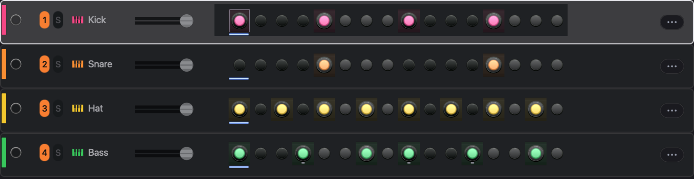
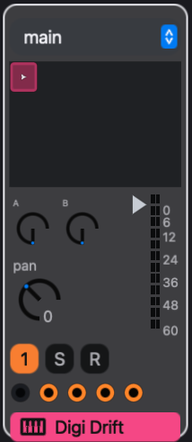
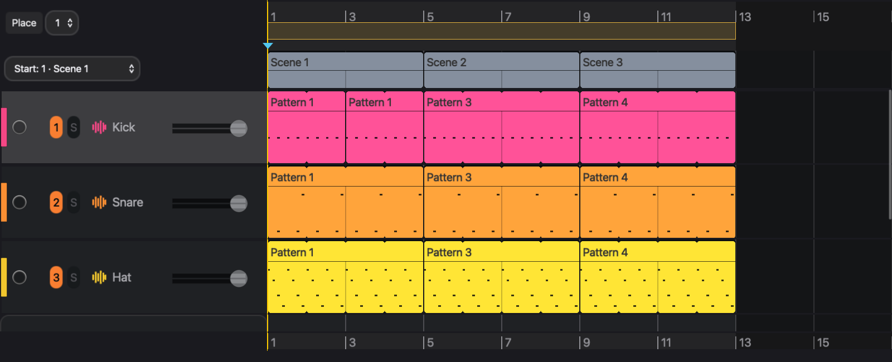

# The eseq concept

This chapter describes how eseq organizes a piece of music: what a project contains, what each part owns, and what happens when a step plays. Every later chapter builds on it.

## The project

A **project** holds one piece of music: its tracks, the patterns each track can play, the scenes that choose between those patterns, and an arrangement on a timeline. One project is open at a time.

The fixed limits are:

- 64 tracks per project.
- 256 steps per pattern, edited as 16 pages of 16 steps.
- 24 scenes per scene bank. A project can hold several banks.
- 8 audio effects per effect chain and 4 MIDI effects per track.
- 16 layers in an Instrument Rack (created with **Create > Layer Rack**).
- 14 process lanes on every track. You can add more to a single track.

The containers nest like this:

```
PROJECT
  Tracks (up to 64)
    Pattern pool        patterns this track can play
      Pattern           = sequence + sound
        sequence        steps, chords, step values, length, timebase,
                        swing, bar transposes
        sound           refers to a patch + mix; can be shared
                        patch: instrument, MIDI effects, audio effects,
                               voice settings, added lanes
                        mix:   level, pan, mute, sends, output
    Takes               linear recorded performances
  Scenes (banks of up to 24)
    one pattern (or none) per track
    + bus and group settings, modulation routings, graph sequencers,
      rack clip choices, default lanes, scene values
  Arrangement (starts empty)
    scene lane          markers that recall a scene's state
    track lanes         clips: a pattern or a take, placed in time
```

## Tracks

A **track** is one part of the music. It has a sound source, a chain of MIDI effects, a chain of audio effects, a mixer strip, and a pool of patterns. It plays one pattern at a time.

A track's sound source is normally one of these:

- an **instrument**: a factory or user-built synth, drum voice or physical model;
- a **sampler** playing a sample;
- an **Instrument Rack**, which layers up to 16 instruments or samples on the one track.

A new MIDI track starts with no sound source until you load one.

A **Drum Rack** is different. It is a group of tracks with a pad map: each pad is a full member track with its own pattern, length and effects, and the rack sums them. See [Racks](racks).

Selecting a track makes it the target of your edits: the step inspector, the track settings and the device panel all follow the selection. Selecting does not arm. The circle at the left of the track header (**R** in its mixer strip) arms it for live input from the computer keyboard or a MIDI controller. The numbered button mutes the track, and **S** solos it.



## Patterns

A **pattern** belongs to exactly one track. It has two halves.

The **sequence** is what the steps mean:

- which steps play, and any chords on them;
- each step's values: velocity, duration, transpose, pan, sync, delay, retrig and rate;
- the pattern's length, timebase and swing;
- a transpose for each 16-step page;
- locks on timebase, swing, sends and rack macros.

The **sound** is how the track plays those steps. It is made of a **patch** and a **mix**:

- the patch holds the instrument and its settings, the MIDI effect and audio effect chains with their settings, the parameter locks on those controls, the voice settings (polyphony, voice priority, retrigger or legato, mute group), and the process lanes added to this track;
- the mix holds the track's level, pan, mute, sends and output.

This is where eseq differs most from a DAW. The instrument and fader settings travel with the pattern, not with the track. Launching another pattern can change the filter, the effect settings and the fader position as well as the notes. A bass track can hold a dark, quiet pattern and a bright, loud one without automation. Solo is not stored anywhere; it is a live control only. The values you paint on a track's process lanes are also stored with the pattern.

Each new pattern normally gets its own patch and mix. The sound palette can make several patterns share one sound, or fork a shared one; see [Patterns and scenes](patterns-and-scenes). Because instrument and effect locks live in the patch, patterns that share a patch share those locks too.

With no steps selected, turning an instrument or effect control changes the base value in the pattern's patch, and every pattern that shares that patch hears the change. With steps selected, it writes a **parameter lock** (p-lock): a value for those steps only. See [Parameter locks](parameter-locks).

## Scenes

A **scene** chooses one pattern for every track, or none, in which case that track is silent in the scene. It also holds the state that belongs to the whole project rather than to one track:

- bus and group settings, including their effects;
- modulation routings;
- graph and neural sequencer state;
- for each Drum Rack that has rack clips, which clip plays, or none, in which case the rack is silent;
- the default process lanes, which every track runs ahead of its own added lanes;
- scene values declared by the interface or by packages, such as the transport's transpose amount.

Note that a scene holds no notes. It only tells each track which pattern to play; the patterns themselves are not part of the scene. Two scenes can point at the same pattern, and then an edit to that pattern is heard in both.

Scenes are grouped in **banks** of up to 24. The transport shows the viewed bank's scenes as numbered buttons. Click one to launch that scene. The transport's launch quantization menu decides whether it switches at once or waits for the next boundary.


Pressing **+** creates a scene from the current one:

1. Each track's current pattern, including one launched by hand, is copied into a new pattern with its own patch and mix. A track with no pattern stays empty.
2. The new scene points at the copies.
3. Bus, group, modulation, graph, lane and scene values are copied from the current scene. A Drum Rack with rack clips gets a copy of its current clip.
4. The new scene is added at the end of the viewed bank and becomes the current scene.

A new scene therefore starts out sounding the same as the one it came from, and shares nothing with it. Two scenes share a pattern when both point at it: clicking a pattern's cell in the mixer assigns that pattern to the current scene. Duplicating a pattern (Command-D in the mixer) makes an independent copy for the current scene only. See [Patterns and scenes](patterns-and-scenes).



## A worked example

This project has four tracks and one bus:

- Track 1, Kick: 909 Kick.
- Track 2, Hat: Digi Hat.
- Track 3, Bass: Digi Drift.
- Track 4, Keys: PM Piano.
- Bus A carries a reverb. The hat and the keys send to it.

In scene 1 each track plays its first pattern: a four-on-the-floor kick, offbeat hats, a root-note bass line and four chords. The reverb on Bus A has a long decay.

Press **+**. Scene 2 is created and becomes current. It points at four new patterns, copies of the four in scene 1. Now make three changes in scene 2:

- add sixteenth notes to the hat pattern;
- with no steps selected, raise the Digi Drift filter cutoff;
- shorten the reverb decay on Bus A.

Finally, click the first Keys pattern's cell in the Keys mixer strip. Scene 2 now plays the same keys pattern as scene 1. The copy made by **+** stays in the pool, unused.

eseq labels patterns Pattern 1, Pattern 2 and so on. This chapter names them by track, so Keys 1 is the Keys track's first pattern.

```
            Kick      Hat       Bass      Keys      Bus A reverb
Scene 1     Kick 1    Hat 1     Bass 1    Keys 1    long
Scene 2     Kick 2    Hat 2     Bass 2    Keys 1    short
```

When the project plays:

- In scene 1 all four tracks play their first patterns, through the long reverb.
- Launching scene 2 switches the kick, hat and bass to their second patterns. The hats get busier. The bass gets brighter, because the cutoff is stored in Bass 2's patch. The reverb shortens, because bus settings belong to the scene. The keys keep playing Keys 1.
- Kick 2 sounds the same as Kick 1 but is independent. Editing it leaves scene 1 untouched.
- Editing a chord in Keys 1 while scene 2 plays changes it in scene 1 too, because both scenes point at it.
- Clicking the Bass 1 cell while scene 2 is current makes scene 2 play Bass 1, with its darker filter and its own fader setting. The other three tracks are unaffected. This is an edit to scene 2, not a temporary launch.
- Deleting Hat 2 from the pool would leave scene 2 with no pattern for the Hat track. Scene 2 would then play without hats, while scene 1 keeps Hat 1.

## The arrangement

Every project has an **arrangement**: a timeline that starts empty and 16 bars long, and that you need only when you want a fixed song order. It has a scene lane at the top and one lane per track below.

A **clip** places a source on one track lane, with a start, an end and an offset into the source. The source is either a pattern, which loops to fill the clip, or a **take**, a linear performance recorded on the timeline. A take is notes, not audio, and it is silent past its end. Where a lane has no clip, that track is silent.

A marker on the scene lane recalls that scene's project-wide state, such as its bus and group settings, from its beat until the next marker. It never places notes. **Place Scene Patterns** is the separate gesture that writes a scene's patterns into the track lanes as clips over the marker's span, replacing what was there.



In the example, set scene 1 at bar 1 and scene 2 at bar 9, then use Place Scene Patterns on each span. The Keys lane then holds two clips that both play Keys 1, so a chord edit changes both halves of the song. Clips refer to patterns; they do not copy them. See [Arrangement](arrangement).

## One transport

Session and arrangement share one transport. While the timeline plays, launching a pattern or a scene by hand overrides the timeline, and clicking a pattern cell launches it without editing the scene. **Back to Arrangement** in the transport hands control back to the timeline.

Play always starts the arrangement. If every lane is empty at the cursor, as in a new project, eseq launches the current scene instead. An override lasts, even through Stop, until you click Back to Arrangement. See [Arrangement](arrangement).

The view you are in when recording starts decides what is recorded. Started in session view, recording overdubs into the looping pattern. Started in arrangement view, it records a take. Switching views during the pass does not change that. See [Recording](recording).

## What happens when a step plays

When playback reaches an active step, eseq works through the following stages:

1. The step's notes and values are read from the pattern. The page's bar transpose is added, and, on tracks that follow it, the scene transpose.
2. P-locks on the step replace the patch's base values for that step.
3. The process lanes run: first the 14 default lanes, then any lanes added to this track. They can change the step's values, silence it, repeat it, or move any control mapped to a lane's output.
4. The MIDI effects transform the resulting notes, for example into an arpeggio.
5. The instrument plays the notes, under its modulation sources and, in a rack, its macros.
6. The audio effect chain processes the sound.
7. The mix sets level and pan, then sends the signal to the track's output (Main, a bus, or nowhere for sends only; a track inside a group always goes to the group) and feeds its sends to the buses. Groups and buses run their own effects before Main.

The values stored in the pattern are not changed by this process. Process lanes keep their running values, such as an accumulator's total, separately from the pattern.

Notes from a graph or neural sequencer join at stage 4. The sequencer routes each note to a track, and the note passes through that track's MIDI effects, instrument, effects and mix like any other.

## Ways to fill and drive a pattern

Each way of making music in eseq acts on one stage of the path above.

- Stage 1, the pattern's notes: the step grid writes steps one at a time ([Step sequencer](sequencer-tour)); the piano roll edits the same pattern, or a take, by pitch and time ([Piano roll](piano-roll)); live playing records into a pattern or a take, and Capture MIDI keeps recent playing you did not record ([Recording](recording)).
- Stage 2, per-step control values: p-locks and knob recording ([Parameter locks](parameter-locks)).
- Stage 3, values computed as the pattern plays: process lanes ([Process lanes](process-lanes)).
- Stage 4, notes reshaped or generated live: MIDI effects ([MIDI effects](midi-effects)), and graph and neural sequencers and other sequencers written in Lisp, which arrive as packages ([Packages](packages)).

## For Cirklon users

- A Cirklon song is an eseq project.
- A Cirklon pattern is an eseq pattern, which belongs to one track and holds up to 256 steps.
- A Cirklon instrument is an external MIDI or CV destination, assigned per track for the whole song. In eseq the instrument is an internal sound engine, and its settings live in each pattern's patch, so they can change from pattern to pattern.
- A Cirklon scene is an eseq scene, which also recalls bus, group, modulation and graph sequencer state.
- Cirklon song play mode is the eseq arrangement: a timeline of clips rather than a list of scenes with bar counts.
- Cirklon aux events and accumulators are eseq process lanes.
- Cirklon bar XPOSE is eseq's per-page bar transpose.
- Cirklon's Prh timebase is eseq's Prh timebase.

## Where to go next

[Your first session](first-session) puts this model to work: it loads an instrument, writes a pattern, locks a value on one step and saves the project. The chapters after it follow the order of the model: the step sequencer, parameter locks and process lanes for what a pattern holds; the piano roll and recording for other ways to fill it; patterns and scenes, then the arrangement, for how patterns are chosen over time; [Instruments](instruments), [Racks](racks) and [Audio effects](effects) for the sound; the [Mixer](mixer) for where the sound goes; then [Packages](packages) for extending eseq in Lisp, and [Keys and customization](customization) for its shortcuts, `init.lisp` and the Customize dialog.
