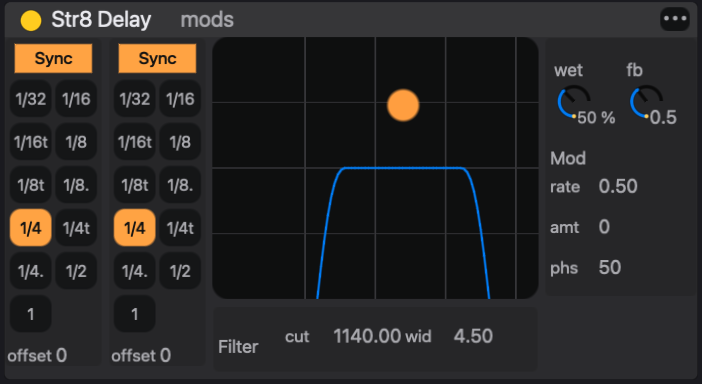

# Audio effects

An **audio effect** is a processor in an **effect chain**: an ordered series of up to 8 effects that the sound passes through, first to last. eseq has 20 built-in effects and loads DGenLisp effects, compiled when first loaded, from the factory library, your own effects folder and installed packages. Every chain works the same way. What differs between chains is what feeds them and who owns their settings.

In the signal path, audio effects come after the instrument and before the mix. A track's notes pass through its MIDI effects and play the instrument. The instrument's audio passes through the track's effect chain. The result then reaches the track's mixer strip, which sends it on to Main or a group and to the buses. See [Concepts](concepts) for the whole path from step to output.

## Where effect chains live

Each of these places has its own chain:

- **Track.** Every track has one chain, labelled **Track FX** in the device panel, which processes that track's instrument or sampler.
- **Instrument Rack layer.** Each layer of an Instrument Rack has a chain, labelled **Slot FX**, which processes that layer only. The rack's Track FX chain processes the summed layers.
- **Drum Rack.** Each pad is a member track with its own track chain. The rack as a whole sums into a bus, and that bus's chain processes the whole kit. Selecting the rack shows the kit first and the rack's chain after it.
- **Group.** A group sums its member tracks into a bus. The group's chain processes that sum.
- **Bus.** A send bus (Bus A, Bus B, and any you add with **Create > Bus**) has a chain that processes whatever the tracks send to it.
- **Main.** The Main strip is also a bus. Effects on it process the whole mix.

So distortion on one layer of a bass rack, a compressor on the rack's Track FX, and a shared reverb on Bus A are three different chains. The routing itself (sends, groups, outputs) is covered in [Mixer](mixer). Racks are covered in [Racks](racks).

## Who owns an effect's settings

eseq makes one decision about effects that a DAW does not. The **settings** of a track effect belong to the pattern, and the settings of a bus or group effect belong to the scene.

- **Track effects.** The chain's contents, meaning which effects are loaded and in what order, are the same in every pattern of the track. Adding an effect adds it to all of the track's patterns. The parameter values, however, are stored in each pattern's patch. Launching another pattern recalls that pattern's values.
- **Instrument Rack layer effects.** Their values belong to the pattern, like the rack's other layer values. They have no **•••** menu of their own; **Copy rack (all slots) to all scenes** in the rack header's **•••** menu copies them with the rest of the rack.
- **Bus, group and Main effects** (a Drum Rack's kit chain is a bus chain). The chain is shared by the whole project. Its parameter values are stored in each scene, like the rest of the bus and group state. Recalling a scene recalls them.

A worked example makes the consequence concrete. A bass track has **Filter** followed by **Str8 Delay**. Bus A has **Reverb**.

1. In pattern 1 the Filter's cutoff is 400 Hz and the delay's wet is 0 %. In pattern 2 the cutoff is 2000 Hz and the wet is 30 %.
2. Scene 1 plays bass pattern 1 and sets the Bus A reverb to a long decay. Scene 2 plays bass pattern 2 and sets a short decay.
3. Clicking bass pattern 2's cell in the mixer while scene 1 plays assigns it to scene 1 and launches it. The filter opens and the delay comes in; the reverb stays long, because the scene did not change.
4. Launching scene 2 plays bass pattern 2 and shortens the reverb.

Turning a track effect's knob with no steps selected therefore changes the value for the pattern you are playing, not for the track. This is the usual surprise. Two patterns that share one patch share its values; the [Patterns and scenes](patterns-and-scenes) chapter explains when that happens.

To make one setting apply everywhere, open the effect header's **•••** menu and choose **Copy current values to all scenes**. For a track effect it writes the effect's current base values into every pattern of the track. For a bus, group or Main effect it writes them into every scene. The status line reports how many patterns or scenes it updated. Parameter locks are not copied.

## Adding an effect

The **Audio FX** tab of the browser lists every effect you can load. **Built-in** comes first. **Custom** follows, with the factory DGenLisp effects and your own. Then comes one section for each installed package that provides effects. Typing in the search field filters the list.

To add an effect:

1. Select the destination. Click a track for a track chain. Click a bus, group or the Main strip in the mixer for that chain; the selection decides where a double-clicked effect goes.
2. Double-click the effect in the Audio FX tab.

The effect goes to the end of the chain, and the device panel switches to show the chain.

Dragging gives more control over where the effect goes:

- Drop it on the empty panel at the end of a chain (**Drop Audio or MIDI Effect Here**) to append it.
- Drop it on an effect already in the chain to insert it before that effect.
- Drop it on a track strip in the mixer to append it to that track, or on a bus strip or group header to append it to that bus.
- Drop it on a layer row of an Instrument Rack, or on that layer's **Slot FX** drop panel, to add it to the layer.

A chain holds 8 effects. When it is full, the status line reports "No free effect slots available". Adding, moving and removing effects can be undone.

## The effect header

Each effect in the device panel has a header strip across its top. From left to right it holds:

- the **enable** dot, which bypasses the effect when off, without unloading it or losing its settings. Like any other control, the enable state is stored with the pattern (or, for a bus effect, the scene), so bypassing an effect in one pattern leaves it on in the others;
- the effect's name;
- **mods**, on effects that have modulation slots; it switches the panel to the modulation view (see Modulation below);
- the **•••** menu with **Copy current values to all scenes** (Instrument Rack layer effects have no such menu);
- **edit**, on DGenLisp effects in track and bus chains, which opens the effect's source in the patch editor.

Below the header each effect draws its own panel. Many built-ins have custom displays, such as the Str8 Delay filter curve, the compressor meter and the EQ8 response.

## Arranging the chain

Audio flows through the chain from left to right. To reorder, drag an effect by its header and drop it on another effect; it is placed before that one. Dropping it on the end panel moves it to the end.

An effect moves only within its kind of chain:

- a track effect can be dragged to another position in its chain, to another track's chain, or onto another track's mixer strip. It moves with its settings and leaves the source track;
- a bus or group effect stays in its own bus;
- an Instrument Rack layer effect stays in its own layer.

To remove an effect, click its header to select it and press Backspace or Delete. If steps are selected in the sequencer, the key clears those steps instead, so clear the step selection first.

To duplicate an effect with its settings, select its header, press `Cmd-C`, select the destination track and press `Cmd-V`. The copy is appended to that track's chain. Copy works from any chain; paste always goes to the current track.

Note: order matters as much as choice. A compressor before a distortion evens out what the distortion receives; after it, the compressor evens out what the distortion produces. A filter before a delay filters the repeats as well; a filter after it filters the dry signal and the repeats alike.

## The built-in effects

Most built-in effects are native code compiled into eseq and load instantly. Filter Table, Convolution Reverb and ES Compressor are written in DGenLisp and ship inside eseq; like other DGenLisp effects they are compiled the first time they load. Most built-ins have their own panel. They are listed here by family.

### Filters and EQ

- **Filter**: resonant lowpass, highpass, bandpass or notch with drive, a built-in LFO and an envelope follower on cutoff.
- **EQ8**: eight-band parametric equaliser with a response display.
- **Filterbank**: a dual-filter mangler after the Sherman Filterbank 2, with a switched-capacitor clock model. It has FM and AM inputs that can take another track as a sidechain.
- **Filter Table**: morphs through a table of 64 frequency-response frames. Load a factory preset, drop an audio sample on it to analyse the sample into a table, or reshape the frames in its response editor.

### Delays and echoes

- **Str8 Delay**: stereo delay with independent left and right times, synced or free, a bandpass filter in the feedback path, and modulation.
- **Space Echo**: a tape-echo model after the Roland RE-201, with three playback heads, repeat rate, tape saturation and a spring reverb.

### Reverbs

- **Reverb**: one insert with three tanks. **galaxy** is a dense, bright modulated space, **plate** is a Dattorro plate, and **hall** follows a Lexicon 224 concert hall. Shared stages add predelay, input filters, damping, chorus on the tail, width and dry/wet.
- **Convolution Reverb**: convolves the signal with an impulse response. Drop any sample on its IMPULSE RESPONSE area to use it as the room.

### Modulation

- **Chorus**: a stereo chorus with two phase-related delay reads and filtering on the wet path.
- **Dimension**: an ensemble chorus after the Roland SDD-320. It adds width with little audible vibrato, and it stays mono-compatible.
- **Phaser-Flanger**: three engines in one device. It works as a phaser of up to 12 stages, a short-delay flanger, or a doubler.

### Dynamics

- **Compressor**: a general-purpose compressor with peak, RMS and downward-expander detection, soft knee, lookahead, auto makeup, and an external sidechain that can listen to another track.
- **Glue Compressor**: a compressor driven by one amount control, with attack and release character choices, a low cut on the detector and drive. It is suited to groups and buses.
- **ES Compressor**: three compressor designs behind one mode switch. **Punch** keeps transients, **Level** evens out program material, and **Sustain** brings up tails.
- **OTT**: three-band upward and downward compression with per-band meters, in the style of multiband dynamics processors.
- **Limiter**: input gain, ceiling and release.

### Saturation and colour

- **Roar**: up to three waveshaper stages in serial, parallel, multiband, mid-side, feedback or delay routings, followed by tone, feedback and compressor sections.
- **Tape**: a hysteresis tape model with drive, bias, speed, wow, flutter and hiss.

### Time and performance

- **Slowdown**: rolling-buffer varispeed. It can drop the pitch, time-stretch in slices in the manner of an SP-303 sampler, or combine the two.
- **DJ Mixer**: a live looper for performance. It captures a short loop, free or synced to a division from 1/16 to 2 bars, and plays it back at a variable speed, including reverse.

Note: projects saved with the older **Delay**, **Multiverb** and **444 Compressor** effects still load and play them, but these effects are no longer offered in the browser. Str8 Delay, the multi-mode Reverb, and Compressor or Glue Compressor replace them.

## DGenLisp effects

The Custom and package sections of the Audio FX tab hold effects written in DGenLisp, eseq's DSP language. Each one is compiled to native code when it loads, so the first load of an effect can take a moment. The factory set includes:

- a spectral family built on short-time FFT processing: spectral bloom (a feedback spectral cloud), spectral shatter (per-bin delay and freeze), bin freeze, cloud gate, a phase-vocoder pitch shifter, a spectral notch phaser, a resonance tamer, and spectral vox and xenovox (formant machines and vocoders that take a sidechain);
- Lexicon-style modulated reverbs (lexilush, lushlexiconreverb);
- choruses, flangers, modulated delays, a stereo tremolo, a pitch delay and a shimmer;
- a tape hysteresis model, a curve saturator, a sample-rate reducer, and a sidechain compressor.

Your own effects appear under Custom beside the factory ones. Effects from an installed package are listed under that package's name.

Note: a few entries in Custom, such as channel-meter-probe and spectral-stft-identity, are development probes and drafts. They can be ignored.

DGenLisp effects are also where you write your own:

- **+ New Effect** at the top of the Audio FX tab, or **Create > Create Effect…**, opens the patch editor on a new effect.
- **Fork…** makes an editable draft copy of the selected Custom effect, loads it on the current track and opens it in the patch editor. It is saved under a new name when you save it; the original is left untouched.
- **edit** in a loaded effect's header, or **Edit > Edit Selected Effect…**, opens that effect's source.

The patch editor is covered with instrument building in [Instruments](instruments). Effects shared as packages are covered in [Packages](packages).

## Modulation

The Filter, Filterbank, Str8 Delay, Space Echo, Reverb, Chorus, Dimension, Phaser-Flanger, Roar, Slowdown and DJ Mixer built-ins each have four **modulation slots**. DGenLisp effects can declare slots of their own. Compressor, Glue Compressor, ES Compressor, OTT, Limiter, EQ8, Tape, Filter Table and Convolution Reverb have none.

Click **mods** in the effect's header to switch the panel to the modulation view: the four slots on the left, with the selected slot's editor beside them. Click **mods** again to return. The mods view works as described in [Instruments](instruments), Modulation: pick a slot and a source, then turn a knob to set that slot's depth on the parameter. The depth is shown in the parameter's own modulation units; the Filter's cutoff depth, for example, is in octaves.

The sources are **lfo**, **rand**, **drift**, **env** and **ext1** to **ext4**. An effect has no notes of its own, so it has no gate to retrigger an LFO or open an envelope. Group and bus effects refuse the **env** source outright. Use an LFO, random, drift or ext source on effects.

The **ext1** to **ext4** sources read the modulation cables patched into the track, bus or group in the mixer. On a bus or group they are the way to drive an effect from another track. See [Mixer](mixer).

## Locks and process lanes

Effect parameters on a track take [parameter locks](parameter-locks) exactly as instrument parameters do. Select steps, then turn the control, and those steps play with their own value. A step that locks the Str8 Delay wet to 60 % throws one note into the delay while the rest of the pattern stays dry. The parameter's value text changes colour while a lock is active on the selected steps.

A process lane's OUT port can also drive an effect parameter. The knob then shows a second dot at the value the effect actually receives, as it does for instrument parameters. See [Process lanes](process-lanes).

## Latency compensation

Some effects delay the audio they process. Lookahead compression, FFT-based spectral effects and convolution are examples. Each effect reports its delay, and eseq pads the parallel paths where they meet: track outputs, sends, bus returns and Main. A track with a spectral effect therefore stays in time with the rest of the mix.

Note: this compensation does not yet reach inside an Instrument Rack. If one layer's Slot FX chain has latency and another's does not, the layers drift apart by that amount where the rack sums them. Put latency-heavy effects on the rack's Track FX instead.
