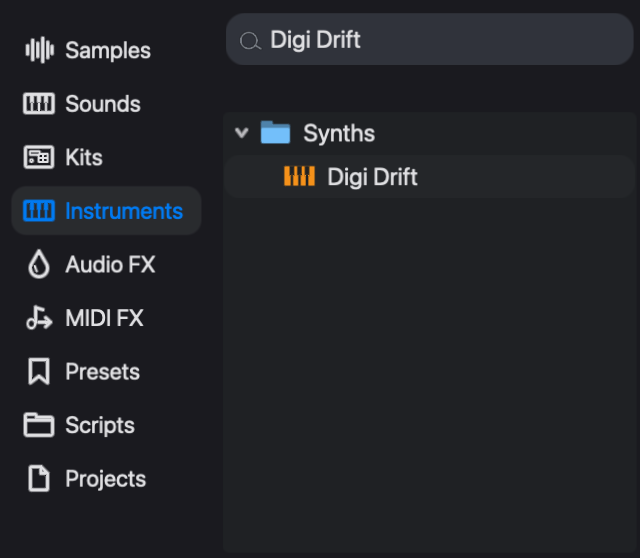
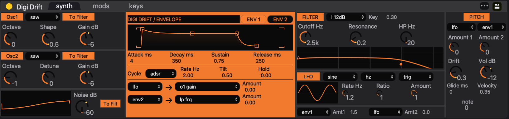
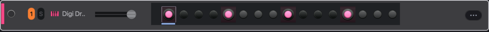

# Your first session

Make a repeating four-note synth part, change one note, and save the project. This walkthrough uses **Digi Drift**, an instrument included with eseq.

Keep the [workspace map](index) handy. You will choose a sound in the **browser**, enter notes in the **step sequencer**, start playback in the **transport**, and edit the sound in the **device panel**. These are different parts of the same workspace.

## Start a project

Choose **File > New Project**. If eseq asks about unsaved changes, save the project you were working on before continuing.

The new project starts with two empty tracks. You will use the first one.

Use the session view shown in the map, with the browser on the left and devices along the bottom. If the middle of the screen shows a timeline, click the session-view button beside the arrangement button at the far right of the transport.

## Load a sound from the browser

1. In the **step sequencer**, click the name area of the first track to select it.
2. In the **browser**, click **Instruments**. Click **Search instruments** and type **Digi Drift**. The matching factory instrument appears under **Synths**.
3. Double-click that **Digi Drift** result. The selected track now uses that instrument.

Look back at the **sequencer**: the track is now named **Digi Drift**. Then look along the bottom of the window: the **device panel** shows Digi Drift's sound controls. The browser chose the instrument; these controls edit the instrument you loaded.

Double-clicking an instrument replaces the sound on the selected track. When you want to add another track, drag an instrument onto **Drop sounds here** instead.

## Put four notes on the row

Find the round step buttons to the right of the Digi Drift name. They run from left to right. A new pattern has 16 steps; count them from 1 at the left edge.

1. Click the first unlit step. It lights up, showing that it now contains a note.
2. Click steps **5**, **9**, and **13**. You should have four lit steps, with three unlit steps between each pair.

If you add a note in the wrong place, double-click its lit step to remove it. A single click on a lit step selects the note for editing; it does not erase it.

## Play the pattern

Click the triangular **Play** button in the **transport**, across the top of the window.

Watch the position indicator travel along the row. Each time it reaches one of your lit steps, you should hear Digi Drift play. After the last step, playback returns to the beginning and repeats. This repeating sequence is the track's **pattern**.

Look down at the **mixer**: Digi Drift's meter should move when a note sounds. Click the square **Stop** button to stop playback. If the indicator moves but you hear nothing, check [Troubleshooting](troubleshooting) before continuing.

## Change the first note's pitch

Now use the **step inspector**, at the upper right, to change one note without changing the other three.

Single-click the first lit step in the Digi Drift row. Look at the inspector: it should show **1 selected**. This confirms that the next note edit applies to one step.

Drag the number beside **Transpose** upward until it reads **12**. Transpose counts semitones; 12 raises the note by one octave.

Click **Play**. The first note now sounds higher. The following three notes keep their original pitch, and the higher note returns at the start of each loop.

## Give that note a different tone

Keep the first step selected. Look down at Digi Drift in the **device panel** and find **Cutoff Hz** in its **FILTER** section. Lower the cutoff while the pattern plays. You should hear the first note become darker while the other notes keep their original tone.

You have given one step its own control value. eseq calls this a **parameter lock**: when that step plays, it uses the value stored for it. This is why the step selection also matters when you work in the device panel.

Command-click the first step to deselect it, and check that the inspector shows **0 selected**. Turning Cutoff Hz now changes the pattern's base tone; the first note keeps the cutoff you stored for it. See [Parameter locks](parameter-locks) for editing and removing these values.

## Save what you made

1. Click **Stop** in the transport.
2. Choose **File > Save As**, enter a project name, and click **Save**.

The project stores the instrument, notes, and edits you made. You can reopen it from **Projects** in the browser or **File > Open Project**. Use **File > Save** to keep later changes.

You now have a saved loop and have used the browser, sequencer, transport, inspector, devices, and mixer together. To continue, try [Audio effects](effects) to add a delay to this sound, or [Step sequencer](sequencer-tour) to learn more ways to enter and edit notes.
