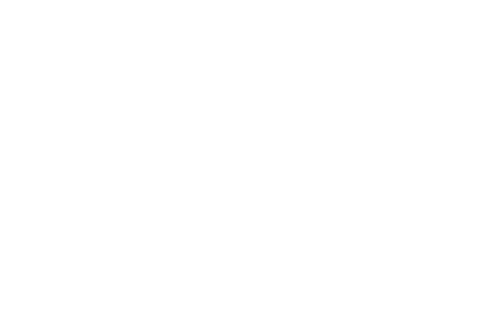

# eseq Manual

In eseq, you make music by placing notes in rows and choosing the sounds that play them. Start by finding your way around the screen below. [Your first session](first-session) then takes you through loading a sound, making a short loop, and saving it.

## Find your way around

This is the **session view**, where you write and play repeating parts. The diagram shows only panel boundaries and labels so you can see where each area belongs.

1. **Transport — across the top.** Start and stop playback here. The tempo sets how fast the music plays. These controls apply to the whole session.
2. **Browser — on the left.** Find instruments, samples, effects, and saved projects. To begin, you will choose an instrument here and load it onto a track.
3. **Step sequencer — in the middle.** Each row is a **track**: a part that plays a sound, such as a synth or a drum. The round buttons are **steps**, successive positions in time. A lit step plays a note when playback reaches it. The sequence of notes on a track is its **pattern**.
4. **Step inspector — at the upper right.** Select a note in the sequencer to edit it here. For example, **Transpose** changes its pitch and **Velocity** changes how strongly it plays. The selection count tells you how many steps an edit will affect.
5. **Track settings — below the inspector.** Set the selected track's pattern length and timing. These controls affect the track as a whole.
6. **Mixer — below the sequencer.** Each track has a strip for its level and stereo position. The moving meters show which tracks are producing sound.
7. **Devices — along the bottom.** This panel shows the selected track's instrument and effects. Use the instrument's controls to shape its sound.

## One track, several panels

Selecting a track connects these areas. Click the track's name in the sequencer: the inspector and track settings refer to that track, and the device panel shows its sound controls. Select another track and those panels follow the new selection. The mixer keeps the tracks side by side so you can balance them together.

There is one more distinction to watch: selecting a **track** chooses the part you are working on; selecting **steps** chooses particular notes within it. Before turning a sound control, check the inspector's selection count. With no steps selected, you change the pattern's base sound. With steps selected, you give those notes their own values. The first-session guide lets you hear this difference.

The three panel buttons at the far left of the transport show or hide the browser, mixer, and bottom panel. The two view buttons at the far right switch between this session view and the arrangement, where you assemble parts on a timeline. The map shows the bottom panel displaying devices; it can also display the piano roll. See [Navigation and keys](customization) when you want to change the layout.

## Start here

Follow [Your first session](first-session) with eseq open beside the manual. It uses the panel names above and shows what should change after each action. The remaining chapters explain individual areas in more detail. Instructions use the macOS controls and shortcuts.

- [Your first session](first-session) — load a sound, make a loop, change a note, and save
- [Concepts](concepts) — how tracks, patterns, scenes, and clips fit together
- [Step sequencer](sequencer-tour) — enter steps and shape a pattern
- [Instruments and presets](instruments) — add synths and recall sounds
- [Samples and sounds](sample-browser) — find samples and load a sampler
- [Audio effects](effects) — add, order, and bypass processing
- [MIDI effects](midi-effects) — arpeggiate, repeat, and route notes
- [Racks](racks) — layered instruments and drum kits
- [Recording](recording) — arm a track and play the keyboard
- [Parameter locks](parameter-locks) — per-step values and knob recording
- [Process lanes](process-lanes) — accumulators, random values, and grabs per step
- [Piano roll](piano-roll) — pitch, length, chords, and automation
- [Patterns and scenes](patterns-and-scenes) — variations and project-wide recall
- [Mixer](mixer) — levels, sends, buses, and groups
- [Arrangement](arrangement) — clips, takes, and captured launches
- [Saving and export](saving-and-export) — projects and stereo WAV
- [Packages](packages) — install and share packs of instruments and effects
- [Navigation and keys](customization) — panels, shortcuts, and this manual
- [Troubleshooting](troubleshooting) — when something is silent or wrong
