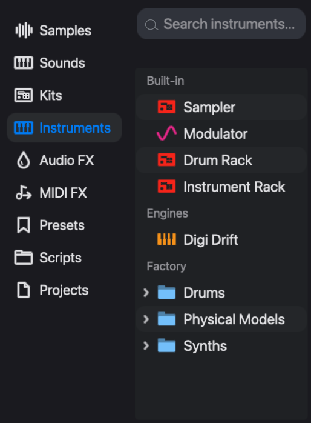
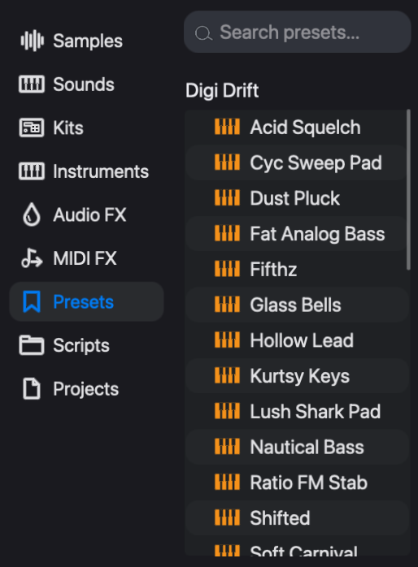

# Instruments and presets

An **instrument** is a track's sound source: the part of the track that turns notes into audio. Every note a track plays, whether it came from the step grid, the piano roll, live input, a process lane or a graph sequencer, arrives at the instrument after the MIDI effects and leaves it for the audio effects and the mixer.

The Instruments tab offers two kinds of engine:

- **Compiled instruments.** Synthesizers and drum voices written in DGenLisp, eseq's DSP language, and compiled to native code when they load. The 40 factory instruments are of this kind, and so is anything you build in the patch editor or install from a package.
- **Built-in engines.** Engines that are part of eseq itself. The **Sampler** and the **Instrument Rack** are sound sources; the **Drum Rack** builds a group of member tracks; and the **Modulator** produces a control signal instead of sound.

This chapter covers compiled instruments: finding and loading them, the instrument panel, presets, voices, modulation and key locks, and building your own. The sampler is covered in [Samples and sounds](sample-browser), and the Drum Rack and Instrument Rack in [Racks](racks).

## How an instrument belongs to a track

A track holds one instrument at a time. A rack is the exception by design: it holds several instruments on one track and is covered in [Racks](racks).

The choice of instrument applies to the whole track. Replacing it changes the instrument in every pattern of that track.

The instrument's control values are another matter. They belong to the pattern's **patch**, together with the effect chain (see [Concepts](concepts)). Two patterns on the same track can therefore play the same instrument with different settings: a dark bass in pattern 1 and an open, resonant one in pattern 2. The **•••** menu in the instrument header has **Copy current values to all scenes** for the times you want one setting everywhere.

When a note plays, each instrument parameter starts from the base value stored in the pattern's patch (what the knob shows with no steps selected while the transport is stopped). Two things are specific to instruments:

- a **key lock** for the note being played applies to every parameter the step has not locked; a **parameter lock** on the step wins over it;
- modulation from the **mods** tab moves the parameter around whichever value is in force.

The order is resolved per parameter. A step that locks only the cutoff leaves a key lock on the detune in force. None of this changes the stored values: the next note starts from the base value again. Printed knob values and process lanes also take part; the full order is in "What happens when a step plays" in [Parameter locks](parameter-locks).

## The Instruments tab

The **Instruments** tab of the browser lists everything that can be loaded as a sound source, in sections:

- **Built-in**: Sampler, Modulator, Drum Rack and Instrument Rack.
- **Engines**: the instruments already in use in this project, on tracks or in rack slots.
- **Factory**: the instruments shipped with eseq.
- **Library**: instruments you have created or forked.
- One section per installed package that ships instruments, headed by the package's name.

The **Factory**, **Library** and **Packages** chips above the list narrow the saved instruments to one source; Built-in and Engines always show. Click the active chip again to show everything. Typing in the search field replaces the sections with one filtered list, with the folders expanded.

The factory instruments come in three folders, the first two divided into sub-folders:

- **Drums** (16). Kicks: 808 Kick, 909 Kick, Boom Bap Kick, Break Kick, Modal Kick, Virus B BassDrum 23. Snares: Digi Snare, Membrane Snare, Modal Snare. Claps: 808 Clap, Digi Clap. Hats & Cymbals: 909 Open Hat, Digi Cymbal, Digi Hat. Toms: 808 Tom, Orbit Tom 66.
- **Physical Models** (15). Winds: PM Clarinet, PM Flute, PM Saxophone. Strings: PM Cello, PM Electric Bass. Keys: PM Piano. Cymbals: PM Crash, PM Hi-Hat, PM Ride. Gamelan: PM Bonang, PM Kempyang, PM Kethuk, PM Saron, PM Slenthem, PM Slenthem Slendro. The six Gamelan models are Javanese gamelan instruments.
- **Synths** (9): Digi Drift, Digi FM, Digi Wave, Grit, Heat, Melt, Poseidon, Revsynt and Vox.

Every compiled instrument, factory or not, is the same kind of object: DGenLisp source plus a panel description. A factory instrument has no privileges that one of yours lacks.

The **Modulator** is not a sound source. A Modulator track turns its steps into a control envelope, shaped by **Rise** and **Fall**, and sends it from the mod output on its mixer strip. See Modulation below for where that signal goes.

## Adding and replacing an instrument

There are two outcomes, a new track or a new instrument on an existing track, and the gesture decides which:

- Drag an instrument onto **Drop sounds here** in the mixer, or onto the empty area below the last track in the sequencer, to add a new track playing it.
- Drag an instrument onto a track row, that track's mixer strip or its device panel to replace the track's instrument.
- Double-click an instrument to replace the instrument on the selected track. If the selected track cannot take one, a new track is added instead.

**Create > MIDI Track**, or a double-click on the empty area below the tracks, adds a track with no instrument. Its notes are silent until you give it one by any of the gestures above.

Replacing an instrument keeps the music and discards what only made sense for the old instrument. The notes, step values, chords, timebase, swing, effects, effect locks, MIDI effects, mixer settings and base note stay. The instrument's parameter locks and key locks are cleared in every pattern, because the new instrument has different parameters. Process lanes and graph-sequencer nodes mapped to the old instrument's parameters lose those mappings. The status line reports what was cleared, for example "Swapped → Digi FM (cleared instrument p-locks in 3 patterns)". The track takes the new instrument's name, unless you renamed it.

This makes replacement the quickest way to audition sounds: enter a pattern once, then double-click one instrument after another while it plays.

Note: with a drum rack selected, double-clicking a saved instrument is refused. Drop it onto a pad or the rack instead; see [Racks](racks).

## The instrument panel

Selecting a track shows its instrument at the left of the device panel. The header carries, from left to right:

- the on/off switch and the instrument's name;
- the **synth**, **mods** and **keys** tabs, which change what the panel shows, not which instrument is loaded;
- **Base note**, an offset of -48 to +48 semitones applied to every note the instrument plays;
- **poly** or **mono**, a toggle for the track's polyphony;
- the **•••** menu: **Copy current values to all scenes**, **Group Rack** (which wraps the track in an Instrument Rack) and **Edit** (which opens the instrument in the patch editor);
- the save icon, which saves a preset.

The **synth** tab shows the instrument's own controls. Each instrument lays these out itself, so there is no single layout to learn, but most synths have oscillators or another source, a filter, an amplitude envelope and some modulation of their own. Digi Drift, for instance, has two oscillators and noise, two routable envelopes, a filter, an LFO and a pitch section.

A knob in the panel writes to one of three places, depending on what is selected:

- nothing selected: the base value in the pattern's patch;
- steps selected in the sequencer: a parameter lock on those steps (see [Parameter locks](parameter-locks));
- keys selected in the **keys** tab: a key lock on those notes.

## Presets

A **preset** is a saved state of one instrument: every base value, the base note and the key locks. Presets belong to the instrument, so the list changes with the selected track.

To load one, select the track and open the **Presets** tab of the browser. Click a preset to load it. The list shows the factory presets and your own; when a rack slot is selected, it shows the presets of that slot's instrument.

Loading a preset replaces the base values, the base note and the key locks of the current pattern's patch, and so of any pattern sharing that patch. Other patterns on the track keep their own settings; use **Copy current values to all scenes** in the **•••** menu to spread the preset to them. Step parameter locks stay, and still win on their steps.

To save, click the save icon in the instrument header, then either:

- type a name and click **Save as New**, which refuses a name that is already taken; or
- click **Overwrite**, which replaces the preset currently loaded, whatever name you typed. The button shows that preset's name and appears only when one is loaded.

Presets you save go to your own preset bank. Overwriting a factory preset writes your version there; the factory file is not changed.

A preset holds a sound for one instrument. To keep a whole track setup (instrument, preset, effects and mix) for reuse in other projects, drag a preset onto the **Sounds** tab to make a **Sound**; see [Samples and sounds](sample-browser). A project stores its own copy of every value, so it does not depend on the preset it was built from.

## Voices

A **voice** is one sounding note. The **poly**/**mono** button in the instrument header switches the track between polyphonic and monophonic. If a chord loses notes, raise the track's **voices** setting. If notes hang on after they should have stopped, look at the instrument's release before the voice settings. Voice count, priority, mono trigger and mute groups are described under "Voice settings" in [Step sequencer](sequencer-tour).

## Modulation

Many instruments have LFOs and envelopes of their own, drawn in their synth tab. The **mods** tab adds four more modulation slots that work the same way on every compiled instrument.

Each slot has a source:

- **lfo**: triangle, sine, pulse or sawtooth, at a rate in Hz or synced to a note division, with a phase offset, pulse width and optional retrigger on each note;
- **env**: an attack, decay, sustain and release envelope, drawn and editable as a curve;
- **rand**: stepped random values at a free or synced rate, with slew;
- **drift**: slow, wandering movement;
- **ext1** to **ext4**: the four mod inputs on the track's mixer strip;
- **off**.

The modulation runs per voice, so each note of a chord has its own LFO phase and its own envelope.

To modulate a parameter:

1. Click **mods** in the instrument header. The slots appear at the left of the panel, and every parameter that can be modulated is tinted blue.
2. Click a slot to select it, and choose its source from the menu beside it.
3. Drag a tinted knob. With the mods tab open, dragging sets the depth from the selected slot rather than the knob's value. A knob that the slot does not yet reach is connected to it by the drag.
4. Double-click a knob to connect it to the selected slot at zero depth, or to disconnect it.

The knob draws the modulation range as an arc and a dot that shows where the modulation is pushing the value while the track plays. Click **synth** to return to ordinary editing; the modulation keeps running.

Only parameters the instrument's author marked as modulatable take part. A parameter that is not tinted in the mods tab cannot be modulated from here, though it can still be locked.

Audio effects and the sampler have the same mods tab; see [Audio effects](effects) and [Samples and sounds](sample-browser).

The ext sources bring in signals from elsewhere in the project. On the mixer, drag from the mod output of a Modulator track, or of another track that has one, to one of the four mod inputs of the destination strip. Input 1 arrives in the instrument as **ext1**, and so on. A Modulator track can therefore sequence a filter sweep on a synth track step by step.

## Key locks

A **key lock** stores a parameter value for one note. Where a parameter lock says "on this step, cutoff is 3 kHz", a key lock says "whenever C3 plays, cutoff is 3 kHz". The idea follows the AFX mode of the Novation Bass Station II.

Key locks are stored in the pattern's patch, next to the base values, not in its steps. They apply equally to sequenced notes and to notes played live, and they are saved with presets. Patterns that share a patch share its key locks; a pattern with its own patch has its own set.

The lock is looked up by the note the instrument finally receives: after step, bar and scene transpose, the track's scale, MIDI effects and the Base note offset. Transposing a pattern, or changing Base note, therefore moves its notes onto different key locks.

To set key locks:

1. Click **keys** in the instrument header. A keyboard appears beside the synth controls. The arrows move it by an octave, and **oct** sets how many octaves it shows, from 1 to 7.
2. Select keys. Click selects one key and deselects the others, Cmd-click adds or removes a key, and Shift-click selects the range from the last key clicked.
3. Turn any synth control. The value is stored as a key lock on every selected key, and the knob shows the locked value.
4. Click **unselect all** when you are done. With no keys selected, the controls edit base values again.

Note: key locks are edited on an instrument track's own panel. A layer inside an Instrument Rack cannot be key-locked from its panel. Leaving the keys tab also returns the knobs to base-value editing.

Keys that carry locks are marked on the keyboard. Each distinct set of locked values also appears as a coloured chip under the keyboard, and the keys that carry that set are marked in its colour. Click a chip to copy its set onto the selected keys. The **base** chip removes all key locks from the selected keys. The headphones icon at the right of the keys header turns on audition, which plays a key when you select it.

### Example: a bass that changes with register

This builds a bass that changes character by register. It assumes a Digi Drift track playing a two-page pattern whose notes stay between C2 and B2.

1. With no steps and no keys selected, set **Cutoff Hz** low for a dark sound.
2. Click **keys** and select C3 to B3.
3. Raise **Cutoff Hz** and **Resonance**. Those twelve keys now carry a bright, resonant setting, and a chip for it appears under the keyboard.
4. Click **unselect all**, then **synth**.

The pattern sounds as before: none of its notes reach C3. Now set the bar transpose of page 2 to +12, in the field under that page's button in the expanded track. Page 2 plays bright, page 1 stays dark, and the stored notes are unchanged. A parameter lock on any step still overrides the key lock on that step.

## Building your own

An instrument is a DGenLisp program, `dsp.lisp`, with a panel description, `ui.lisp`. The factory instruments are built the same way, and any of them can be opened, studied and forked.

- **Create > Create Instrument…** (Command-I) opens the patch editor on a new draft. Choose **Instrument** or **Free Patch** at the top: an Instrument allocates a voice per note, and a Free Patch runs a single voice continuously. Name it under **Save as** and click **Finalize** to save it to your Library.
- **Edit** in an instrument's **•••** menu opens that instrument in the patch editor. **Save** overwrites the instrument's definition, which every project using it shares. **Fork** turns the editor into a draft copy to name and finalize, leaving the original untouched.
- Command-Option-I opens the selected instrument's panel description, `ui.lisp`.

The patch editor shows the instrument as a graph of nodes. When you are editing an existing instrument, **View code** switches to its source, where **Eval** (`C-c C-c`) compiles the buffer and swaps it into the running track, and **Open as patch** returns to the graph.

A patch-editor tutorial is beyond the scope of this manual. Two experimental aids exist. **Patch Learn** searches an instrument's parameters for settings that match a target sample. It has no button yet; with the instrument's patch editor active, run `M-x` `open-learn-patch`. It needs the DGenLisp trainer and says so if the trainer is missing. **Agent Mode** (`C-x a`) is a conversation buffer that drafts instruments and effects; it needs an API key in an environment variable such as `ANTHROPIC_API_KEY`. Both may change.

Instruments you build can be shared as packages; see [Packages](packages). To change how instrument panels behave or which keys do what, see [Keys and customization](customization).
