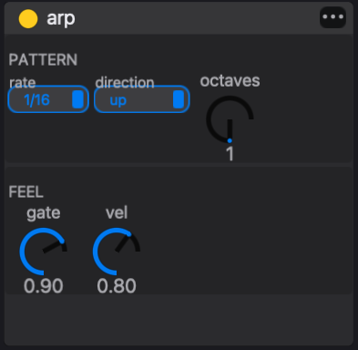

# MIDI effects

A **MIDI effect** is a note processor that sits between a track's sequencing and its instrument. It receives the notes a track is about to play, from its steps, from live playing or from a graph sequencer, and returns zero, one or many notes in their place: an arpeggio, a train of repeats, a set of echoes, the same notes folded into a range, or a copy sent to another track. It never touches audio; that is the job of the audio effects further down the chain.

Each track has one **MIDI effect chain** of up to four effects, run in order from left to right. The factory set contains six effects: **arp**, **beat-repeat**, **quantizer**, **spatial-harmonic-delay**, **transpose-range** and **trigger-to-track**. Every one of them is written in eseq's Lisp, and you can write your own the same way.

MIDI effects work on notes inside eseq only. eseq does not send MIDI to external instruments, so the output of the chain always goes to the track's own instrument, or to another track's.

## Where the chain sits

The MIDI effect chain comes after the process lanes and before the instrument. When a step on a track with a MIDI effect chain comes due, this happens:

1. The step's notes, step values and parameter locks are read from the pattern.
2. The track's process lanes run. They can change the step's values, veto it, or write to any MIDI effect control they are mapped to.
3. If the chain holds a clocked effect (arp or beat-repeat), the notes are cut into time slices at that effect's rate, as described under "Note groups and the clock".
4. The first effect receives the notes and passes on its output. Each later effect receives the output of the one before it.
5. Whatever leaves the last effect is played by the instrument, then passes through the audio effects and the mixer strip.

The notes stored in the pattern are not changed. An arpeggio is not written into the step grid, and bypassing the chain gives you back the plain pattern.

This is the difference from process lanes. A process lane decides, one step at a time, whether a step plays and with what values, and it can keep state from one step to the next, such as an accumulator's running total. A MIDI effect transforms the notes the step produces, in time as well as pitch, after every per-step decision has been made. Use a lane to choose which steps play and how; use a MIDI effect to change what a played step turns into. [Process lanes](process-lanes) covers the lanes.

Note: the chain always runs after the process lanes. There is no setting to place it before them, so a process lane cannot react to an arpeggio's notes.

## Note groups and the clock

MIDI effects see notes in **note groups**, not one step at a time. A group starts with a step's note or chord and lasts until its notes have ended. A later note that begins while the group is still sounding is added to it. A note that begins exactly as the group ends starts a new group, so two chords placed end to end are arpeggiated one after the other.

The first effect in the chain with a rate that drives a clock sets the chain's clock. In the factory set that is the arp's or beat-repeat's **rate**. The scheduler cuts each note group into slices of that length and sends every slice through the whole chain. Every effect in the chain, including any placed before the clocked one, therefore sees one slice at a time. Two consequences follow:

- A clocked effect only has as much time to work with as the notes last. The step's duration, not the step's length on the grid, decides how long an arp runs or how many repeats beat-repeat plays.
- With both arp and beat-repeat in the chain, only the first of them sets the slice length.

Chains with no clocked effect process each group once, when it starts.

Note: the note group is read from the notes stored in the pattern. The arp and transpose-range take their pitches and lengths from it, and so does every effect in a clocked chain. A process lane's change to a step's pitch or duration therefore does not reach their output.

## Adding, ordering and removing effects

To add an effect, select a track and open the browser's **MIDI FX** tab. Double-click an effect to append it to the end of the selected track's chain; the device panel opens to show it. You can also drag an effect from the browser:

- onto a track's mixer strip, to append it to that track's chain;
- onto an existing MIDI effect in the device panel, to insert it before that effect;
- onto the **Drop Audio or Midi Effect Here** panel at the end of the device panel, to append it.

A chain holds four effects; a fifth is refused.

In the device panel the chain appears after the instrument and before the audio effects. Each effect has a header with an **enable** dot, its name and a ••• menu, and a body with its controls.



- **Reorder.** Drag an effect by its header and drop it on another MIDI effect to place it before that one, or on the end panel to move it to the end.
- **Move to another track.** Drag the header onto another track's mixer strip. The effect keeps its base values but loses its parameter locks, which belonged to the old track's steps. On the new track, its current values are copied to every pattern.
- **Bypass.** Click the enable dot. A bypassed effect passes notes through unchanged.
- **Remove.** Click the header to select the effect, then press Delete or Backspace.
- **Copy.** With an effect selected in the device panel, Cmd-C copies it and Cmd-V pastes it into the chain.

Adding, moving, removing and pasting an effect can each be undone with Cmd-Z.

Note: if steps are selected in the sequencer, Delete and Backspace act on the steps first. Clear the step selection before removing an effect this way.

## The factory effects

Four of the effects take a rate or division from the same list of 13 note values: 1, 1/2, 1/4, 1/8, 1/16, 1/32 and 1/64, plus the triplets 1/2T, 1/4T, 1/8T, 1/16T, 1/32T and 1/64T. "1" is a whole note. The default in each case is 1/16.

### arp

The arpeggiator plays the notes of a note group one at a time, at a fixed rate, for as long as the group lasts. The original notes are replaced by the arpeggio.

- **rate** — the time between arp notes.
- **direction** — up, down, up-down or random.
- **octaves** — 1 to 4, default 1. With 2, the arp plays the group's notes and then the same notes an octave higher.
- **gate** — the length of each arp note as a fraction of the rate, 0.05 to 1.00, default 0.90.
- **vel** — the velocity of every arp note, 0.00 to 1.00, default 0.80.

The arp does not sort notes by pitch. "Up" plays them in the order they entered the group: earlier notes first, and within one chord in the order the notes were added. Octave copies follow after all the original notes, so a C–E–G chord with octaves at 2 plays C E G, then C E G an octave up.

Every arp note takes the **vel** value. The step's own velocity is ignored, so velocity accents in the pattern do not come through. Lock **vel** on individual steps, or map a process lane to it, to vary it.

The arp does not restart its cycle with each new group. It counts its position in steps of its rate along the transport's beat count, and the note chosen at each step depends on that position. At 1/16, a three-note chord on the very first sixteenth begins on its first note; the same chord one sixteenth later begins on its second. A bar holds sixteen sixteenths, which is not a multiple of three, so the same chord at the start of bar 2 also begins on its second note. A chord that recurs can start on a different note each time.

### beat-repeat

Beat-repeat retriggers every note that is still held, once per division, until the note ends. A note four steps long at 1/16 steps with **rate** 1/32 plays eight times.

- **rate** — the repeat division.
- **gate** — the length of each repeat as a fraction of the rate, 0.05 to 1.00, default 0.90.
- **vel x** — a multiplier on the note's own velocity, 0.00 to 2.00, default 1.00.

A note shorter than one division plays only once, so beat-repeat does nothing to short notes. Lengthen the steps' duration to give it room.

### quantizer

The quantizer moves each note start forward to the next line of its grid. A note already on a grid line plays on time. The grid is counted along the same beat count as the arp's cycle, not from the start of each note, so a 1/8 grid lines up with the eighths of the bar.

- **division** — the grid, from the note-value list.

If several separate notes reach the same grid line, only the loudest is kept. The notes of one chord travel together and are kept or dropped together. This makes the quantizer a thinning tool as well as a timing one. For example, an arp at 1/32 followed by a quantizer at 1/8 plays one arp note per eighth.

The quantizer acts on sequenced notes only. Notes you play live pass through it unchanged. It is also separate from the transport's record quantize, which changes where recorded notes are written; see [Recording](recording).

Note: the panel's caption says note starts snap to the "nearest" line. They are always moved forward to the next one; a note is never played early.

### transpose-range

Transpose-range keeps every note inside a pitch window by moving it in whole octaves. A note below the window is raised to its lowest octave inside the window. A note above the window is lowered to its highest octave inside it. Notes already inside pass unchanged.

- **low** and **high** — the window's edges in semitones, with C4 as 0, from −96 to +96. The defaults are −12 and +12. A readout shows the window as note names, C3 to C5 by default.

With a window narrower than an octave, some notes have no octave that fits; they are held at the nearest edge.

Transpose-range is most useful after something that spreads pitch, such as a multi-octave arp, when the instrument only sounds good in one register.

### spatial-harmonic-delay

This effect adds up to six delayed, transposed and panned copies of every note. The original note still plays.

- **rate** — the time unit for the tap delays.
- **taps** — how many copies play, 0 to 6, default 3. Only the rows for active taps are shown.
- **delay** — each tap's delay in units of the rate, 0 to 16. Fractional values are allowed, so 1.5 at 1/16 lands between two sixteenths.
- **trn** — each tap's transpose in semitones, −48 to +48.
- **vel x** — a multiplier on the original velocity, 0 to 2.
- **pan** — each tap's pan position, −1 (left) to +1 (right).

The defaults make a rising, alternating echo: tap 1 is one unit later at the same pitch, panned left, at 0.70 of the velocity. Tap 2 is two units later, a fifth up (+7), panned right, at 0.50. Tap 3 is three units later, an octave up (+12), slightly left, at 0.35. Taps 4 to 6 continue at +19, +24 and +31 semitones. Each copy keeps the length of the original note.

### trigger-to-track

Trigger-to-track fires another track every time a note reaches it. The original note continues through the rest of this chain unchanged.

- **track** — the track number to fire, 1 to 64, default 2.

The target track plays the same pitch with its own sound. It uses its own values and parameter locks at the same step number, and the note passes through the target's own MIDI effect chain first. Put trigger-to-track on a kick track and point it at a sub-bass track, and every kick also sounds the sub, with no steps entered on the sub's pattern.

- A track never fires itself.
- A routed note is dropped if it would return to a track it has already passed through, so two tracks that point at each other cannot feed back.
- The number is a track position. Moving tracks changes which track is fired.
- A target with no sound plays nothing.

## Playing live through the chain

When a track's MIDI effect chain is not empty, notes you play on that track from the computer keyboard or a MIDI keyboard pass through the chain as well. This works with the transport running or stopped. With an arp on the track, holding a chord plays the arpeggio.

A clocked chain runs for as long as keys are held. The first arp note or repeat waits for the next line of its rate, so live arpeggios stay on the grid. While you hold keys on a track with a clocked chain, the track's own steps stop triggering. The notes its pattern is holding at that moment join your held keys in the arp. Release the keys and the pattern takes over again.

Recording writes the notes you played, not the chain's output, so a recorded part stays editable and the arp can still be changed afterwards. See [Recording](recording).

## Locks, lanes and patterns

Every MIDI effect control takes parameter locks in the same way as an instrument or audio effect control. Select steps and change the control to lock it on those steps, or record a control move during playback. [Parameter locks](parameter-locks) describes both methods. A few locks are specific to MIDI effects:

- The **enable** dot can be locked. Select steps and click the dot to switch the effect off, or on, for those steps only.
- The arp's and beat-repeat's **rate** can be locked. A lock on the step that starts a note group sets the rate for that whole group.
- The trigger-to-track **track** number can be locked, so different steps fire different tracks.

Process lanes can drive MIDI effect controls. In a lane's **map** mode, MIDI effect controls light up as targets alongside the instrument and audio effect controls. See [Process lanes](process-lanes).

The chain's structure, which effects in which order, is kept the same in every pattern of the track: adding, moving or removing an effect changes it everywhere. The effects' values live in each pattern's patch, as instrument and audio effect values do. One pattern can arpeggiate at 1/16 while another runs at 1/8T or has the arp switched off. **Copy current values to all scenes** in the effect's ••• menu copies the current values to every pattern of the track. [Patterns and scenes](patterns-and-scenes) explains how patterns carry their sound.

## A worked example

This example builds a two-chord arpeggio and then shapes it. It uses a track with a sustained instrument, such as PM Piano or Digi Drift, running at 1/16 steps.

1. On step 1, enter a C–E–G chord in the C4 octave with a duration of 8 steps. On step 9, enter an F–A–C chord, also 8 steps long. Chords are entered in the [Piano roll](piano-roll); Duration is a step value, see [Step sequencer](sequencer-tour). With no MIDI effects the track plays two held chords per bar.
2. Add **arp** from the browser's MIDI FX tab. Leave **rate** at 1/16 and **direction** at up, and set **octaves** to 3. Each chord becomes a run of sixteenths cycling through nine notes: its three notes, then the same three one octave up and two octaves up. The pattern itself still shows two chords.
3. Select step 9 and set the arp's **rate** to 1/32. The second half of the bar now runs twice as fast, sixteen notes over the F chord, while the first half is unchanged.
4. Add **transpose-range** after the arp and set **low** to 0 (C4) and **high** to 17 (F5). Notes above F5 fold down by whole octaves: G5 becomes G4, C6 becomes C5, E6 becomes E5 and G6 becomes G4. The C chord's run now rises to E5 and turns back to G4 instead of climbing three octaves. Bypass transpose-range with its enable dot to hear the full climb again.
5. Add **spatial-harmonic-delay** at the end of the chain and set **taps** to 1. Every arp note now has a quieter echo one sixteenth later, panned left.

Bypass all three effects and the pattern plays the two plain chords you entered at the start.

## Writing your own

A MIDI effect is a folder with two Lisp files. `dsp.lisp` declares the effect's parameters with `midi-fx-param` and its behaviour with `def-midi-fx`. `ui.lisp` lays out its panel with `def-midi-fx-ui`. The factory effects, one folder each, are the best reference. The whole of trigger-to-track's `dsp.lisp` is:

```lisp
(midi-fx-param "track"
  :default 2
  :min 1
  :max 64)

(def-midi-fx "trigger-to-track"
  (let ((target (- (fx-positive-int (fx-param "track")) 1)))
    (if (= target (fx-track))
      false
      (fx-emit 0 :track target))))
```

The body runs once for each incoming event. `fx-param` reads a control's current value, including any lock on the current step. `fx-emit` adds a note with an offset in time and optional changes such as `:note`, `:vel`, `:pan` or `:track`. `fx-suppress` drops the incoming note, which is how the arp replaces its input instead of adding to it. `fx-notes` and `fx-note-count` give access to the current note group. Every effect gets an enable control without declaring one, and every declared parameter can be locked and mapped from a process lane.

eseq loads MIDI effects from one place: the factory `midi-fx/` folder, which is `content/midi-fx/` in a source checkout and sits in the application's resources in a release build. A new effect goes there, in a folder of its own. A package can include a `midi-fx/` folder, and the import summary counts the effects in it, but eseq does not yet load MIDI effects from packages; see [Packages](packages).
