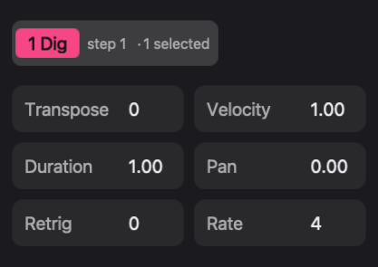
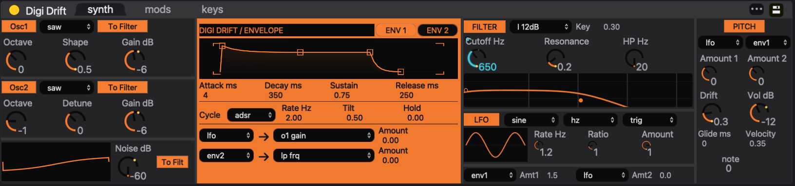

# Parameter locks

A parameter lock, or **p-lock**, gives one step its own value for a synth, effect, or mix parameter. The pattern keeps its base value; the locked step overrides it.

## Lock selected steps

1. Click an active step, or select several. The inspector shows the count.
2. Turn a synth or effect control. The value locks onto those steps.
3. Play and listen.
4. Command-click the steps to deselect them before editing the base sound.

Selection stays while you use device controls. If an edit only changes part of a pattern, check the selected count.

## Record a knob movement

1. Deselect all steps.
2. Enable Record and press Play.
3. Hold and move a control while the pattern runs. Values print onto the steps passing under the playhead.
4. Release to stop printing. Stop and disable Record when done.

Printed values are per step, not a continuous curve. Edit them afterward in the [Piano roll](piano-roll) automation lane.

## The marker

A small colored marker on a control means that parameter has locks somewhere in the pattern. The displayed value follows the selected step or the playhead, so a knob that jumps during playback is recall, not an edit.

## Clear locks

- Right-click a marked control and choose **Clear p-locks** to remove that parameter's locks across the pattern.
- Double-click a point in the piano roll lane to clear one step.

Notes and other parameters are untouched. Moving the base value never clears locks.

## A knob that ignores you

Check the marker first. If the parameter has locks, playback recalls them right after your edit. Then check the owner: track values follow patterns, bus and group values follow scenes.
