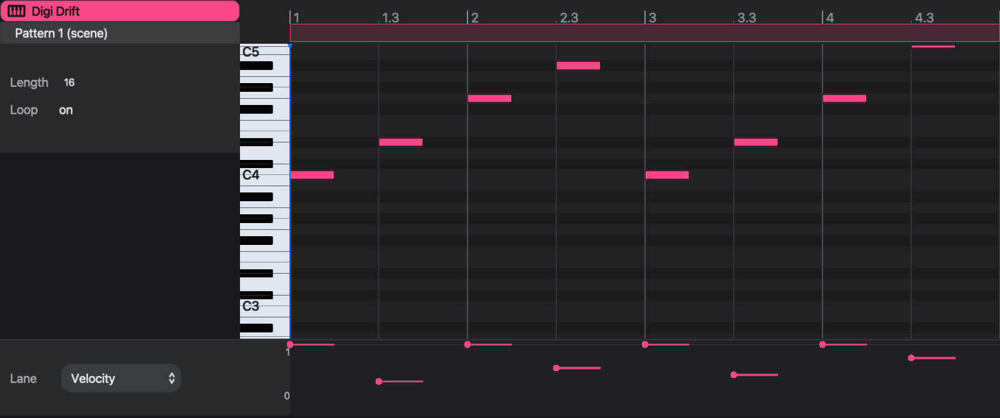

# Piano roll

The **piano roll** is a pitch-and-time editor for the notes a pattern or take holds. It shows one track's pattern, or one take, with pitch running up a keyboard and time running left to right, and an **automation lane** underneath for per-step values. Nothing in it is a separate kind of data: a note drawn here is a step in the pattern, and a step entered in the grid appears here as a note.

Use it for what the grid is poor at: chords, melodic lines across a wide range, notes longer or shorter than a step, notes placed slightly off the grid, and velocity or lock curves you want to see as a shape. For entering rhythms, the [step sequencer](sequencer-tour) is usually quicker.

## How notes map onto steps

The piano roll's time axis is the pattern's steps. Every note belongs to the step it starts in, and it carries three things:

- a **pitch**, as a transpose in semitones. C4 is a transpose of 0, the same as an unchanged step; the keyboard spans C0 to C8 (−48 to +48).
- a **duration** in steps, from 1/32 of a step upward. It can be shorter or longer than one step.
- an **offset** inside the step, from 0 up to one step. This is microtiming kept for each note: a note drawn at step 5 plus a quarter starts a quarter of a step late. Once a step has been edited here, its notes' offsets set its timing: the step's Delay is set to 0 and no longer applies.

A step that holds several notes is a **chord**. Each chord note keeps its own pitch, duration and offset. A step holds up to 12 notes. In the step grid a chord step is still one lit step, and the step's Duration value is that of its longest note.

The other step values (velocity, pan, retrig and the rest) and every parameter lock belong to the step, not to the note. The notes of a chord therefore share one velocity and one set of locks.

Moving a note to another step does not take these values with it. The note plays with the velocity and locks of the step it lands on, and the step it left keeps its own.

A note's label shows its pitch, plus the offset when there is one, for example `E4 +0.25`. Pitch names use sharps: E♭4 is labelled `D#4`.

Note: a pattern plays in its own timebase, so one step is not always a sixteenth note. The piano roll counts in steps whatever the timebase is. The ruler numbers the steps in groups of four: 1, 1.2, 1.3, 1.4, 2 and so on, so step 9 is at 3. When a step is a sixteenth note, each group is one beat, not one bar.

Note: the piano roll shows the notes stored in the source. Bar transposes, the scene transpose, process lanes such as xpose and grab, and MIDI effects change notes as they play and are not drawn here; see [Process lanes](process-lanes) and [MIDI effects](midi-effects).

## Open the piano roll

The piano roll opens in the device panel, in place of the track's instrument and effects. It shows the current track, and it follows the track selection.

- Double-click a track's name in the sequencer or in its mixer strip. Double-click again to return the panel to the devices.
- Press Shift-Tab to switch the device panel between the devices and the piano roll.
- Choose View > Piano Roll.
- In the arrangement, double-click a clip's title bar. The piano roll opens on that clip's source; see "Arrangement clips" below.

Double-clicking the name of a track with no instrument opens the instrument picker instead. On opening, the view zooms to fit the notes already in the source.

## The source column

The column at the left says what is being edited.

The top line is the track name. Under it is the **source**:

- **Pattern 1 (scene)** — the pattern the track is playing now, chosen by the scene or by a launched cell.
- **Pattern 3 — 2 clips** — a pattern opened from the arrangement, with the number of clips that use it.
- A take's name — a take opened from the arrangement.

Below that:

- **Length** is the source's length in steps: 1 to 256 for a pattern, up to 4,096 for a take. Lengthening a take adds silence at its end.
- **Loop** reads **on** for a pattern and **off** for a take. It is not a switch. It states the difference between the two: a pattern repeats to fill its clip, a take plays once from start to end.
- **Start**, **End** and **Offset** appear only for an arrangement clip; see below.

The band along the top of the ruler also marks the length. Drag its right end to change a pattern's length. A take's length can be changed only from the Length field.

Editing a pattern here changes the pattern itself, so every scene and every clip that plays it hears the change. To change one place only, duplicate the pattern first; see [Patterns and scenes](patterns-and-scenes).

## Edit notes

The note area needs keyboard focus for its keys. Click in it first.

With the mouse:

- Double-click empty space to add a note. It starts at the grid line nearest the click. The new note takes the duration of the last note you drew or resized, which starts at one step.
- Click a note to select it. Drag across empty space to select every note the rectangle touches. Click empty space to clear the selection and park the cursor.
- Drag a note to move it in pitch and time. If it is selected, the whole selection moves.
- Drag a note's right edge to change its duration. If it is selected, every selected note changes by the same amount. The left edge does not move; to start a note earlier or later, drag the whole note.

Moving and resizing are snapped, with one exception. While the note or its end edge stays inside the grid cell it started in, it moves freely; for a moved note this sets its offset within the step. Once it leaves that cell it snaps to the grid lines on screen. The grid lines follow the zoom, so zooming in gives a finer grid.

With the keyboard, when notes are selected:

- Left and Right move them one step earlier or later; with Shift, four steps.
- Up and Down move them one semitone; with Shift, four semitones.
- Backspace or Delete removes them.
- Command-C copies them. Command-V pastes the copied notes at the cursor, keeping their spacing and pitches, and selects the pasted notes.
- Escape clears the selection.

Command-A selects every note in the source. Selecting part of a chord and pressing Delete removes only those notes; the rest of the chord stays.

Each edit is one step of undo (Command-Z).

## Move around

- Scroll to move up and down the keyboard; scroll sideways to move along the pattern.
- Scroll over the ruler, or pinch, to zoom in time. The + and − keys also zoom when the note area has focus. The view shows between 4 and 256 steps.
- Scroll over the keyboard to make the note rows taller or shorter.
- Click the ruler to move the cursor. The cursor sets where Command-V pastes.

The playhead runs through the notes while the source is playing.

## A chord and a velocity shape

This example writes one chord and shapes it. Start with an empty 16-step pattern on a synth track, open the piano roll, and click in the note area.

1. Double-click at the start of step 1 on the C4 row. A one-step C4 appears.
2. Double-click at step 1 on the D#4 row (E♭4, three semitones above C4), then on the G4 row. The step now holds a three-note C minor chord. The step grid shows step 1 lit, and nothing else.
3. Drag across empty space around the three notes to select them (or press Command-A), then drag the right edge of one of them to step 9 (ruler mark 3). All three now last eight steps, and the chord sustains for half the pattern.
4. Double-click at step 9 (ruler mark 3) on the D4 row. Because the last resize left the draw length at eight steps, D4 is eight steps long.
5. In the automation lane, with **Velocity** chosen, drag the point at step 9 down to about 0.5.

The pattern now plays a held C minor chord followed by a softer D4. The three chord notes share step 1's velocity, so the lane has one point for them, not three.

## The automation lane

The automation lane shows one value for each step of the source. Choose the value from the **Lane** menu at its left. The numbers beside it are the value's maximum and minimum, with the value being edited between them.

The menu always lists the step values: Duration, Velocity, Delay, Aux A, Transpose, Pan, Sync, Retrig and Rate. It also lists every instrument, effect, MIDI effect and rack-macro control that already has a parameter lock somewhere in the track's current pattern. Device controls carry a prefix: `inst` for the instrument, `rack` for a rack macro, and the device's name for an audio or MIDI effect, for example `inst Cutoff Hz`.

Note: Delay affects only steps entered in the step grid. On a step written in the piano roll, move the note instead.

To get a control into the menu, lock it on one step first: select the step and turn the control in the device panel, or record a knob movement. [Parameter locks](parameter-locks) describes both.

Each point sits at a note's start. A line from the point spans the note's duration. A device lane also shows locks on steps without a note, as a point with no line.

- Click or drag a point, or anywhere on its line, up or down to set that step's value. A drag stays on the step it started on.
- Double-click a point, or Option-click it, to clear it. A step value returns to its default; a device lock is removed.

For a step value every note has a value, so every point is drawn in the track color. For a device control, colored points are locks. A gray point shows the value the step plays without a lock: the pattern's base value, or an earlier off-step lock that still holds. Dragging a gray point creates a lock on that step.

Note: device-control lanes read and write only the track's current pattern. When the piano roll shows a take, or an arrangement clip whose pattern the track is not playing, a device lane is empty and cannot be edited. Step-value lanes work for every source.

To remove every lock on a control at once, right-click the control in the device panel and choose **Clear p-locks**.

## Arrangement clips

Opened from the arrangement, the piano roll edits the source of the selected clip, which may be a pattern or a take. Clicking a different clip retargets it. With no clip selected, the piano roll shows **No clip selected**. Double-clicking empty space in an arrangement lane creates an empty take clip there and opens the piano roll on it.

For a clip, the source column adds three fields:

- **Start** and **End** are the clip's position in the song, in whole beats. Changing them moves or resizes the clip, as dragging it in the arrangement does.
- **Offset** is the step of the source at which the clip begins. On a pattern clip, an offset in the second half of the pattern is shown as a negative number: −1 on a 16-step pattern means the clip starts one step before the pattern's first step, as a pickup.

The ruler marks where the clip begins in the source. When the clip is shorter than one pass of the pattern, the section it plays is highlighted; when it covers several passes, the ruler shows how many. On a pattern clip you can also drag inside the length band to slide the offset.

Offset and Start/End change where and how much of the source plays. They do not change the notes. Changing notes in a pattern opened from a clip changes every clip that uses that pattern, as the source column's clip count warns.

See [Arrangement](arrangement) for placing and moving clips, and [Recording](recording) for recording takes.
