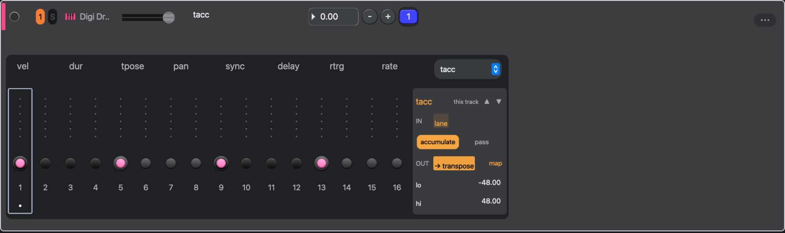

# Process lanes

Beside velocity, duration, and the other step parameters, every track carries twelve process lanes. A lane is a value per step, like any other parameter lane, but instead of setting a note property directly it feeds a small process that runs just before the step plays. Processes remember things between steps, so a few sparse values become a running transform: a transpose that climbs, a random number that lands on a filter, a hit that repeats more each bar.

Every track starts with the same lanes, and you can add more to a single track; each track keeps its own values and its own running state. If you know the Cirklon's accumulators and aux lanes, this is that idea with named lanes.

## The lanes

- **prob** — the chance, 0 to 1, that the step plays at all. A rejected step is silent but the lanes below it still advance.
- **reset** — a step set high clears the three accumulators before that step plays.
- **rand** — draws a new random number between its lo and hi on every step whose lane is high, and holds it otherwise. On its own it does nothing; map its output somewhere.
- **count** — adds the lane value to a counter each step and wraps from hi back to lo. A generator like rand, but predictable.
- **tacc** — accumulates the lane value into a running transpose, added to the step's own transpose. Set 1 on the first step for a line that climbs one semitone per bar.
- **acc A** and **acc B** — two more accumulators with a mappable output. acc A starts on retrig and acc B on rate, so a ramp on either turns into a growing roll.
- **grab** — a step set high plays the value from the step the source track is on right now instead of its own: the note, the velocity or the duration, whichever **value** says in the strip. It is the Cirklon inter-track grab. Set every step high and this track plays the source's melody on its own rhythm; set a few and only those steps borrow. A source track running at a slower timebase holds its step for a whole bar, so the grabbing track plays through transposed by that one note. A note grab keeps this track's own tacc offsets on top, and a chord step moves as a block so its bottom note lands on the source's.
- **cmp A** and **cmp B** — comparators. Wire another lane into it, pick an operator and a value in the strip, and the lane sends 1 when the input passes the test and 0 when it fails. The painted lane is the input when nothing is wired in. On a step where the wired lane sends nothing, such as rand on a step you left low, the comparator falls back to the painted value; set hold to 1 to keep comparing the last number it received instead.
- **veto** — a step set high is silent. Paint it for a mute mask, or wire a comparator into it to mute on a condition: acc A into cmp A set to `>= 8`, cmp A into veto, and the track drops out once the accumulator reaches 8.
- **roll** — a step set high rolls the whole project from that step for the step's length, looping a window at the rate in the strip. Wire rand into cmp A set to `> 0.8` and cmp A into roll for a roll on roughly one step in five. The transport ROLL button lights while it runs. A roll never restarts itself while it is running, and a rate no finer than the step has nothing to repeat.

## Adding a lane

Each lane does one job, so a second job needs a second lane. At the end of the patch bay, which the **patch** chip in the lane strip header opens, there is a **+** box. Click it and a list of the lane types opens; pick one and a new lane is added to this track, at the end of the chain, with nothing painted on it. It appears in this track's lane dropdown under its own name: the plain name if the track has not used it yet, otherwise the name with a number, so a second grab is **grab 2**. Use the strip's header arrows to move it earlier if another lane needs to feed it.

A lane you add belongs to the track, not to the scene. It exists on that track in every scene, while what you paint on it and everything in its strip stay per scene, like the rest of the grid. Removing it removes it from every scene, values and all.

The usual reason to add one is a second grab. grab takes one source track and one kind of value, so to play track 1's notes with track 3's velocities, keep the first grab on track 1 with value set to note, add a second grab, set its source to track 3 and its value to vel, and paint both lanes high on the steps that should borrow.

## Opening a lane

Expand a track, then pick a lane from the dropdown at the right end of the parameter tabs. The grid draws the lane in amber so it never reads as a note property. Sliders, the number picker, typing digits, and selections work exactly as they do for velocity. See [Step sequencer](sequencer-tour).

## The lane strip

With a lane open, a strip appears to the right of the grid. It is the lane's control panel.

- The header shows the lane name. The arrows move the lane earlier or later in the chain, which matters when lanes feed each other.
- **IN** shows where the lane's input comes from: its own values, or another lane wired into it.
- **accumulate** and **pass** appear on the accumulators. Accumulate folds each input into the running value. Pass forwards each input as it arrives, which turns an accumulator into a plain relay for whatever is wired into it.
- **OUT** shows the target the output lands on, and **map** changes it.
- **NOW** shows the running value, with a small scope of its recent history on this track. It stays hidden until the lane has fired.
- **lo** and **hi** set the range the value wraps inside. They also set the range of the lane's sliders.
- grab's **source** is a track picker and **value** picks what is grabbed: note, vel or dur.

## Mapping an output

Press **map**. Everything the output can land on lights up: the step parameter tabs, the other lanes, and every mappable knob on the track's instrument and effects. Click one to bind it. Click **map** again to cancel.

Mapping onto an output that is already bound adds a second target instead of replacing the first. Each extra target gets its own **lo … hi** range in the strip: the output is rescaled from the lane's lo and hi into that range before it is set. This is how one rand drives velocity between 0.1 and 1 and retrig between 4 and 8 at once. The **×** removes a target.

Step parameters take the value in their own units: 3 on tpose is three semitones, 3 on rtrg is three repeats. A synth or effect knob has no natural unit, so give it a range.

## Wiring lanes together

Press **patch** in the strip header and a patchbay opens under the step sliders: one box per lane, in the order they run, with the lane's out ports on the top row and its in ports below. Click a box to select that lane in the strip; the selected lane's box is tinted. Drag from an out port onto an in port to wire them; the cable stays drawn so you can see the whole patch at a glance. Click a cable to select it and press Backspace, or the **× cable** chip, to remove it. rand into acc A with acc A on pass and mapped to a filter is the classic patch: a new random filter position on every step you choose.

An out port can feed as many in ports as you like. The first cable takes the port's main connection; each further cable is a fan-out entry that carries the same value.

Order counts. Lanes run in the order the boxes read, left to right then top to bottom, so a cable that runs backwards lands one step late. The in port marks that with a small arrow. Use the strip's header arrows to move the writer ahead of the reader.

While a map is armed, the **OTHER LANES** row still lists the lanes that can take the output, which is the same wiring without the cables.

## This track or every track

Lane values are always per track. Everything else in the strip, the targets, the mode, lo and hi, applies to the current track only, so mapping rand to prob on track 1 leaves the other tracks alone.

To change every track at once, switch the header's **this track** to **all tracks** before editing. A track you have edited individually keeps its own settings; clearing a target on that track returns it to the shared one.

Try it: put 1 on tacc's first step, set reset high on step 1, and play. The pattern climbs a semitone per bar and snaps back when you reset. Then open rand, map it to prob, and hear the pattern thin out at random.
