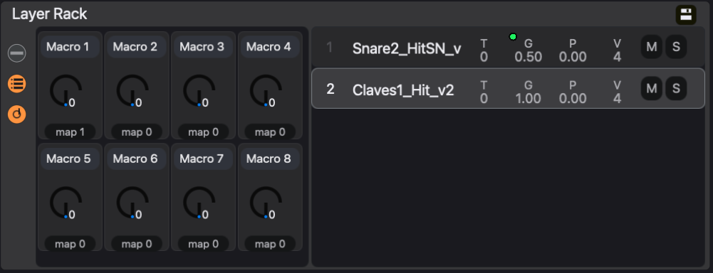

# Racks

A **rack** gathers several sounds into one unit in the sequencer and mixer. eseq has two kinds, built on different models:

- An **Instrument Rack** is one track whose instrument is a stack of up to 16 **layers**. Every note the track plays reaches every layer. The rack adds 8 **macros**, knobs that each drive any number of layer controls. The Create menu and the new track's name call it a Layer Rack, and some controls call a layer a slot (**Slot FX**); they are the same things.
- A **Drum Rack** is a group of ordinary tracks, called **member tracks**, plus a **pad map** that assigns each member to a note. Each member has its own pattern, length, timebase, process lanes and effects. The rack adds pad playing, a shared effects chain, its own bank of **rack clips**, and it can own graph sequencers. A Drum Rack is saved and loaded as a **kit**.

Choose by what the sounds need to do. If they should play the same notes together, as a bass stacked from a sine layer and a distorted layer, use an Instrument Rack. If each sound needs its own rhythm, use a Drum Rack. A kick and a hat are separate parts that happen to share a mix point.

A plain mixer group is neither. It sums tracks for shared processing but has no pad map and no pad playing; see [Mixer](mixer). A group can be turned into a Drum Rack later.

## Instrument Racks

### What a layer holds

A layer is an instrument or a sample, with its own effect chain and a row of mix controls:

- **T**: transpose in semitones, -48 to 48, added to every note the layer plays.
- **G**: gain, 0 to 2.
- **P**: pan, -1 (left) to 1 (right).
- **V**: the most voices the layer may use at once, 1 to 64.
- **M** and **S**: mute and solo. When any layer is soloed, only soloed layers sound.
- The layer number, which is also an on/off switch.

Clicking a layer's number disables that layer. A disabled layer receives no notes, sequenced or live, runs no voices and bypasses its effects, so it costs no processing. The switch is stored per pattern: one pattern can play a pad layer and park the piano, and the next pattern can do the reverse.

### Building a layered instrument

1. Choose **Create > Layer Rack**, or double-click **Instrument Rack** in the browser's Instruments tab. A track named Layer Rack appears, and the device panel shows the empty rack with **Drop an Instrument or Sample**.
2. Drag an instrument from the Instruments tab, or a sample from the Samples tab, onto the rack. Each drop adds a layer.
3. Click a layer row to select it. With the chain view shown (the top button at the rack's left edge), the layer's instrument and effects open beside the rack.
4. Play the track and balance the layers with **G**, **P** and **T**.

To replace one layer's sound, drop an instrument or sample onto that layer's instrument panel instead of the rack. Double-clicking an instrument in the browser while the rack track is selected replaces the whole rack with that instrument.

The three round buttons down the left edge of the rack show or hide its three views: the selected layer's instrument and effects, the layer list, and the macro bank.

### What happens when the track plays a note

1. The note leaves the track's MIDI effects.
2. Each enabled layer receives it, transposed by that layer's **T**.
3. Each layer's instrument plays it within its **V** voice limit, at its **G** and **P**.
4. Each layer's own effects process that layer alone.
5. The layers are summed, and the sum passes through the track's own audio effects and mixer strip.

The track owns the pattern, the MIDI effects and the process lanes. The layers only decide what the notes sound like.

Layers have no key or velocity zones: splitting a keyboard needs separate tracks or a Drum Rack.

### Layer effects and track effects

Drop an audio effect on a layer row, or on **Slot FX** beside the selected layer's instrument, to process only that layer. Effects in the **Track FX** area process the summed rack, as on any track.

A useful first patch has three parts: a bright, short layer with distortion on it, a darker sustained layer without, and one delay in Track FX so the two layers share an echo.

### Layer values follow patterns

Like any instrument's settings, the rack's layer values, layer effects and macro positions belong to the sound of each pattern (see [Concepts](concepts)). A second pattern on the same track can use the same layers with a different balance. The **•••** menu in the rack header has **Copy rack (all slots) to all scenes**, which writes the current layer values, layer effect settings and macro positions into every pattern of the track, so every scene that plays this track hears them.

Layer controls take parameter locks in the usual way. With steps selected, turning **T**, **G**, **P** or **V**, or clicking **M** or **S**, locks the value on those steps, and right-clicking a control opens its lock menu. See [Parameter locks](parameter-locks).

### Macros

A **macro** is one knob that moves several controls across the rack's layers. The rack has eight, each with a range of 0 to 1 and a name you can edit.

1. Show the macro bank with the dial button, the lowest of the three at the rack's left edge.
2. Click the name field and type a name, such as Brightness.
3. Click **map** under the macro. Controls that the macro can drive turn green, and the macro-mapping sidebar opens.
4. Click a green control on any layer's instrument or layer effects. It is mapped, and the number beside **map** counts it.
5. Repeat for other controls, then click **done** in the sidebar.

While **map** is armed, clicking a mapped control unmaps it. For each mapping, the sidebar sets **Min** and **Max**, which are the values the control takes at macro 0 and macro 1, and a **Curve** of linear, exp or log. Click **×** to remove a mapping. A control that a macro drives shows a small green dot.

For example, build a rack from two Grit layers. Name macro 1 Brightness and map layer 1's **Base Hz** with Min 300 Hz, Max 6000 Hz and Curve exp, then layer 2's **Drive** with Min 1 and Max 6. At 0 the rack is dark and only lightly driven. Turning the knob up opens layer 1's filter while layer 2 grows dirtier underneath it, and at 1 both are at their brightest.

Macros take parameter locks like any other control: select steps, then turn the macro. A macro locked on the last step of a bar can open a filter on one layer and raise the drive on another in one move.

Macros can be played from a hardware controller: a CC mapped to `(rack-macro n)` drives macro n (counting from 0) of whichever Instrument Rack is armed. With steps selected, the controller writes locks instead. The mapping table is set up in init.lisp; see [Recording](recording) and [Keys and customization](customization).

### Saving a rack

The save icon in the rack header saves the whole rack, with its layers, their effects and its macros, as a preset. A preset can be made into a Sound; see [Samples and sounds](sample-browser).

## Drum Racks

### How a Drum Rack is built

A Drum Rack has four parts:

- **Member tracks.** Each is a complete track, exactly like any other: its own instrument, pattern, length, timebase, swing, process lanes, MIDI effects and audio effects. The step transpose of a member is pitch, so a snare can be played four semitones down on one step.
- **The pad map.** Each member answers to one **pad note**, from C1 to D#8. Two members never share a note. A new rack's first pad lands on C1.
- **The rack bus.** Every member's output feeds the rack's bus. The bus's effects chain is the kit's shared processing, and the rack's volume fader is the bus fader.
- **The clip bank.** A rack can hold its own set of rack clips, described below.

Because members are tracks, a sequenced kit needs no special routing: each member plays its own pattern. The pad map matters when you play the rack live, and when the rack is saved as a kit.

Pads are created lazily. A new rack has no member tracks, and a pad claims a track only when a sound is dropped on it. A project holds up to 64 tracks, so a 10-piece kit uses 10 of them.

### Building a kit

1. Choose **Create > Drum Rack**. An empty rack appears at the bottom of the sequencer. (Double-clicking **Drum Rack** in the Instruments tab does the same, and if a sample is selected in the Samples tab it becomes the first pad.)
2. Click the rack's header to select it. The device panel shows the rack's pad grid.
3. Drag a kick sample onto the bottom-left pad (C1), a snare onto the pad to its right (C#1), and a closed hat onto the next (D1). Each drop creates a member track, which appears as a row under the rack's header.
4. Enter steps on the member rows: kick on 1 and 9, snare on 5 and 13, hat on every odd step.
5. Press play and balance the members with their own faders.

Now give the hat an independent feel. Select the hat's row, and in the track settings set **timebase** to 32 and **steps** to 24. The hat now runs at double speed against the kick and snare, and the two realign every three bars. Nothing about the kick changes, because the hat is its own track.

Drops onto pads take samples and saved instruments. Built-in instruments, such as the Sampler, are refused on a pad. You can also add a member by dropping a sound on the rack's strip in the mixer, which uses the lowest free pad note.

### The rack in the sequencer and the mixer

In the sequencer, a Drum Rack is a block: a header row, then its member rows. The header holds, from left to right:

- the colour badge and the collapse button;
- the arm circle, which arms the rack for pad playing;
- **M** and **S**, which mute and solo the rack bus;
- the rack's name, and the volume fader for the rack bus;
- the clip grid and a row of activity dots, one per member, once the rack has rack clips.

Collapsing the rack hides its member rows and leaves the header, so a rack with clips stays launchable while taking one row.

With the rack selected, Command-A selects every step on every member, and Backspace clears them all in one undo step.

In the mixer, the rack is a coloured container: the rack's own strip, then its member strips. Right-click the name badge at the foot of the rack strip for the **rack menu**:

- **Rename**.
- **Convert to clips** on a rack without clips, or **Save clip as...** on one that has them.
- **Attach** *name* **to rack** for each graph sequencer not already owned by another rack, and **Detach** *name* for each one the rack owns.
- **Export as kit...**
- **Ungroup**, which dissolves the rack and leaves its members as loose tracks.

The same menu on a plain group offers **Convert to Drum Rack**. A Drum Rack can itself sit inside a plain group, as one unit.

### The pad grid

Selecting a rack fills the device panel with the rack panel: the rack's name and save icon, an octave map, a 4 x 4 pad grid, and the rack bus's effects.

The pad grid shows sixteen notes, lowest at the bottom left, rising left to right and then upward. Every page starts on a C, so adjacent pages overlap by four notes. A pad shows its note, its member's name and its choke group, if it has one. An empty cell shows the note that a drop there would claim. A pad lights while its member is sounding, whatever triggered it.

The **octave map** to the left of the grid shows the whole range from C1 to D#8, four notes to a row, with pads filled in and the notes on the grid highlighted. Click a row to show those notes on the grid. A pad on another page still lights in the map while it plays.

On the grid:

- Click a pad to focus it.
- Double-click a pad to open its member track. The device panel switches to that member's instrument and effects.
- Drag a pad onto another cell, or onto a note in the octave map, to move it. Dropping on an occupied note swaps the two pads; each keeps its track and choke group.
- Drop a sound on an occupied pad to replace its sound. The member's patterns and mix stay.

### Playing and recording pads

A Drum Rack can be played two ways:

- **Arm the rack** with the circle in its header. The keyboard now plays pads: each note triggers the member on that pad at its base pitch. Notes with no pad are ignored.
- **Arm one member** with the circle in its row. The keyboard plays that member chromatically, like any track. Use this to play a melodic line on a single tom.

Arming the rack disarms its members, and arming a member disarms the rack. Tracks outside the rack keep their own arm state and play alongside the pads.

The computer keyboard starts at C4, while a rack's first pads sit at C1. Press `Z` three times to move the keyboard down three octaves; `X` moves it back up.

When recording, each pad hit is written into its member's pattern, on that member's own step grid. In one pass, a hat at timebase 32 is recorded against thirty-second notes while the kick is recorded against sixteenths. See [Recording](recording).

### Chokes

A choke makes one sound cut off another: an open hat stops ringing when the closed hat plays. In eseq this is the track's **mute grp** setting (Off or 1 to 8) in the track settings. When a track in a mute group triggers, every other track in the same group releases its voices. Give the open hat and the closed hat the same group.

Mute groups work between any tracks, inside a rack or not. Like other voice settings, the mute group belongs to the pattern's sound, so check it in each pattern that needs the choke.

Note: a pad can also carry a choke group of its own, from 1 to 16, shown on the pad as *choke n*, and kits save it. The current interface has no control for setting it, so use mute groups.

### Member and shared processing

Effects on a member process one drum. Effects on the rack bus, shown in the rack panel after the pads, process the whole kit. A compressor on the bus hears the kit together; a compressor on the snare member hears the snare alone. To add a bus effect, drop an audio effect on the rack's strip in the mixer, or on the drop panel after the bus effects in the rack panel.

Member values follow the member's patterns, as on any track. Rack bus values follow scenes, as on any bus or group. See [Patterns and scenes](patterns-and-scenes).

## Rack clips

A **rack clip** is a Drum Rack's own scene. It holds one pattern for every member, and the settings of any graph sequencer the rack owns. Each project scene then points at one of the rack's clips, or at none, in which case the rack is silent in that scene.

The rack's clips work like a preset inside the project's scenes. The rack keeps its own collection of grooves, and each project scene chooses one. Changing which clip a scene plays does not touch any other track.

A rack starts without clips. Its members then store their patterns in the project scenes, like any other tracks.

### Converting a rack to clips

Choose **Convert to clips** from the rack menu. For each project scene, the members' patterns become a clip named after that scene, and the scene points at it. Scenes in which no member has a pattern assigned, and no rack-owned sequencer has settings, all point at none. A scene whose members have patterns without steps still becomes a clip, which plays silence. The conversion is one undo step.

Suppose a project has four scenes and a Drum Rack named Break. The rack plays a straight beat in scenes 1 and 2 and a busier one in scene 3, and has no patterns assigned in scene 4. After **Convert to clips**, Break has three clips, named after scenes 1, 2 and 3. Scene 4 points at none, and the rack stays silent there.

### Using clips

Once a rack has clips, its header row in the sequencer shows a cell for each clip. The cell for the clip the current scene plays is lit.

- Click a cell to launch that clip. The current scene now points at it, and the switch waits for the transport's launch quantization, as a scene launch does.
- Shift-click a cell to rename the clip.
- Right-click a cell for **Rename…**, **Launch**, **New Clip from Playing** and **Delete**.
- The number box after the cells shows the playing clip's number. Type or drag a number to launch that clip.

In the mixer, the rack strip lists its clips by name in place of pattern cells. The playing clip shows a play mark, and clicking a row launches it. The list is hidden in the compact mixer.

**New Clip from Playing**, and **Save clip as...** in the rack menu, copy what the rack is playing into a new clip, named Clip 1, Clip 2 and so on. The current scene then points at the copy. To make a variation, take a new clip from what is playing, then edit it; the clip it was copied from is unchanged.

Edits to a member land in the clip the current scene plays. If the rack is silent in the current scene, entering steps on a member creates a new clip for that scene. Creating a new project scene gives each rack with clips a copy of the clip it was playing, so the new scene can be edited without changing the old one. A rack that was silent stays silent. Deleting a clip leaves every scene that pointed at it silent. There is no control for pointing a scene at none directly; deleting the clip a scene plays is the way to silence the rack there.

Note: on a quantized launch, the lit cell and the clip you are editing change as soon as you click, while the sound waits for the boundary. Edits made in that gap already go to the new clip.

## Rack-owned sequencers

A graph sequencer, such as a neural sequencer from a package, normally belongs to the project and routes its nodes to tracks. A Drum Rack can take ownership of one or more. Choose **Attach** *name* **to rack** from the rack menu.

Once attached:

- the sequencer's routes address the rack's members, and its route menus list the members;
- routes that pointed at tracks outside the rack are switched off;
- the sequencer's settings are stored in the rack's clips, so each clip can carry a different configuration;
- the sequencer travels with the rack when it is exported as a kit.

**Detach** *name* gives the sequencer back to the project, and its routes point at the member tracks again. Attaching and detaching are single undo steps. Writing graph sequencers is covered in [Packages](packages).

## Kits

A **kit** is a Drum Rack saved as a browser object and listed in the browser's **Kits** tab.

To save one, click the save icon in the rack panel's header, or choose **Export as kit...** from the rack menu. Either opens the kit save panel in the Kits tab. Type a name. The **Scenes to export as clips** list ticks every scene the rack plays; tick or untick scenes, then click **Save Kit**.

A kit always carries:

- the pad map: each pad's note, choke group and member name;
- one sound per pad: the member's instrument or sample, its settings and its effects;
- the rack bus's effects chain;
- modulator members, and the cables from them to the rack's own inputs.

Every ticked scene becomes a clip in the kit, in scene order and named after the scene. Such a kit is called a **break kit**: it also carries the clips and any graph sequencer the rack owns. A whole break, with its sounds, grooves and generative sequencing, then loads as one object. Untick every scene to save a kit of sounds only. Exporting from a rack without clips converts it to clips first, as its own undo step.

A kit never carries the rack's fader, pan or sends, or cables to anything outside the rack.

To load a kit, double-click it in the Kits tab:

- With a Drum Rack selected, the kit replaces that rack's sounds, pad map and bus chain. A break kit also replaces the rack's clips and sequencers, and the rack is silent until you launch one of the new clips.
- With no Drum Rack selected, the kit builds a new rack beside the existing tracks. A break kit's rack is silent in every existing scene until you launch a clip.

A pad whose sound cannot be found, such as a missing sample or an uninstalled instrument, is reported by name, and the rest of the kit still loads. A sequencer from a package that is not installed is reported the same way. A kit load is one undo step.

Kits hold sounds, not songs. To keep a rack's patterns with a project, save the project; see [Saving and export](saving-and-export). The Kits tab itself is described in [Samples and sounds](sample-browser).
