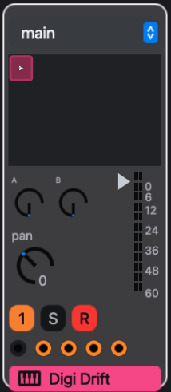
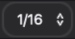

# Recording

Recording turns a performance into pattern data. Notes played on a MIDI keyboard or the computer keyboard, including notes that play an armed Drum Rack's pads, become steps. Moving a control while recording prints its value onto the steps that pass: a step value for the step inspector's controls, a parameter lock for instrument, effect and rack controls. The result is the same kind of data the step grid and piano roll edit, so anything recorded can be corrected, quantized or rearranged afterwards.

Recording writes notes and control values, not audio. Audio comes from the transport's **WAV** button, which records the master output, and from **Pattern > Resample Last 30 s…**, which turns the last 30 seconds of output into a sample.

eseq has four recording routes:

- **Pattern overdub**: in session view, Record writes notes into the pattern each armed track is playing, pass after pass.
- **Takes**: in arrangement view, Record writes a linear, non-looping performance onto the timeline.
- **Capture MIDI**: the last 30 seconds of live playing are always kept, whether or not Record was on, and can be turned into patterns afterwards.
- **Parameter printing**: while Record and Play are on, moving a control writes its value onto the steps that pass.

This chapter covers the controls they share and the ways to play into them, then each route in turn.

## Record, arm and WAV

Three controls take part in recording, and they are independent of each other.


The **Record** button (the red circle in the transport, or the `.` key) is a mode, not a transport command. With the transport stopped it does nothing except wait; Play then starts a recording pass. Pressed while playing, it punches in immediately. Nothing is written while the transport is stopped.

**Arming** chooses which tracks receive live notes. The circle at the left of a track header, or **R** on its mixer strip, arms that track. Command-R arms the selected track and disarms all others; pressed again on the only armed track, it disarms it. Any number of tracks can be armed at once, and every armed track sounds and records each note you play. An armed track plays whether or not Record is on, which makes arming the way to audition a sound from a keyboard.



Selection and arming are separate. Selecting a track decides what the step inspector, track settings and device panel edit; arming decides what the keyboard plays.

**WAV** records the master output to a stereo WAV file, independently of Record and of the transport. Press it once to start and again to stop. See [Saving and export](saving-and-export) for where the file goes and for offline rendering of an arrangement.

## The computer keyboard

```
 W E   T Y U   O
A S D F G H J K L
```

The middle row plays white keys and the row above plays black keys, from `A` to `L`, an octave and a tone. `A` plays the pitch an untransposed step plays on that track; `K` is an octave above it. `Z` and `X` shift the keyboard down and up an octave.

The keyboard plays notes only while a track or Drum Rack is armed. Then the note keys, `Z` and `X` play instead of running their editor shortcuts; other keys, including Space and `.`, keep their bindings. A focused text field or a number field being edited keeps the keys, so click the sequencer or mixer before playing if a field has focus.

## MIDI keyboards and controllers

eseq connects new MIDI inputs automatically while it runs, usually within a second. Arm a track and play; the note sounds with the keyboard's velocity. Notes on any MIDI channel reach the armed tracks. MIDI clock and system messages are ignored, so eseq does not follow an external clock.

**File > Settings…** lists the inputs with their connection status. **Disable** and **Enable** choose which inputs eseq accepts, and **Refresh** rescans the device list. On macOS these choices are saved between launches. Unplugging or disabling an input releases any notes it was holding.

Controllers beyond notes are mapped in Lisp. The `eseq.midi` module keeps a mapping table from MIDI sources (a CC, a note, pitch bend or aftertouch, optionally limited to one channel or device) to targets. The built-in target is an Instrument Rack macro, resolved when each message arrives, so one mapping follows whichever rack is armed. Any other target is a Lisp function of the value and the message. For example, in `init.lisp`:

```lisp
(import eseq.midi :refer (midi-map cc rack-macro))
(midi-map (cc 14) (rack-macro 0))
(midi-map (cc 15) (rack-macro 1))
```

A mapped macro behaves like the on-screen macro knob: with steps selected it writes parameter locks, and during a recording pass it prints (see Record control moves, below). A note consumed by a mapping does not also play the armed track. `midi-map*` with `:mode :relative` treats a CC as an endless encoder. See [Keys and customization](customization) for `init.lisp`.

eseq also ships a preset for the Akai MIDImix. It loads automatically and matches an input named **MIDI Mix** on channel 1: the eight faders set track and group volumes, the master fader sets the main mix, the top two knobs of each strip set its first two sends, and the bottom knob sets the first macro of the strip's Instrument Rack. The knobs act on track strips only. Mute toggles the strip's mute; holding **Solo** and pressing a strip's Mute toggles its solo. Bank Left and Right step through scenes. The Record Arm buttons choose a roll rate and never arm tracks; holding Solo rolls the sequence at that rate. The preset is input-only and does not light the hardware's buttons.

## Drum Racks

Arming a Drum Rack plays its pads. Arm the rack with the circle in its header, or **R** on its mixer strip. Each key or MIDI note then triggers the pad mapped to that note, which plays its member track at the member's own pitch. MIDI note 60 (C4) is pad note 0. Notes with no pad are ignored. Use `Z` and `X` to reach pads outside the keyboard's current octave.

To play one drum sound chromatically instead, arm its member track. Arming a rack disarms its members, and arming a member disarms its rack, so no key plays a sound twice. Only one rack can be armed at a time.

Recorded pad hits land in each member's own pattern, quantized to that member's timebase. Clicking pads on screen sounds them and adds them to the Capture MIDI history, but does not record into patterns. See [Racks](racks).

## Where recorded notes go

The view that is visible when recording starts decides what the pass writes: session view overdubs into patterns, arrangement view records takes. With Record on before Play, that is the view when you press Play. If you press Record during playback, the view that is visible when you play the first note decides. The choice holds until the transport stops or you punch out; switching views during the pass does not reroute it.

When you release a key during a pass, eseq does the following for each armed track:

1. It takes the position at which the note actually sounded, compensated for audio latency, rather than the moment the key was pressed.
2. It snaps that position to the record quantization grid, measured in that track's own timebase and length.
3. It turns the step on and adds the note to the step's chord. A step holds up to 12 notes. Further notes on a full step are not recorded.
4. It sets the step's transpose, velocity and duration from the note. Duration is how long the key was held.
5. It publishes the change, so the next loop of the pattern plays the note back.

Velocity is stored once per step, so a later note on the same step sets the velocity for the whole chord. A MIDI keyboard records its velocity; the computer keyboard always plays at full velocity.

## Overdub a pattern

1. In session view, select the track and make sure it is playing the pattern you want to record into. Recording writes into the pattern the track is currently playing.
2. Arm the track.
3. Choose a record quantization in the transport, or **off** to keep your timing.
4. Turn on Record and press Play (Space).
5. Play. The pattern loops, and each pass layers new notes onto what is already there.
6. Stop, turn off Record, and disarm the track.

Overdubbing only adds notes. To replace a phrase, clear the steps first or undo the pass.

Note: during arrangement playback, overdubbing a track takes that track over from the timeline, as a manual launch does, until you use **Back to Arrangement**. A track whose arrangement lane is playing a take at that moment ignores overdubbed notes rather than overwriting the take.

## Record quantization

The transport's record quantization menu decides where performed notes land. The options are **off**, **1/16**, **1/8**, **1/4**, **1/2** and **1 bar**. The default is 1/16.



- **off** puts each note on the step it fell in and stores its offset within that step as the note's delay. Nothing is moved; the timing can be edited afterwards in the piano roll.
- **1/16** snaps each note to the nearest step of its track, whatever that track's timebase.
- **1/8**, **1/4**, **1/2** and **1 bar** are musical lengths. Each is converted through the track's timebase, so 1/4 lands every fourth step on a 1/16 track and every eighth step on a 1/32 track.

Because every track quantizes against its own timebase, one performance can land on different grids in the same pass. Suppose a Drum Rack has a kick on a 16-step 1/16 track and a hat on a 16-step 1/32 track, and record quantize is at 1/8. You arm the rack and hit kick and hat together, a little early for beat 2:

- The kick falls late in its step 4. On a 1/16 track an eighth note is two steps, so the hit snaps to kick step 5, which is on beat 2.
- The hat falls late in its step 8. On a 1/32 track an eighth note is four steps, so the hit snaps to hat step 9, also on beat 2.
- With quantize at **off**, the kick lands on step 4 and the hat on step 8, each with a delay that places it where you played. Both still sound early for beat 2.

Record quantization affects only notes as they are recorded. It is separate from launch quantization, the neighbouring menu that schedules pattern and scene changes, and from the quantizer MIDI effect, which changes timing on playback without changing the pattern. See [MIDI effects](midi-effects).

## Metronome

**MET** in the transport turns the click on and off. It clicks on every quarter note while the transport runs, with a higher click on every fourth, and does not depend on Record. The click is mixed in after the recorders, so it never appears in a WAV recording. There is no count-in: when overdubbing a looping pattern, let the first pass go by before playing.

## Takes in the arrangement

A **take** is a linear recording on one track's arrangement lane. It is note data, like a pattern, but it plays once from start to end instead of looping.

1. Switch to arrangement view and click the ruler to set the cursor where recording should start.
2. Arm the tracks to record.
3. Turn on Record and press Play.
4. Perform. Each armed track's take starts at its first note, snapped by record quantization.
5. Stop. Each armed track that received notes gets a take clip.

Turning Record off while the arrangement keeps playing punches out: the pass is committed there and playback continues. Recording past the end of the arrangement extends it. A take plays with the sound its track had when you recorded it.

How a take replaces what its lane held, launch capture, clip editing and Back to Arrangement are covered in [Arrangement](arrangement).

## Recover something you just played

eseq keeps the last 30 seconds of live notes played on armed tracks and Drum Racks, whether or not Record or the transport is running. Rolled notes are not kept. Capture MIDI turns part of that history into patterns, so a phrase found while noodling does not have to be played again.

1. Choose **Pattern > Capture MIDI…**. The dialog freezes a copy of the history and shows it as a roll, one row per track and pitch. Playing continues to be captured in the background; reopen the dialog to see the latest.
2. eseq looks for a repeating groove and sets the crop to it: a start, a whole-number tempo, and a bar count. **Detect** runs that search again. To crop by hand, drag across the roll.
3. Adjust **Start (s)**, **Bars** (1 to 16) and **BPM**. The crop's end follows from the other three, so every crop is a loop of whole bars at a whole BPM. A crop that would come out slower than 70 BPM is read in double time: the bar count doubles and the notes keep their timing.
4. Press the dialog's play button to loop the crop through the original tracks' sounds and effects. The transport must be stopped; if it is running, the dialog offers **Stop playback** in place of the send button.
5. Click **Send to tracks**.

Sending sets the project tempo to the crop's BPM and gives each track that played a new pattern in the current scene: 16 steps per bar at a 1/16 timebase, with swing reset. Every note keeps its offset within its step as a delay, so the phrase plays back exactly as performed, without quantization. The previous patterns stay in the pattern pool, and one Command-Z restores both the old patterns and the old tempo.

Only notes that start inside the crop are imported; a note running past the end is shortened there. The import stops with a message, rather than altering the phrase, when two hits on one step have different velocities or a step would hold more than 12 notes; choosing more bars usually separates them. The history holds up to 8192 notes, and the dialog says when dense playing exceeded that. Sequencer playback is not captured, and the history is cleared when you open another project.

## Record control moves

With Record and Play on and **no steps selected**, hold a control and move it. While it is held, its value is printed onto the steps passing under the playhead on the current track. Several controls can be held and printed at once.

- **Step values**: velocity, duration, transpose, pan, retrig and rate in the step inspector print onto every step that plays a note, and leave empty steps alone.
- **Device parameters**: instrument, audio effect, MIDI effect and rack parameters, including rack macros driven from MIDI, print a parameter lock onto every step that passes, empty or not. How a lock on an empty step shapes the notes still ringing is described in [Parameter locks](parameter-locks).

Printing stops when you release the control, stop the transport, turn off Record, or select another track. The pattern's base values do not change.

## Roll

With **ROLL** on in the transport (the `;` key), a held key repeats on every armed track at the roll rate instead of sounding once. Keys `1` to `8` choose the rate: 1/4, 1/4 triplet, 1/8, 1/8 triplet, 1/16, 1/16 triplet, 1/32 and 1/32 triplet. The first hit falls on the next line of the roll grid, and with the transport stopped a held key stays silent until Play. During a recording pass every audible hit is written as a step on the roll grid, without record quantization.

With ROLL on, holding the backtick key in the step grid rolls the whole sequence at the roll rate until you release it. The roll lane, which triggers whole-sequence rolls from a pattern, is described in [Process lanes](process-lanes).

## Undo

Each recording pass is one undo entry. A pass ends when the transport stops or Record is turned off, so stop before pressing Command-Z, and the whole pass is removed in one step. Stopping and starting again while Record stays on makes each run its own entry. A take pass also undoes as one entry, together with any launches it captured.
