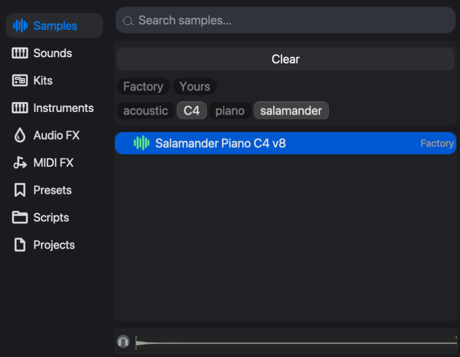
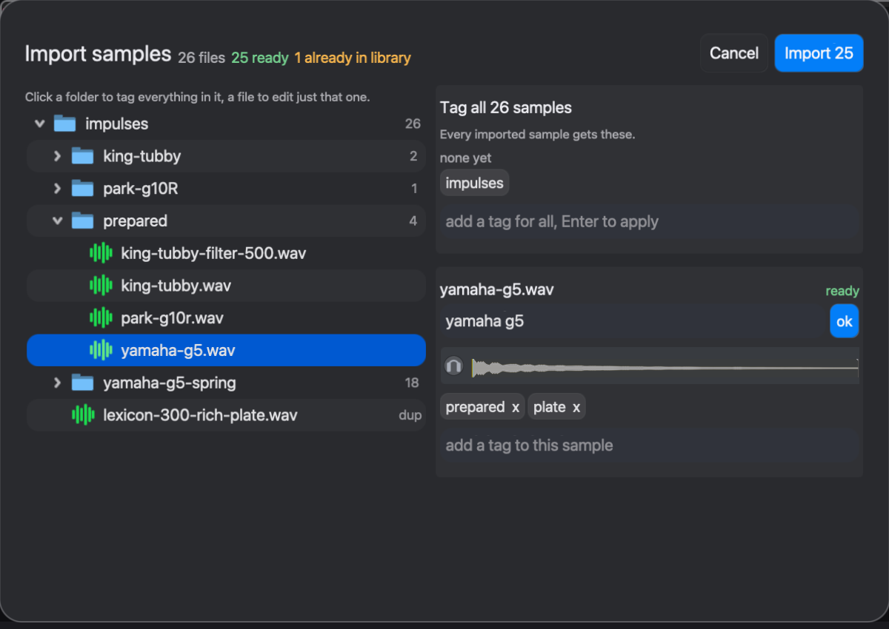

# Samples and sounds

The **sampler** is eseq's built-in sample-playback instrument. It plays one audio file, in one of three ways: whole or in part (**Classic**), cut at its transients so that each note plays a different slice (**Slice**), or stretched to follow the project tempo (**Beats** warp). A sampler can be the sound source of a track, a layer in an Instrument Rack or a pad in a Drum Rack.

Samples come from the **sample library**, one tagged collection shared by every project. Three browser tabs deal with sound material rather than instruments:

- **Samples** searches the library and loads samples into samplers.
- **Sounds** holds saved sound sources that can be loaded onto any track.
- **Kits** holds saved drum racks.

This chapter covers the library first, then finding, importing and loading samples, then the sampler and its three modes, and finally Sounds and Kits. Building racks from samples is covered in [Racks](racks). Synth instruments and their presets are covered in [Instruments and presets](instruments).

## The sample library

The library is a database of samples, each with a title, a set of **tags** and an **origin**. When a sample is added, eseq stores its own WAV copy of the audio and identifies it by a hash of the file's contents. The same file can therefore never be added twice, and the original file on disk is left alone.

The origin says where a sample came from:

- **Factory**: the samples that ship with eseq.
- **Yours**: samples you imported.
- A package name: samples installed by a package other than the factory one.

The factory library is the **universalsequences/factory-samples** package, which is built into the app and available offline from the first launch. It holds 76 samples from three collections:

- **TR-808**: 34 hits covering all 16 voices, plus variations of the kick, snare and cymbal knob settings (CC0, recorded by Michael Fischer).
- **Salamander Grand Piano**: 30 single notes at one velocity, one every minor third from A0 to C8 (CC BY 3.0, Alexander Holm). Each note is a separate sample, tagged with its pitch. They are not a mapped multisample instrument.
- **Versilian Community Sample Library**: 12 acoustic percussion hits, including bass drum, snare, hats, tambourine, claves, shaker and crash (CC0).

A sample whose audio file cannot be found is still listed, marked **Unavailable**.

## Finding a sample

Show the browser with the browser button at the left end of the transport, or with **View > Show Browser**, then click **Samples**.

The list stays empty until you narrow it. It shows **Choose a tag or search samples.** until you type in the search field or click a tag or origin chip. Clicking **Factory** alone lists every factory sample.

- **Tag chips.** Before a filter is applied, the chip area offers up to 16 common tags, such as kick and snare. Clicking a chip selects it. Selected tags combine, so kick and 808 together list only the samples that carry both. Once a filter is active, the chip area shows up to 32 tags that occur alongside the current selection, which lets you narrow step by step.
- **Origin chips.** **Factory**, **Yours** and any package names appear above the tags. Selecting one restricts the list to that origin.
- **Search.** Text matches sample titles and tag names. Typing a search clears the selected tags, and clicking a tag clears the search.
- **Clear.** This button appears while any chip is selected and deselects all of them.

A search returns at most 2,000 samples. With a large library, add a tag to find the rest.

The **preview strip** below the list shows the waveform of the sample under the cursor. The headphone button at its left switches automatic preview on or off, and it starts off. While it is on, the preview plays each sample once as you land on it, whether by clicking or with the arrow keys. The preview plays outside the tracks, so the sequencer is not affected.

## Importing samples

To add your own samples:

1. Drag audio files or folders from the Finder onto the eseq window, or choose **File > Import Samples…**. eseq reads WAV, AIFF, MP3 and FLAC files. It searches dropped folders recursively and skips hidden files.
2. The **Import samples** dialog lists what it found, with counts in the title: files that are ready, files already in the library, and files that failed to read.
3. Under **Tag all**, add tags that every imported sample should receive. The names of the dropped folders are offered as one-click suggestions.
4. Click a folder in the tree to tag everything inside it. Click a file to tag just that file and edit its title. Confirm the title with **ok**.
5. Click **Import**. The button shows how many samples will be added.

Subfolder names inside a dropped folder become tags automatically. A file in `impulses/prepared/` gets the tag *prepared*, as the figure shows. Tag fields autocomplete from tags already in the library. A typed tag that matches an existing tag, ignoring case, takes the existing spelling, which keeps the tag list free of near-duplicates.

Files that are already in the library are marked and skipped, even when their names differ, because eseq matches them by content. The headphone button in the dialog previews the selected file, as in the browser.

Importing only adds to the library. Nothing is loaded onto a track until you load it. Titles and tags are set in this dialog, and the Samples tab only reads them, so tag a batch carefully before you import it.

## Loading a sample

A sample reaches a sampler in the following ways:

- **Drag it onto Drop sounds here** at the end of the mixer, onto the arrangement's **Drop sounds here to add a track** zone, or onto the empty area below the last track in the sequencer. This creates a new sampler track.
- **Drag it onto a track row or a mixer strip.** If the track is a sampler, its sample is replaced. If it is a synth track, the track becomes a sampler.
- **Drag it onto an open sampler's panel** in the device panel. This replaces that sampler's sample.
- **Double-click it, or press Enter.** If the project has no tracks, a new sampler track is created. If the selected track has no instrument, the sample loads there. If the selected track is a sampler, its sample is replaced. On any other kind of track nothing loads, and the status line says to drop the sample instead.
- **Press `Cmd-Enter`** (or `Shift-Enter` or `Control-Enter`). This always adds a new sampler track playing the sample.

**Create > Sampler Track** adds an empty sampler. The **Sampler** entry in the Instruments tab turns the selected track into a sampler, or adds a new sampler track when the selected track cannot be converted.

Note: replacing a sample does not touch the pattern's steps. The same steps play the new sample.

## The sampler

Select a sampler track to show the sampler in the device panel. The header holds the on/off switch, the **synth** and modulation buttons, which switch the panel between the sampler's controls and its modulation sources, the voice count and the ••• menu. Below the header are the Classic/Slice switch and the waveform, a row of number fields under it (base, attack, release, start, end), and a row of knobs and switches starting with **gate**.

Like any instrument's values, the sampler's controls belong to the sound of each pattern (see [Concepts](concepts)): pattern 2 can play the same break in Slice mode while pattern 1 plays it whole. The sample itself is saved with each pattern too, so two patterns on one track can play different samples.

The step supplies the note. At a transpose of 0 (C4), the sample plays at its recorded pitch. Every semitone up or down changes both pitch and length, as on a tape machine. With Beats warp on, a transposed note still changes pitch, but its length stays locked to the tempo grid. When a step plays, the sampler works as follows:

1. The step's note sets the playback rate. In Slice mode the note chooses a slice instead (see below).
2. Playback starts at the **start** point and runs toward the **end** point, or backwards from end to start when **reverse** is on.
3. The **loop** mode decides when the note stops.
4. The **attack** and **release** envelope (0 to 5,000 ms and 0 to 2,000 ms) shapes the level, scaled by the step's velocity.
5. The **sr** control reduces the sample rate, from 44.1 kHz down to 2 kHz, for aliasing and grit.

The other controls are **speed** (a playback-rate multiplier, default 1), **scrub** (an offset to the read position), **smooth** (0 to 250 ms, default 6 ms), which softens changes to scrub, and **base**, which shifts every note the sampler plays by a fixed number of semitones.

### The playback region

In Classic mode, drag across the waveform to set the start and end points, or drag either marker. The shaded region is what plays. Press `Esc` with the waveform focused to reset the region to the whole sample.

To zoom, scroll over the time ruler above the waveform, pinch on the trackpad, or press `+` and `-`. Scrolling over the waveform, or pressing the left and right arrow keys, moves the view.

### Loop modes

The **loop** control sets how long a note lasts:

- **one-shot** plays from start to end, whatever the step's duration.
- **gate** (the default) plays until the step's duration ends, then releases. If the end point comes first, the sound stops there.
- **loop** repeats the region until the step's duration ends. **xfade** (0 to 250 ms) crossfades the loop point.
- **ping-pong** plays the region forwards and backwards until the step's duration ends.

The **gate** button at the left of the knob row is the track's gate setting. With it off, a note in gate mode plays through to the end point instead of stopping with the step.

### Slice mode

Click **slice** in the switch at the left of the waveform. eseq analyses the sample for transients and draws a marker at each one. Each marker starts a slice, and the step's note chooses which slice plays. The **slice base** control sets which note plays the first slice.

With slice base at 0, C4 plays slice 1, C#4 plays slice 2, D4 plays slice 3, and so on up the keyboard. A note below the slice base, or past the last slice, plays nothing. Each slice plays at its recorded pitch. The note chooses the slice and does not transpose it.

**sens** (default 50%) sets how close together two slices may be. At 0% slices are at least 500 ms apart, and at 100% they may be as close as 40 ms. Markers that the current setting rejects are drawn dimmed, and playback runs through them.

The markers can be edited by hand:

- `Shift`-click on the waveform adds a marker.
- Dragging a marker moves it.
- `Option`-click on a marker deletes it. You can also click a slice to select it and press `Delete`.

Hand edits are saved with the project for that sample. They are discarded if the sampler loads a different sample.

While Slice mode is on, the start, end, loop and xfade controls are hidden, because each slice defines its own region. A step can still override a slice's region by locking start or end on that step.

Note: until the transient analysis has finished, a sampler in Slice mode plays nothing. With a short sample this delay is too brief to notice.

### Beats warp

Beats warp plays a loop at the project tempo without changing its pitch. The sample is cut into segments on a beat grid, and each segment starts at its own time.

1. Turn **warp** on and set **mode** to **beats**.
2. Set **bpm** (default 120) to the tempo the sample was recorded at. The **1/2** and **2x** buttons beside it halve or double the playback speed relative to the project, by doubling or halving the bpm value.
3. Move the start point onto the sample's first downbeat, because the grid is anchored there.
4. Choose a **preserve** division: **1 bar**, **1/2**, **1/4**, **1/8**, **1/16**, **1/32**, or **transients** (the default). **transients** uses a 1/16 grid and moves each grid point to a detected transient within 25 ms.

When the project is slower than the sample, the segments leave gaps. **fill** decides what happens in each gap: **off** leaves silence, **loop** (the default) repeats the end of the segment, and **ping-pong** plays it back and forth. **decay** fades each segment from its start. At high values this gives the choppy, gated sound of extreme time-stretching and hides the repeats.

The other warp modes (**tones**, **texture** and **re-pitch**) currently all behave as re-pitch: the sample is sped up or slowed down to the project tempo, and its pitch changes with the speed. **reverse** has no effect while Beats warp is on.

### Locks and modulation

The sampler's controls can be locked per step, including the Classic/Slice switch. Locked controls are drawn in the lock color. See [Parameter locks](parameter-locks).

The modulation button in the header opens the modulation sources beside the controls. Up to four modulation lanes each can drive **speed**, **scrub**, **sr**, **bpm**, **start** and **end**. Modulating start or end moves the playback region continuously while a note plays. See [Instruments and presets](instruments) for the modulation sources themselves.

### A worked example

Suppose you have imported a two-bar drum break recorded at 96 BPM, and the project runs at 120 BPM.

1. Drag the break onto **Drop sounds here**. A sampler track appears. Set the pattern's **steps** to 32 (two bars at the default timebase of 16; see [Step sequencer](sequencer-tour)) and enter one step on step 1 at C4. That step plays the break from its start at the recorded speed and pitch. In the default **gate** mode it stops when the step's duration ends, and it runs slower than the other tracks.
2. Turn **warp** on with **mode** set to **beats**, and set **bpm** to 96. The break now plays at 120 BPM at its original pitch, for as long as the step's duration.
3. Set **loop** to **one-shot**. The whole break now plays in time, once per pattern cycle.
4. For a rearranged break, set warp off and switch to **slice**. Enter steps at C4, C#4, D4 and so on to play slices 1, 2 and 3 in any order. Raise **sens** if hi-hats are missing from the slice list. Lower it if a single hit has been split in two.

## Sounds

A **Sound** is a saved sound source, such as an instrument with its settings or a whole Instrument Rack, stored outside any project so that it can be used again anywhere. A Sound, capitalised, is a browser object; it is not the same thing as a pattern's sound described in [Concepts](concepts). Loading one replaces the track's sound source.

To make a Sound, select a track that uses the instrument, open **Presets**, and drag a preset onto the **Sounds** tab button. The preset becomes a Sound with the same name. This works for synth instruments and for Instrument Rack presets. Samplers have no presets, so a sampler cannot be turned into a Sound this way.

A Sound made from a synth preset holds the instrument and its values only; the track's audio effects and mix are not included. A Sound made from an Instrument Rack preset includes each layer's effects.

To use a Sound:

- Double-click it to replace the selected track's sound source.
- Drag it onto a track to replace that track's sound source, or onto **Drop sounds here** to create a new track.

Note: with a Drum Rack selected, double-clicking a Sound replaces the whole rack with a single track playing that Sound.

## Kits

A **Kit** is a saved Drum Rack: its pads, each pad's sound and effects, and the rack's shared effects chain. By default it also carries the rack's clips (one per ticked scene) and any sequencer the rack owns; untick every scene in the save panel to save only the pads and the shared effects chain. Double-clicking a kit with a Drum Rack selected replaces that rack's kit. With no rack selected, it builds a new rack. Save a kit with the save icon in a Drum Rack's header, or with **Export as kit...** in the rack's menu. [Racks](racks) covers kits in detail.

The Sounds and Kits tabs list factory entries first, then your own saves. No factory Sounds or Kits ship yet, so both tabs start empty.
