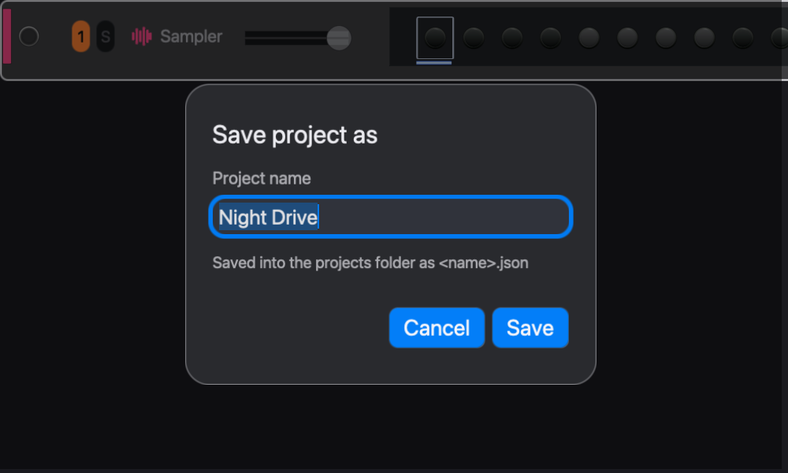
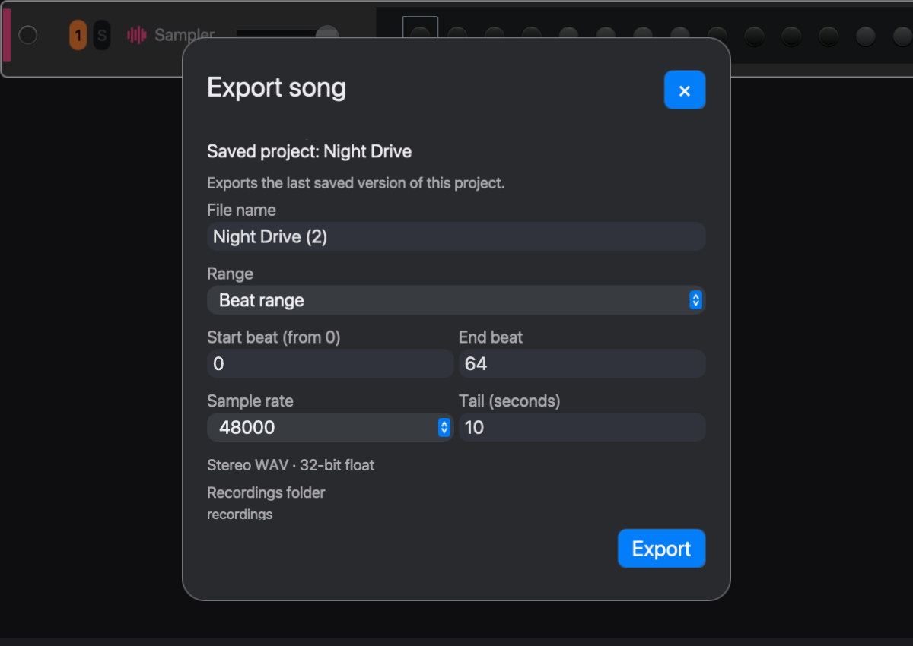

# Saving and export

A project is your editable music. An audio export is a stereo file of it. Presets, Sounds, and Kits store reusable sounds, not the project.

## Save a project

**File > Save As** names a new project. **File > Save** updates it. Reopen from **Projects** in the sidebar or **File > Open Project**.

Save a named version before replacing a kit, restructuring the arrangement, or recording over a section you like.

## Export the arrangement

1. Play the arrangement through once and check clips, scene lane, and ending.
2. **File > Export Audio**.
3. Name the file and choose **Entire arrangement** or **Beat range**.
4. Choose the sample rate and a **Tail** long enough for the last reverb or delay to fade.
5. Click **Export**. **Show in Finder** opens the Recordings folder.

Exports are 32-bit float stereo WAV at 44.1, 48, or 96 kHz.

Beat range counts beats from zero, not bars from one. Eight bars of 4/4 from the top is beat 0 to beat 32.

Only clips make sound. A scene marker on its own exports silence.

## Record a live jam

1. Turn on **WAV** in the transport.
2. Play, launch, and perform.
3. Let the tail fade, then turn WAV off.

WAV records the master output as audio. It is independent of the red Record button and of the transport, so you can stop the music and keep recording the reverb tail.
