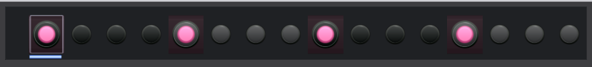
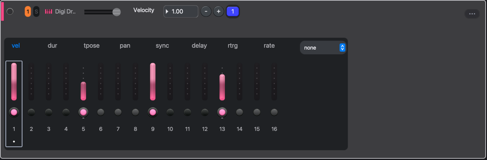

# Step sequencer

The step grid is the fastest way to build rhythms. Each row is a track; each lit cell is a note.

## Steps

- Click an empty step to add a note.
- Click an active step to select it. Double-click to remove it.
- Shift-click selects a range. Command-click adds or removes single steps.
- Drag across empty steps to paint notes. Drag an active step to move it.
- Backspace or Delete removes the selected steps.

With the keyboard: Left and Right move the cursor, Return toggles the step, Up and Down change track. With steps selected, Left and Right shift them instead. Shift with the arrows extends the selection.

## Step parameters

The inspector edits the selected steps.

- **Transpose** shifts pitch from the track's base note.
- **Velocity** sets strength.
- **Duration** sets note length.
- **Pan** places the step in stereo.
- **Retrig** repeats the note inside the step; **Rate** sets the spacing.

Try it: select every other hi-hat, lower the velocity, then give the last snare a retrig.

Expand a track for parameter lanes and more room. Use the [Piano roll](piano-roll) for chords and precise lengths.

## Expanded track

Expanding a track turns its row into a lane editor: one slider per step for the parameter chosen on the tabs above the grid, with the step toggles and numbers underneath.

- Click a tab (**vel**, **dur**, **tpose**, **pan**, **sync**, **delay**, **rtrg**, **rate**) to choose the lane. The dropdown at the end of the tabs opens a process lane instead; see [Process lanes](process-lanes).
- Drag a slider to set that step. With steps selected, dragging a selected step sets all of them.
- The number picker in the track header edits the cursor step, or every selected step when there is a selection. Type digits while the row has focus to enter a value, Return commits, Escape cancels. When another number picker has focus, typing goes there instead.
- Left and Right move the cursor along the row; the picker follows.

Lanes draw in the track colour. A process lane draws in amber and adds a strip of its own controls to the right of the grid.

## Length and timing

Track settings hold the timing controls.

- **Steps** sets the pattern length. Long patterns span several pages.
- **Timebase** sets how much time one step takes. Sixteen steps is one bar only at the default timebase.
- **Swing** delays alternate subdivisions; swing resolution picks which subdivision.
- **Poly**, voices, priority, and trig decide how overlapping notes behave. Give chords enough voices; let a mono bass overlap and glide.

Tracks can have different lengths. Their patterns drift against each other on each repeat, which is a good way to make a short loop feel longer.

## Bar transpose

Every sixteen steps of a track is one page, and each page has its own transpose under its page button. Set it and every note on that page moves by that many semitones, on top of each step's own transpose and on top of the scene transpose. Chords move as a block.

Bar transposes belong to the pattern, so each scene keeps its own, like the steps themselves. Set a page back to 0 to clear it.

Try it: write four bars, leave the first page at 0, and put -5 on the third. The phrase answers itself a fourth down without editing a single note.

## Base value or p-lock

With steps selected, turning a synth or effect knob locks that value onto those steps. With nothing selected, it changes the pattern's base value. Read the selected count in the inspector before you turn a knob. See [Parameter locks](parameter-locks).

## Variations

In the mixer, select a track's pattern cell and press Command-D to duplicate the pattern. Edit the copy. The transport's scene **+** duplicates the whole scene instead. See [Patterns and scenes](patterns-and-scenes).
