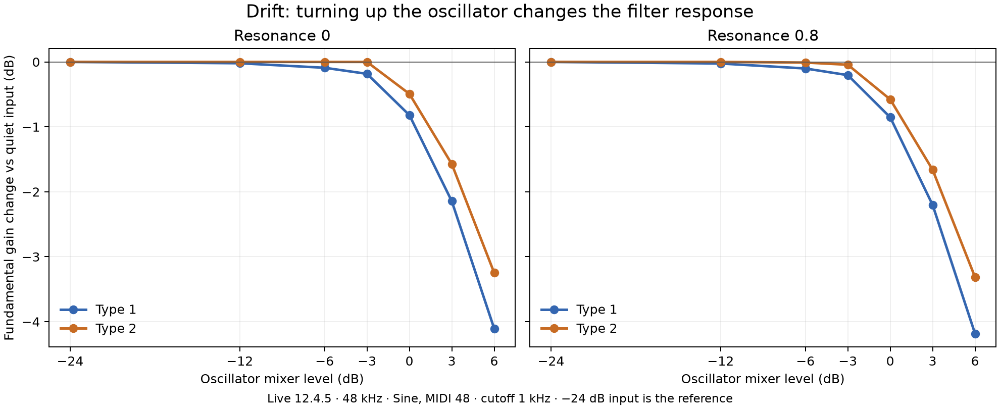

# Native Drift characterization — 2026-09-07

Captured and analyzed 463 individual 20-second tracks (2,315 held-note windows)
from Live 12.4.5 at 48 kHz, stereo float32, without normalization. Reports:
`levels.json` (76), `response.json` (38), `summing.json` (20), `linear.json` (55),
`linear-clean.json` (55 independent re-exports), `ordering.json` (10),
`sine-response.json` (56), `highpass.json` (28), `highpass-drive.json` (29),
and `character.json` (67). Raw WAVs and sets
are retained under the ignored `../reference/`; the levels WAVs are losslessly
gzipped. Reports contain original-WAV hashes and full per-case native parameters.

## Controls and architecture

The inspected UI and saved native parameter inventory contain no Drive knob.
[Ableton's manual](https://www.ableton.com/en/manual/live-instrument-reference/#drift)
explains that oscillator gains engage saturation around the filter. It identifies
Type I as DFM-1 and Type II as Cytomic MS2/Sallen-Key. Their nonlinear equations
and state topology have not been identified by these measurements.

## Oscillator level changes the filter response

At MIDI 48 (~130.813 Hz), Sine/Shape 0, 1 kHz low-pass, 10 Hz high-pass, resonance
0, the fundamental's gain change relative to the same filter at -24 dB input is:

| Oscillator gain | Type I | Type II |
| --- | ---: | ---: |
| -12 dB | -0.02 dB | approximately 0 dB |
| -6 dB | -0.09 dB | approximately 0 dB |
| -3 dB | -0.18 dB | approximately 0 dB |
| 0 dB | -0.82 dB | -0.49 dB |
| +3 dB | -2.15 dB | -1.57 dB |
| +6 dB | -4.11 dB | -3.25 dB |

The bypassed oscillator fundamental tracks the prescribed 30 dB increase from
-24 to +6 dB within 0.003 dB. Thus the above fundamental compression is in the
filtered path, not merely the source gain law. These numbers describe one
pitch/cutoff/resonance combination, not a universal saturation threshold.

The bypassed Sine is already harmonic-rich: THD is approximately -28.39 dB at
MIDI 48 across the input levels. Filtered THD therefore includes oscillator
harmonics. Total THD must not be relabeled as distortion created by the filter.

## Resonance laws and low-frequency gain differ

For the quiet (-24 dB) Saw, MIDI 36 (~65.407 Hz), 1 kHz cutoff and resonance 0.8,
the largest measured harmonic-to-bypass ratios below 4 kHz are approximately:

| Type | Sampled peak frequency | Ratio to bypass |
| --- | ---: | ---: |
| I | 915.7 Hz | +10.44 dB |
| II | 1046.5 Hz | +23.86 dB |

These are harmonic-grid samples, **not fitted exact resonance peaks**. Even at
resonance 0, the fundamental-to-bypass ratio is +4.32 dB for Type I and +2.82 dB
for Type II at this low note. A unity-gain generic low-pass with the same cutoff
and slope would not reproduce this measured level behavior. The resonance-1
captures can be strongly nonlinear even with a quiet input; their ratios must
not automatically be treated as small-signal responses.

## Loud source summing compresses even with filtering bypassed

With both sine oscillators bypassing the filter, oscillator 2 seven semitones
above oscillator 1, MIDI 48, and Global_Volume 0.25:

| Both oscillator gains | Steady stereo RMS |
| --- | ---: |
| -6 dB | 0.050073 |
| 0 dB | 0.099908 |
| +6 dB | 0.153894 |

The last +6 dB input increase produces only about +3.75 dB RMS. Both oscillators
individually scale linearly over this range. Changing Global_Volume to 0.125 or
0.5 scales the already-compressed two-oscillator waveform almost exactly by 0.5
or 2 (whole-capture relative RMS errors about 0.019% for the +6 dB pair).

This supports a nonlinearity upstream of Global_Volume that remains active
with the filter routing bypassed. The precise position relative to source
summing remains unresolved. New sustain controls place it before the amplifier
envelope in the tested steady-state configuration (details below). It would be incorrect
to fit this compression entirely inside the low-pass model, or to recreate it
with a saturator whose drive changes with the final volume knob.

## Envelope placement and note-order controls

Both oscillators at +6 dB, bypassed, with sustain 0.25/0.5/1: the lower sustain
values scale the already-compressed output by their prescribed ratios. Across
five pitches and both exports, steady-window relative RMS error is about
0.021–0.022%. No gain or phase correction is fitted. This supports compression
before the amplifier envelope; it is not a measurement of attack/decay dynamics.

Ascending, descending, repeated MIDI 36, and repeated MIDI 84 captures confirm
that the apparent clipping ceiling follows pitch rather than note position.
However, the independent solo-oscillator output level also varies with pitch.
Using those measured RMS ratios to normalize a clip ceiling fitted **only** on
the first ascending MIDI 36 window produces these predictions:

| MIDI note | Fixed output-unit clip error | Independently normalized clip error |
| --- | ---: | ---: |
| 36 (training) | 0.061% | 0.061% |
| 48 (holdout) | 1.183% | 0.080% |
| 60 (holdout) | 2.145% | 0.171% |
| 72 (holdout) | 2.847% | 0.463% |
| 84 (holdout) | 3.269% | 1.303% |

Errors are relative waveform RMS, with no phase alignment. Reversed/repeated
notes give similar results; every window is retained in `diagnostics.json`.
The one-parameter tanh candidate gives 8.61% error even on the training window.
These results favor a sharper clipping characteristic in this bypass test.
They **do not** identify a native clipping equation, justify a pitch-dependent
threshold table, or establish where the pitch-level compensation occurs.
The remaining high-note error may involve bandwidth or antialiasing behavior;
that explanation has not yet been tested.

## Very quiet captures expose a measurement limit

Lowering a saw to -48/-60 dB does not automatically give a better linear-filter
measurement. Noise obscures the weaker source harmonics and Type-I output.
Re-exporting all 55 tracks with No Dither at float32 retains this behavior.
For the -60 dB bypass saw at MIDI 36, steady RMS is approximately 0.0000623
with No Dither, versus 0.0000629 in the earlier export. Pre-note silence is
exactly zero in these inspected controls. The noise's internal origin is not
identified; this check does not attribute it to a particular DSP stage.

Requiring 30 dB harmonic-to-local-background ratio in both levels and both
paths leaves at most the fundamental for these -48/-60 dB comparisons. There
is therefore insufficient reliable spectral coverage to fit their full
response. The raw ratios remain in the reports, but must not be used blindly
as an LTI target. Better excitation (sine measurements at usable levels around
the cutoff, with repeat/level controls) is needed for further filter fitting.

## Complex linear-section identification — 2026-09-08

`linear-section-fits.json` retains per-case fits of both magnitude and phase,
with a 30 dB local-SNR guard and no fitted delay. A candidate with two-pole
high-pass and low-pass sections evaluated at 96 kHz fits the three high-pass
controls (100/1000/4000 Hz; LP 19999 Hz, resonance 0) to 0.0252–0.0257 dB RMS
and approximately 0.0031 rad RMS. Their fitted HP Q is about 1.47, LP Q about
0.423, and path gain about 1.541. The fitted HP frequencies closely match their
settings. The same model family at 48 kHz gives 0.38–0.48 dB magnitude error.

For Type I at LP 4 kHz, the 96 kHz candidate gives approximately 0.092–0.108 dB
RMS across resonance 0/0.5/0.8, versus 0.83–1.18 dB at 48 kHz. This supports
investigating 2x processing and a much more resonant high-pass than Digi Drift's
current implementation. The HP-at-10-Hz cases fit an effective HP around 20 Hz;
a native lower clamp is a hypothesis, not independently established yet.

These fits identify candidates on the training captures. They do not validate
the nonlinear feedback topology, prove the exact native oversampling method,
or establish full-range parameter laws. After restarting Live, the 56-track
sine-response set and 28-track high-pass controls were exported and analyzed.

## Independent Type-I sine validation — 2026-09-08

`validate_sine.py` fixes the candidate to the earlier saw/HP identification:
96 kHz internal evaluation, LP Q = 0.423/(1-resonance), path gain 1.541,
HP 20 Hz/Q 1.469. It fits no gain, phase, delay, or parameters to the sine batch.
All 120 fundamental comparisons pass the 30 dB local-SNR guard.

Across 90 held-note windows at resonance 0/0.5/0.8, cutoff 250/1000/4000 Hz,
and oscillator gain -24/-36 dB, RMS magnitude error is 0.01090 dB, maximum
absolute error 0.03990 dB, and RMS phase error 0.000979 rad. These are independent
predictions of the linear fundamental response, not nonlinear waveform parity.
At resonance 0.95, the remaining 30 windows give 0.2273 dB RMS and 0.7202 dB
maximum error. Raising input level changes these responses; they cannot all
be used as linear targets. Every result is in `sine-validation.json`.

The new low-note HP controls independently distinguish the lower clamp:
settings 10, 15, and 20 Hz produce the same measured response; 30/40/100 Hz
move it accordingly. The Type-II/Type-I complex ratio is effectively unchanged
across these HP settings. Thus its extra low-frequency phase shift is outside
the adjustable HP response. This constrains subsequent Type-II identification;
it does not establish the internal placement or exact native circuit.

## Saturation symmetry

At MIDI 36, +6 dB oscillator gain, sine source, LP 1 kHz and resonance zero,
the second harmonic is approximately -99 dBc in the bypass capture, -18.5 dBc
with Type I, and -16.6 dBc with Type II. These values are directly available in
`levels.json`. Symmetric memoryless saturation on a symmetric sine cannot
account for that large even-harmonic contribution. Candidate fitting must
allow asymmetry and test where DC rejection occurs relative to saturation.
The 29-track `highpass-drive` set tests that ordering across input levels and
HP settings. It is exported and included in the corpus counts.

## Adjustable high-pass follows the nonlinear processing

At LP 1 kHz, resonance zero, the fundamental compression relative to -24 dB
input is essentially unchanged when HP moves from 20 Hz to 1 kHz or 4 kHz.
This holds at -6/0/+6 dB input across all five notes for both filter types.
For example, Type-I MIDI 48 at +6 dB gives -4.107/-4.105/-4.108 dB compression
for those three HP settings. Type II gives approximately -3.248 dB at all three.
The generated harmonics are reshaped by HP, but their generation is not reduced
as it would be by placing that attenuating high-pass before the drive.
These controls support placing the adjustable high-pass after nonlinear
processing in the tested configuration; they do not determine the placement
of any separate internal DC blockers.

`check_highpass_order.py` additionally predicts complex output harmonics by
changing only the known final HP response of the captured 20 Hz case. All
80 windows have qualified harmonics at 30 dB local SNR; the weakest windows
retain only two. Maximum per-window RMS errors are 0.2977 dB and 0.02704 rad,
with no gain/phase/delay fitting. Results are in `highpass-order.json`.

## Repeatability and limits

Duplicate full captures differ: approximately 0.83% relative RMS for the quiet
bypass sine and 0.044% for the loud resonant Type-I saw. Zero Drift and oscillator
retrigger do not make separate renders sample-identical. Spectral magnitude
comparisons are useful; strict raw-sample parity needs this variation accounted
for. The level-batch output-volume errors are near the duplicate Type-I error
and about 0.0011% for Type II, supporting downstream gain behavior in those cases.

The analysis has ten passing tests: off-bin harmonic amplitude/THD
recovery, prescribed linear-gain ratios, invalid capture rejection, and exact
lossless-compression recovery, clipping prediction on an independent input,
local-noise discrimination, paired note-order construction, matching sine
excitation controls, candidate-section corner gain/phase, and matching controls
for the character/drive-order batches. No ESeq DSP changes were made, so no Rust build
or instrument probe was required. The plot was rendered and visually inspected.

This corpus establishes reproducible characterization, not a calibrated Digi
Drift implementation. Dynamic cutoff/resonance sweeps, envelope transients,
self-oscillation decay, sample-rate behavior, aliasing, and independent holdout
comparisons remain necessary during model development. No filter equations,
extra drive controls, or compensating production-code changes were guessed.

## Character holdout and unresolved nonlinear topology — September 8

The new character capture supplies 120 independent Type-I sine/saw windows at
250/4000 Hz, resonance 0/0.5/0.8, oscillator gain 0/+6 dB. A research candidate
with biased input and feedback saturation, output saturation, and a final HP
was evaluated with its earlier 1 kHz sine-fit coefficients unchanged. The worst
fundamental error is 0.528 dB; the worst first-12-harmonic amplitude-vector
relative error is 11.302%. These are amplitude comparisons, not waveform or
phase validation. The candidate is **not accepted for production**.

The finer Type-II quiet resonance sweep supports fitting two second-order
sections at low/moderate resonance, but independently fitting each setting is
not a validated continuous resonance law. At resonance 0.95 and 1, a section Q
hits the diagnostic upper bound of 1000 and leaves phase errors of 0.0259 and
0.0516 radians. Those bounded fits cannot be used as native Q measurements or
copied into a production lookup table.

The law sweep's actual MIDI notes are 48/60/70/74/84: approximately
130.8/261.6/466.2/587.3/1046.5 Hz. Thus only the last fundamental sits close to
the 1 kHz cutoff; the lower pair must not be mislabeled 932/1174 Hz.

A separate compiled SVF probe disproves an earlier working suspicion about the
existing Digi Drift high-pass selector. The pinned compiler maps mode 2 to HP
and mode 3 to notch. At 100/1000/10000 Hz with cutoff 1000 and Q 0.6, mode 2
gives -40.059/-4.437/-0.0248 dB. The existing mode-2 selection is correct.
The generated C passed the fusion check. This was a component ABI probe, not
the host instrument_probe and not end-to-end instrument validation.

Compiler packaging issue eseq-ywoh: the SHA-verified v0.1.13 macOS release
archive contains only the compiler, omitting its required audit script and ABI
allowlists. The diagnostic compile explicitly used DGEN_BINARY_AUDIT_TOOL
with those three files extracted unchanged from pinned upstream commit
b0f120d2514e9eed20996d36f8dcf6dd4f8b4049. Inline binary auditing remained enabled.
Production Digi Drift was still unchanged at this research stage.

## Resonance-law controls and feedback refinement

The additional 29-track `resonance-law` batch brackets 1 kHz with MIDI
76/80/83/86/90 at -48 dB and reserves -60 dB high-resonance controls. Together
with `character` and `sine-response`, `fit_type2_linear.py` fits a continuous
rational resonance law to qualified fundamentals and excludes intermediate
0.05 steps and all -60 dB observations from training. The report verifies raw
capture, ledger, and set hashes and uses a 30 dB local-SNR floor. Intermediate
-48 dB controls have worst per-case RMS magnitude error about 0.029 dB;
independent -60 dB resonance 0.8/0.9/0.95 controls remain below 0.064 dB.
Resonance 1 and louder high-resonance controls are level dependent and must not
be treated as an LTI calibration target. See `type2-linear-law.json`.

A Type-I feedback candidate that includes a negative low-pass-state component
in the nonlinear feedback input improves the previously reported 11.302%
worst harmonic-amplitude error to 5.952% on the same unused 120 character
windows. Its nine coefficients were fitted only to the earlier 1 kHz sine
training windows. Complex spectra expose additional phase error: worst complex
relative error is 14.173%, and worst fundamental phase error is 0.13922 radians.
These figures use the independently measured oscillator pitch-gain controls
for analysis normalization; they do not justify a production pitch lookup.
This remains a research approximation, not an accepted production match.

The rational-knee feedback equation admits a unique closed-form root when
`a > r >= 0`. `feedback-root-validation.json` checks the actual compiled
float32 macro against 3,840 independently bracketed roots: maximum relative
error is 2.20e-7, and the generated-code fusion check passes. The complete
Type-I closed-form C recurrence agrees with the earlier iterative recurrence
within 3.8e-13 absolute error over 30 noise-excited cutoff/resonance cases.
The compiled Type-I step also passes the fusion check. Its 25 noise-excited
comparisons against the double-precision recurrence have worst relative RMS
error 0.263%, at the 20 Hz/full-resonance extreme. This numerical comparison
is separate from native-audio validation and does not test voice integration,
oversampling, parameter modulation, or end-to-end oscillator matching.

Type-II experiments with saturation in individual section feedback paths
remain inadequate. A reversed Sallen-Key cascade that matched the 1 kHz
basis missed unused 250 Hz cases by up to 4.51 dB. Allowing an earlier-state
feedback mixture and training across cutoff settings still left unused sine
cases with 3.42 dB fundamental error and 32.58% harmonic error; that optimizer
also exhausted its evaluation budget without convergence. These candidates
are rejected. Cytomic's [The Drop manual, page 11](https://cytomic.com/files/TheDrop-Manual.pdf)
describes MS2's OTA core, buffers, and resonance limiter. That supports
investigating saturation inside the integrators, but does not establish that
Drift uses the same equations or parameters as The Drop.

Scripts, C recurrences, fitted parameters, and checks from this refinement are
preserved with hashes under `reference/research-2026-09-08-refinement/`.
Production Digi Drift DSP was unchanged at this research stage; see the final
implementation section below for the subsequently accepted native-rate update.

## Current instrument filter baseline

`baseline-diagnostic.json` compiles the pre-update production `drift-filter` macro
with Drive=0 and no filter modulation, feeds it the native bypass captures,
and measures the same 120 character windows per type. This isolates the filter;
it excludes the instrument's oscillator, envelopes, and final output tanh.
The input/output mapping assumes native oscillator amplitude 0.4 per unit
Digi Drift oscillator and uses the separate pitch-level controls. It is not an
end-to-end preset comparison. The production source hash is recorded, and the
compiled baseline passes the fusion check.

| Type-I component | Median fundamental error | Worst fundamental error | Median harmonic-amplitude error | Worst harmonic-amplitude error |
| --- | ---: | ---: | ---: | ---: |
| Current filter, Drive=0 | 5.439 dB | 11.640 dB | 48.35% | 249.59% |
| Research feedback candidate | 0.057 dB | 0.431 dB | 0.866% | 5.952% |

The candidate's worst complex-spectrum error remains 14.173%, compared with
253.51% for this baseline. The current Type-II component has median/worst
fundamental error 10.105/17.651 dB and median/worst harmonic-amplitude error
68.71/86.66%. These baseline discrepancies establish room for improvement;
they do not make the rejected Type-II nonlinear models accurate or stable.

The band-pass-feedback Type-II variant also exhausted its fitting budget;
its worst unused fundamental error is 2.80 dB and harmonic error 27.60%.
The initial all-resonance OTA-integrator experiment was stopped after its
training residual plateaued; it has no accepted fit or convergence claim.

## Final native-rate implementation

The user explicitly accepted proceeding without oversampling and without a
1:1 native match. Digi Drift's production DSP now uses the measured Type-I
nonlinear SVF candidate, and the measured Type-II linear law with the simpler
high-Q-first Sallen-Key feedback model. The latter preserves the quiet
resonance response and has a closed-form feedback solve; it is not the failed
all-resonance OTA experiment or the wide-fit model with a near-zero clipping
threshold. Coefficients remain continuous functions of resonance, not per-note
lookup tables. Type-I's feedback low-pass mix stays below .423, retaining a
positive restoring term even when feedback saturation is fully engaged.

All filter coefficients use the host sample rate. Cutoff is capped at the
smaller of 16 kHz and .36 times that rate, keeping the nonlinear state transform
inside its valid domain at lower sample rates. The source mixer uses explicit
0.4 oscillator-unit scaling. Input gains now determine drive, so the extra
Drive parameter and its 28 preset entries are removed. High-pass frequency
replaces Drive as the third large filter knob. The authored patch graph was
regenerated through the production projector API, retaining existing layout
positions where applicable.

The resonant high-pass follows the low-pass drive. The routed and bypassed
signals then share a symmetric .875 summing ceiling before amp-envelope,
velocity, volume, and pan gain. Output volume therefore changes loudness
without changing saturation. The former post-volume stereo tanh is removed.
No oscillator waveform rewrite or empirical pitch-compensation table is added.

`production-component.json` compares the actual compiled native-rate filter
macro against the same 120 native character windows per type. This component
check excludes the final shared summing ceiling and envelope, as the baseline
did. Median/worst fundamental errors are 0.050/0.513 dB for Type I and
0.150/4.463 dB for Type II. Median harmonic-amplitude errors are 0.924% and
3.515%; worst errors are 13.865% and 67.172%. The high-error Type-II cases are
heavily driven low-cutoff settings. Worst complex-spectrum error is 17.309%
for Type I and 119.881% for Type II, so an exact phase/waveform-match claim
would be false. The pre-update baseline figures above remain useful context,
not a reason to hide these remaining differences. Native-rate nonlinear
processing also retains aliasing; the 96 kHz research comparisons are not
results for the shipped implementation.

Production validation:

- `check_instrument.py`: 90 static cases and 10 cutoff/resonance/high-pass/pitch
  sweep-and-release cases at 22.05/32/44.1/48/96 kHz. Output and complete voice
  memory remained finite, with silence after release.
- All 28 factory presets produced finite, non-silent audio. Their parameter
  values are otherwise unchanged; this is not a claim that their old sound
  is preserved after changing the filter and drive architecture.
- A 30 dB oscillator-level increase at LP 1 kHz/resonance zero produced
  4.177 dB Type-I and 3.384 dB Type-II fundamental compression. A separate
  12 dB output-volume change scaled the waveform with relative residual
  below 4.9e-8 for both types.
- Pinned compiler binary audits and generated-code fusion checks passed.
  `instrument_probe` passed for the default voice and for Type II at full
  resonance with host-applied cutoff jumps.
- The exact `metal_seq` Digi Drift layout test passed. The real host-loaded
  capture fixture `digi-drift.lisp` was rendered and visually inspected:
  cutoff, resonance, and high-pass controls are visible with nonzero geometry.

The archived 2x FIR experiment passed its numerical tests, but is not used by
this instrument. The production code has no FIR latency or oversampling path.
